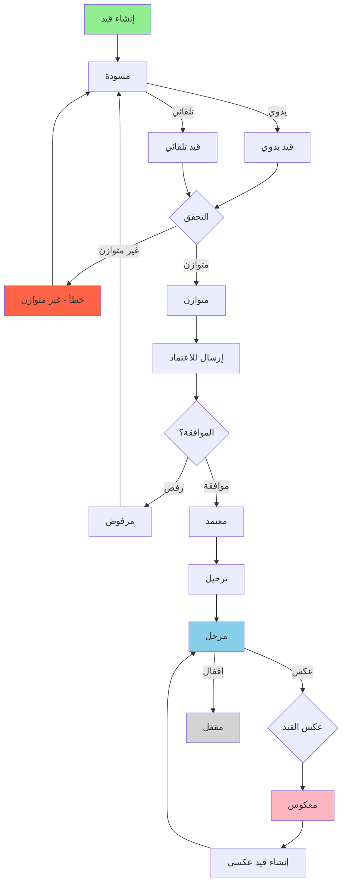
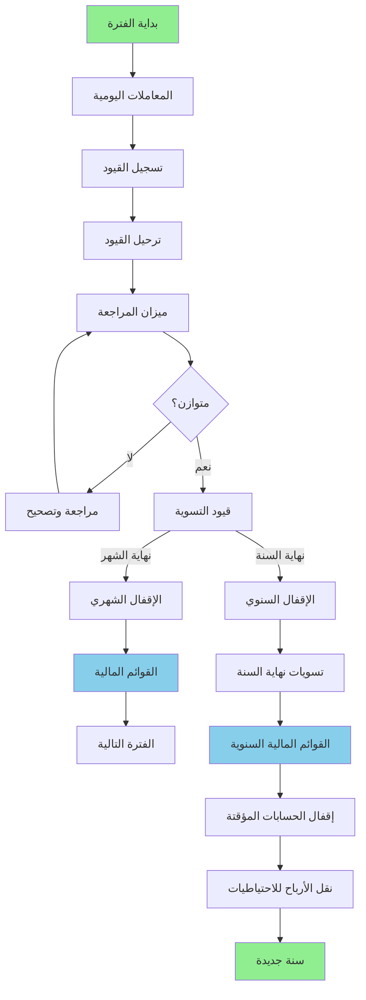
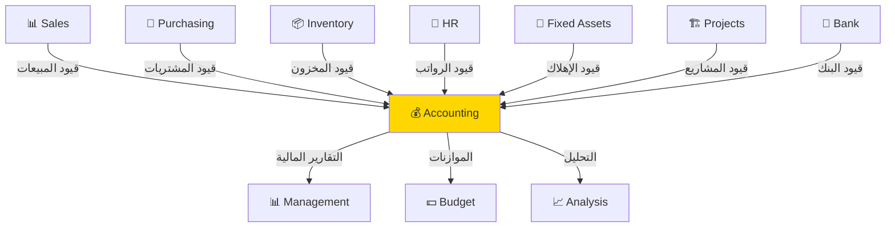

# 💰 مديول المحاسبة - Accounting Module
## التحليل التفصيلي الكامل والمعماري

---

## 📑 جدول المحتويات

1. [نظرة عامة](#overview)
2. [الكيانات الأساسية](#entities)
3. [دليل الحسابات](#chart-of-accounts)
4. [القيود اليومية](#journal-entries)
5. [مراكز التكلفة](#cost-centers)
6. [السنة المالية والفترات](#fiscal-year)
7. [دورة العمل المحاسبية](#workflow)
8. [الشاشات التفصيلية](#screens)
9. [التكامل مع المديولات](#integration)
10. [القوائم المالية](#financial-statements)
11. [الإقفالات](#closing)
12. [قواعد العمل](#business-rules)
13. [Database Schema](#database)
14. [APIs المطلوبة](#apis)
15. [الأمثلة العملية](#examples)

---

<a name="overview"></a>
## 🎯 1. نظرة عامة على المديول

### الهدف الرئيسي
مديول المحاسبة هو القلب النابض لنظام الـ ERP، مسؤول عن تسجيل وتتبع وتحليل جميع المعاملات المالية، ويشمل:
- دليل الحسابات المرن والقابل للتخصيص
- القيود اليومية والسندات
- مراكز التكلفة المتقدمة
- القوائم المالية (قائمة الدخل، الميزانية، التدفقات النقدية)
- موازين المراجعة
- التقارير المحاسبية المتقدمة
- الإقفالات الشهرية والسنوية
- التسويات والمطابقات

### النطاق (Scope)
- ✅ Flexible Chart of Accounts (دليل حسابات مرن)
- ✅ Multi-Level Cost Centers (مراكز تكلفة متعددة المستويات)
- ✅ Multi-Currency Support (دعم عملات متعددة)
- ✅ Multi-Company & Branch (شركات وفروع متعددة)
- ✅ Automated Journal Entries (قيود تلقائية)
- ✅ Financial Statements (القوائم المالية)
- ✅ Budget Management (إدارة الموازنات)
- ✅ Cash Flow Management (إدارة التدفقات النقدية)
- ✅ Bank Reconciliation (مطابقة البنوك)
- ✅ Fixed Assets Integration (تكامل مع الأصول الثابتة)
- ✅ Audit Trail (سجل تدقيق كامل)
- ✅ Period Locking (قفل الفترات)

---

<a name="entities"></a>
## 🗂️ 2. الكيانات الأساسية (Core Entities)

### 2.1 هيكل الكيانات

```
Accounting Module
├── Chart of Accounts
│   ├── Account (الحساب)
│   ├── Account Type (نوع الحساب)
│   ├── Account Group (مجموعة الحسابات)
│   └── Account Currency (عملة الحساب)
│
├── Cost Centers
│   ├── Cost Center (مركز التكلفة)
│   ├── Cost Center Group (مجموعة مراكز)
│   └── Cost Center Distribution (توزيع التكلفة)
│
├── Journal Entries
│   ├── Journal Entry (القيد اليومي)
│   ├── Journal Entry Line (بند القيد)
│   ├── Journal Type (نوع اليومية)
│   └── Journal Sequence (تسلسل القيود)
│
├── Fiscal Management
│   ├── Fiscal Year (السنة المالية)
│   ├── Fiscal Period (الفترة المالية)
│   └── Period Status (حالة الفترة)
│
├── Financial Statements
│   ├── Income Statement (قائمة الدخل)
│   ├── Balance Sheet (الميزانية العمومية)
│   ├── Cash Flow Statement (قائمة التدفقات النقدية)
│   └── Trial Balance (ميزان المراجعة)
│
├── Bank & Cash
│   ├── Bank Account (حساب بنكي)
│   ├── Bank Statement (كشف حساب بنكي)
│   ├── Payment Voucher (سند صرف)
│   ├── Receipt Voucher (سند قبض)
│   └── Bank Reconciliation (مطابقة بنكية)
│
├── Budget
│   ├── Budget (الموازنة)
│   ├── Budget Line (بند الموازنة)
│   └── Budget vs Actual (الموازنة مقابل الفعلي)
│
└── Closings & Adjustments
    ├── Period Closing (إقفال فترة)
    ├── Year Closing (إقفال سنة)
    └── Adjustment Entry (قيد تسوية)
```

### 2.2 تفاصيل الكيانات الرئيسية

#### 📊 Account (الحساب)
```typescript
interface Account {
  // Basic Info
  id: string;
  code: string; // كود الحساب (يمكن أن يكون هرمي: 1-1-001)
  nameAr: string;
  nameEn: string;
  description?: string;
  
  // Hierarchy
  parentAccountId?: string; // الحساب الأب
  level: number; // المستوى في الشجرة (0 = رئيسي)
  isParent: boolean; // هل هو حساب رئيسي
  hasChildren: boolean; // هل له حسابات فرعية
  fullPath: string; // المسار الكامل "1 > 1-1 > 1-1-001"
  
  // Account Type & Classification
  accountType: 'Asset' | 'Liability' | 'Equity' | 'Revenue' | 'Expense';
  accountNature: 'Debit' | 'Credit'; // الطبيعة المدينة أم الدائنة
  accountGroupId: string; // المجموعة (Current Asset, Fixed Asset, etc.)
  
  // Financial Statement Classification
  financialStatementSection: string; // القسم في القوائم المالية
  balanceSheetSection?: 'CurrentAssets' | 'FixedAssets' | 'CurrentLiabilities' | 'LongTermLiabilities' | 'Equity';
  incomeStatementSection?: 'Revenue' | 'COGS' | 'OperatingExpenses' | 'OtherIncome' | 'OtherExpenses';
  
  // Behavior & Settings
  isActive: boolean;
  isPostingAccount: boolean; // هل يمكن الترحيل عليه مباشرة
  requiresCostCenter: boolean; // هل يتطلب مركز تكلفة
  requiresProject: boolean; // هل يتطلب مشروع
  allowManualEntry: boolean; // هل يسمح بالقيد اليدوي
  isSystemAccount: boolean; // حساب نظامي (لا يمكن حذفه)
  
  // Currency
  currency: string; // العملة الأساسية للحساب
  allowMultiCurrency: boolean; // هل يسمح بعملات متعددة
  
  // Control Accounts
  isControlAccount: boolean; // حساب تحكم (مثل: العملاء، الموردين)
  controlledBy?: string; // يُتحكم به من قبل (Customers, Suppliers)
  
  // Balance & Opening
  openingBalance: number;
  openingBalanceDate: Date;
  currentBalance: number;
  currentBalanceDebit: number;
  currentBalanceCredit: number;
  
  // Multi-Company
  companyId: string;
  
  // Status & Audit
  status: 'Active' | 'Inactive' | 'Closed';
  createdAt: DateTime;
  createdBy: string;
  modifiedAt: DateTime;
  modifiedBy: string;
  deletedAt?: DateTime;
  deletedBy?: string;
}
```

#### 📝 Journal Entry (القيد اليومي)
```typescript
interface JournalEntry {
  // Basic Info
  id: string;
  entryNumber: string; // رقم القيد (تلقائي من sequence)
  entryDate: Date; // تاريخ القيد
  postingDate: Date; // تاريخ الترحيل
  
  // Journal Type
  journalTypeId: string;
  journalType: JournalType; // Sales, Purchase, General, Opening, Closing, etc.
  
  // Description
  description: string;
  notes?: string;
  
  // Source Reference
  referenceType?: string; // SalesInvoice, PurchaseInvoice, Payment, etc.
  referenceId?: string;
  referenceNumber?: string;
  
  // Lines
  lines: JournalEntryLine[];
  
  // Totals
  totalDebit: number;
  totalCredit: number;
  difference: number; // يجب أن يساوي صفر
  isBalanced: boolean; // totalDebit === totalCredit
  
  // Currency
  currency: string;
  exchangeRate: number;
  
  // Fiscal Period
  fiscalYearId: string;
  fiscalPeriodId: string;
  
  // Reversal
  isReversal: boolean; // هل هو قيد عكسي
  reversedEntryId?: string; // القيد المعكوس
  reversalDate?: Date;
  
  // Multi-Company
  companyId: string;
  branchId?: string;
  
  // Workflow & Status
  status: 'Draft' | 'Submitted' | 'Posted' | 'Reversed' | 'Cancelled';
  isDraft: boolean;
  isPosted: boolean;
  isReversed: boolean;
  
  postedBy?: string;
  postedAt?: DateTime;
  
  approvedBy?: string;
  approvedAt?: DateTime;
  
  // Audit
  createdAt: DateTime;
  createdBy: string;
  modifiedAt: DateTime;
  modifiedBy: string;
  deletedAt?: DateTime;
  deletedBy?: string;
}

interface JournalEntryLine {
  id: string;
  lineNumber: number; // ترتيب البند
  
  // Account
  accountId: string;
  account: Account;
  accountCode: string;
  accountName: string;
  
  // Debit & Credit
  debit: number;
  credit: number;
  amount: number; // القيمة المطلقة
  entryType: 'Debit' | 'Credit';
  
  // Cost Center
  costCenterId?: string;
  costCenter?: CostCenter;
  
  // Project
  projectId?: string;
  project?: Project;
  
  // Currency
  currency: string;
  exchangeRate: number;
  amountInBaseCurrency: number;
  
  // Description
  description?: string;
  notes?: string;
  
  // Party (طرف ثالث - عميل أو مورد)
  partyType?: 'Customer' | 'Supplier' | 'Employee';
  partyId?: string;
  partyName?: string;
  
  // Due Date (للحسابات المدينة/الدائنة)
  dueDate?: Date;
  
  // Bank
  bankAccountId?: string;
  chequeNumber?: string;
  chequeDate?: Date;
}
```

#### 🎯 Cost Center (مركز التكلفة)
```typescript
interface CostCenter {
  id: string;
  code: string;
  nameAr: string;
  nameEn: string;
  description?: string;
  
  // Hierarchy
  parentCostCenterId?: string;
  level: number;
  isParent: boolean;
  hasChildren: boolean;
  fullPath: string;
  
  // Type & Classification
  type: 'Branch' | 'Department' | 'Project' | 'Product' | 'Custom';
  
  // Manager
  managerId?: string;
  manager?: Employee;
  
  // Budget
  hasBudget: boolean;
  annualBudget?: number;
  
  // Status
  isActive: boolean;
  
  // Multi-Company
  companyId: string;
  
  // Audit
  createdAt: DateTime;
  createdBy: string;
  modifiedAt: DateTime;
  modifiedBy: string;
}
```

#### 📅 Fiscal Year (السنة المالية)
```typescript
interface FiscalYear {
  id: string;
  yearCode: string; // مثال: FY2025
  yearName: string; // "السنة المالية 2025"
  
  // Dates
  startDate: Date;
  endDate: Date;
  
  // Periods
  periods: FiscalPeriod[]; // الفترات (شهرية عادةً)
  numberOfPeriods: number; // عادة 12
  
  // Status
  status: 'Open' | 'Closed' | 'Locked';
  isActive: boolean; // السنة الحالية
  isClosed: boolean;
  
  closedBy?: string;
  closedAt?: DateTime;
  
  // Multi-Company
  companyId: string;
  
  // Audit
  createdAt: DateTime;
  createdBy: string;
}

interface FiscalPeriod {
  id: string;
  fiscalYearId: string;
  periodNumber: number; // 1-12
  periodName: string; // "يناير 2025"
  
  // Dates
  startDate: Date;
  endDate: Date;
  
  // Status
  status: 'Open' | 'Closed' | 'Locked';
  isOpen: boolean;
  isClosed: boolean;
  isLocked: boolean;
  
  // Closing
  closedBy?: string;
  closedAt?: DateTime;
  
  // Audit
  createdAt: DateTime;
}
```

#### 🏦 Bank Account (حساب بنكي)
```typescript
interface BankAccount {
  id: string;
  accountNumber: string; // رقم الحساب البنكي
  accountName: string;
  
  // Bank Details
  bankName: string;
  bankBranch?: string;
  bankCode?: string;
  swiftCode?: string;
  iban?: string;
  
  // Currency
  currency: string;
  
  // GL Account Link
  glAccountId: string; // الحساب في دليل الحسابات
  glAccount: Account;
  
  // Balance
  openingBalance: number;
  currentBalance: number;
  
  // Settings
  allowNegativeBalance: boolean;
  minimumBalance?: number;
  
  // Status
  isActive: boolean;
  
  // Multi-Company
  companyId: string;
  branchId?: string;
  
  // Audit
  createdAt: DateTime;
  createdBy: string;
}
```

---

<a name="chart-of-accounts"></a>
## 📊 3. دليل الحسابات (Chart of Accounts)

### 3.1 الهيكل الهرمي

```
Chart of Accounts
│
├── 1. Assets (الأصول)
│   ├── 1-1. Current Assets (الأصول المتداولة)
│   │   ├── 1-1-001. Cash in Hand (النقدية في الصندوق)
│   │   ├── 1-1-002. Cash at Bank (النقدية في البنك)
│   │   │   ├── 1-1-002-001. Bank Account - Al Rajhi
│   │   │   ├── 1-1-002-002. Bank Account - SAMBA
│   │   │   └── 1-1-002-003. Bank Account - SNB
│   │   ├── 1-1-003. Accounts Receivable (العملاء)
│   │   │   ├── 1-1-003-001. Customer A
│   │   │   ├── 1-1-003-002. Customer B
│   │   │   └── ...
│   │   ├── 1-1-004. Notes Receivable (أوراق القبض)
│   │   ├── 1-1-005. Inventory (المخزون)
│   │   │   ├── 1-1-005-001. Raw Materials
│   │   │   ├── 1-1-005-002. Work in Progress
│   │   │   └── 1-1-005-003. Finished Goods
│   │   └── 1-1-006. Prepaid Expenses (مصروفات مقدمة)
│   │
│   └── 1-2. Fixed Assets (الأصول الثابتة)
│       ├── 1-2-001. Land (الأراضي)
│       ├── 1-2-002. Buildings (المباني)
│       ├── 1-2-003. Machinery & Equipment (الآلات والمعدات)
│       ├── 1-2-004. Vehicles (المركبات)
│       ├── 1-2-005. Furniture & Fixtures (الأثاث)
│       ├── 1-2-006. Computers & IT Equipment (الحاسبات)
│       └── 1-2-007. Accumulated Depreciation (مجمع الإهلاك)
│
├── 2. Liabilities (الخصوم)
│   ├── 2-1. Current Liabilities (الخصوم المتداولة)
│   │   ├── 2-1-001. Accounts Payable (الموردين)
│   │   │   ├── 2-1-001-001. Supplier A
│   │   │   └── ...
│   │   ├── 2-1-002. Notes Payable (أوراق الدفع)
│   │   ├── 2-1-003. Short-term Loans (قروض قصيرة الأجل)
│   │   ├── 2-1-004. Accrued Expenses (مصروفات مستحقة)
│   │   ├── 2-1-005. Salaries Payable (رواتب مستحقة)
│   │   └── 2-1-006. VAT Payable (ضريبة القيمة المضافة)
│   │
│   └── 2-2. Long-term Liabilities (الخصوم طويلة الأجل)
│       ├── 2-2-001. Long-term Loans (قروض طويلة الأجل)
│       └── 2-2-002. Bonds Payable (سندات للدفع)
│
├── 3. Equity (حقوق الملكية)
│   ├── 3-1-001. Capital (رأس المال)
│   ├── 3-1-002. Retained Earnings (الأرباح المحتجزة)
│   ├── 3-1-003. Current Year Profit/Loss (ربح/خسارة العام الحالي)
│   └── 3-1-004. Drawings (مسحوبات)
│
├── 4. Revenue (الإيرادات)
│   ├── 4-1. Sales Revenue (إيرادات المبيعات)
│   │   ├── 4-1-001. Product Sales (مبيعات منتجات)
│   │   ├── 4-1-002. Service Revenue (إيرادات خدمات)
│   │   └── 4-1-003. Sales Returns (مرتجعات المبيعات) - مدين
│   │
│   └── 4-2. Other Income (إيرادات أخرى)
│       ├── 4-2-001. Interest Income (إيرادات فوائد)
│       ├── 4-2-002. Rental Income (إيرادات إيجار)
│       └── 4-2-003. Gain on Asset Sale (أرباح بيع أصول)
│
└── 5. Expenses (المصروفات)
    ├── 5-1. Cost of Goods Sold (تكلفة المبيعات)
    │   ├── 5-1-001. Material Costs (تكلفة المواد)
    │   ├── 5-1-002. Labor Costs (تكلفة العمالة)
    │   └── 5-1-003. Manufacturing Overhead (تكاليف صناعية)
    │
    ├── 5-2. Operating Expenses (مصروفات تشغيلية)
    │   ├── 5-2-001. Salaries & Wages (الرواتب والأجور)
    │   ├── 5-2-002. Rent Expense (إيجار)
    │   ├── 5-2-003. Utilities (مرافق)
    │   ├── 5-2-004. Depreciation (إهلاك)
    │   ├── 5-2-005. Marketing & Advertising (تسويق)
    │   ├── 5-2-006. Insurance (تأمين)
    │   └── 5-2-007. Office Supplies (مستلزمات مكتبية)
    │
    ├── 5-3. Financial Expenses (مصروفات مالية)
    │   ├── 5-3-001. Interest Expense (فوائد)
    │   └── 5-3-002. Bank Charges (عمولات بنكية)
    │
    └── 5-4. Other Expenses (مصروفات أخرى)
        ├── 5-4-001. Loss on Asset Sale (خسائر بيع أصول)
        └── 5-4-002. Bad Debts (ديون معدومة)
```

### 3.2 نظام الترميز

```typescript
// نظام ترميز مرن يدعم مستويات متعددة
interface AccountCodeStructure {
  // Level 1: Account Type (1 digit)
  level1: string; // 1=Asset, 2=Liability, 3=Equity, 4=Revenue, 5=Expense
  
  // Level 2: Main Group (1 digit)
  level2: string; // 1=Current, 2=Fixed, etc.
  
  // Level 3: Sub Group (3 digits)
  level3: string; // 001, 002, 003...
  
  // Level 4: Individual Account (3 digits) - optional
  level4?: string; // 001, 002, 003...
  
  // Full Code Examples:
  // "1" - Assets (Level 1 only - Parent)
  // "1-1" - Current Assets (Level 2 - Parent)
  // "1-1-001" - Cash (Level 3 - Posting Account)
  // "1-1-003-001" - Customer A (Level 4 - Posting Account)
}

// Validation Rules
const accountCodeRules = {
  minLength: 1,
  maxLength: 15,
  separator: '-',
  allowCustomFormat: true, // للشركات التي تريد نظام مختلف
  reservedCodes: ['0', '9999'], // أكواد محجوزة
};
```

### 3.3 أنواع الحسابات

```typescript
enum AccountType {
  // Balance Sheet Accounts
  Asset = 'Asset',           // الأصول - طبيعة مدينة
  Liability = 'Liability',   // الخصوم - طبيعة دائنة
  Equity = 'Equity',         // حقوق الملكية - طبيعة دائنة
  
  // Income Statement Accounts
  Revenue = 'Revenue',       // الإيرادات - طبيعة دائنة
  Expense = 'Expense',       // المصروفات - طبيعة مدينة
}

enum AccountNature {
  Debit = 'Debit',   // مدين (Assets, Expenses)
  Credit = 'Credit'  // دائن (Liabilities, Equity, Revenue)
}

// Sub-classifications
interface AccountGroup {
  // Assets
  CurrentAssets: 'الأصول المتداولة';
  FixedAssets: 'الأصول الثابتة';
  IntangibleAssets: 'الأصول غير الملموسة';
  Investments: 'الاستثمارات';
  
  // Liabilities
  CurrentLiabilities: 'الخصوم المتداولة';
  LongTermLiabilities: 'الخصوم طويلة الأجل';
  
  // Equity
  Capital: 'رأس المال';
  Reserves: 'الاحتياطيات';
  RetainedEarnings: 'الأرباح المحتجزة';
  
  // Revenue
  OperatingRevenue: 'الإيرادات التشغيلية';
  NonOperatingRevenue: 'إيرادات أخرى';
  
  // Expense
  COGS: 'تكلفة المبيعات';
  OperatingExpense: 'مصروفات تشغيلية';
  FinancialExpense: 'مصروفات مالية';
  OtherExpense: 'مصروفات أخرى';
}
```

---

<a name="journal-entries"></a>
## 📝 4. القيود اليومية (Journal Entries)

### 4.1 أنواع اليوميات

```typescript
interface JournalType {
  id: string;
  code: string;
  nameAr: string;
  nameEn: string;
  
  // Purpose
  purpose: 'Sales' | 'Purchase' | 'Cash' | 'Bank' | 'General' | 'Opening' | 'Closing' | 'Adjustment';
  
  // Sequence & Numbering
  prefix: string; // مثال: JE, SJ, PJ
  numberSequence: string; // JE-{YYYY}-{0000}
  
  // Settings
  requireApproval: boolean;
  autoPost: boolean; // ترحيل تلقائي
  allowManualEntry: boolean;
  
  // Status
  isActive: boolean;
  
  // Multi-Company
  companyId: string;
}

// أمثلة على أنواع اليوميات:
const journalTypes = [
  {
    code: 'GJ',
    nameAr: 'يومية عامة',
    nameEn: 'General Journal',
    purpose: 'General',
    prefix: 'GJ'
  },
  {
    code: 'SJ',
    nameAr: 'يومية المبيعات',
    nameEn: 'Sales Journal',
    purpose: 'Sales',
    prefix: 'SJ'
  },
  {
    code: 'PJ',
    nameAr: 'يومية المشتريات',
    nameEn: 'Purchase Journal',
    purpose: 'Purchase',
    prefix: 'PJ'
  },
  {
    code: 'CJ',
    nameAr: 'يومية النقدية',
    nameEn: 'Cash Journal',
    purpose: 'Cash',
    prefix: 'CJ'
  },
  {
    code: 'BJ',
    nameAr: 'يومية البنك',
    nameEn: 'Bank Journal',
    purpose: 'Bank',
    prefix: 'BJ'
  },
  {
    code: 'OJ',
    nameAr: 'قيد افتتاحي',
    nameEn: 'Opening Journal',
    purpose: 'Opening',
    prefix: 'OJ'
  },
  {
    code: 'CLJ',
    nameAr: 'قيد إقفال',
    nameEn: 'Closing Journal',
    purpose: 'Closing',
    prefix: 'CLJ'
  },
  {
    code: 'AJ',
    nameAr: 'قيد تسوية',
    nameEn: 'Adjustment Journal',
    purpose: 'Adjustment',
    prefix: 'AJ'
  }
];
```

### 4.2 دورة حياة القيد اليومي



### 4.3 أمثلة على القيود

#### قيد بيع نقدي
```
التاريخ: 2025-01-15
رقم القيد: SJ-2025-001
الوصف: فاتورة بيع رقم INV-2025-001

من ح/ النقدية                 11,500 ريال (مدين)
    إلى ح/ المبيعات                       10,000 ريال (دائن)
    إلى ح/ ضريبة القيمة المضافة           1,500 ريال (دائن)

مركز التكلفة: فرع الرياض
```

#### قيد شراء آجل
```
التاريخ: 2025-01-16
رقم القيد: PJ-2025-001
الوصف: فاتورة شراء رقم PO-2025-001

من ح/ المشتريات              8,700 ريال (مدين)
من ح/ ضريبة القيمة المضافة   1,300 ريال (مدين)
    إلى ح/ الموردين - شركة ABC       10,000 ريال (دائن)

تاريخ الاستحقاق: 2025-02-16
مركز التكلفة: المستودع الرئيسي
```

#### قيد رواتب
```
التاريخ: 2025-01-31
رقم القيد: GJ-2025-015
الوصف: رواتب شهر يناير 2025

من ح/ الرواتب والأجور              500,000 ريال (مدين)
    إلى ح/ مستحقات التأمينات الاجتماعية   50,000 ريال (دائن)
    إلى ح/ مستحقات ضريبة الدخل             30,000 ريال (دائن)
    إلى ح/ البنك                           420,000 ريال (دائن)

مركز التكلفة: الموارد البشرية
```

#### قيد إهلاك
```
التاريخ: 2025-01-31
رقم القيد: AJ-2025-001
الوصف: إهلاك شهر يناير 2025

من ح/ مصروف الإهلاك            15,000 ريال (مدين)
    إلى ح/ مجمع الإهلاك - مباني          5,000 ريال (دائن)
    إلى ح/ مجمع الإهلاك - معدات         7,000 ريال (دائن)
    إلى ح/ مجمع الإهلاك - سيارات        3,000 ريال (دائن)
```

---

<a name="cost-centers"></a>
## 🎯 5. مراكز التكلفة (Cost Centers)

### 5.1 الهيكل الهرمي لمراكز التكلفة

```
Cost Centers
│
├── CC-001. الشركة الأم
│   │
│   ├── CC-001-01. فرع الرياض
│   │   ├── CC-001-01-001. قسم المبيعات
│   │   ├── CC-001-01-002. قسم التسويق
│   │   ├── CC-001-01-003. قسم المشتريات
│   │   └── CC-001-01-004. قسم المالية
│   │
│   ├── CC-001-02. فرع جدة
│   │   ├── CC-001-02-001. قسم المبيعات
│   │   └── CC-001-02-002. قسم التسويق
│   │
│   └── CC-001-03. فرع الدمام
│
├── CC-002. المشاريع
│   ├── CC-002-01. مشروع A
│   ├── CC-002-02. مشروع B
│   └── CC-002-03. مشروع C
│
└── CC-003. خطوط الإنتاج
    ├── CC-003-01. خط إنتاج المنتج A
    └── CC-003-02. خط إنتاج المنتج B
```

### 5.2 أنواع مراكز التكلفة

```typescript
enum CostCenterType {
  Branch = 'Branch',           // فرع
  Department = 'Department',   // قسم
  Project = 'Project',         // مشروع
  ProductLine = 'ProductLine', // خط إنتاج
  Activity = 'Activity',       // نشاط
  Custom = 'Custom'           // مخصص
}

// مثال على توزيع التكلفة
interface CostDistribution {
  // توزيع مصروف على عدة مراكز تكلفة
  expenseAmount: 100000; // مصروف كهرباء
  distribution: [
    {
      costCenterId: 'CC-001-01', // فرع الرياض
      percentage: 60,
      amount: 60000
    },
    {
      costCenterId: 'CC-001-02', // فرع جدة
      percentage: 30,
      amount: 30000
    },
    {
      costCenterId: 'CC-001-03', // فرع الدمام
      percentage: 10,
      amount: 10000
    }
  ];
}
```

### 5.3 التقارير حسب مراكز التكلفة

```typescript
// تقرير الربحية حسب مركز التكلفة
interface CostCenterProfitability {
  costCenterId: string;
  costCenterName: string;
  period: string;
  
  revenue: number;        // الإيرادات
  directCosts: number;    // التكاليف المباشرة
  allocatedCosts: number; // التكاليف الموزعة
  totalCosts: number;     // إجمالي التكاليف
  
  grossProfit: number;    // الربح الإجمالي
  netProfit: number;      // الربح الصافي
  
  profitMargin: number;   // هامش الربح %
  roi: number;            // العائد على الاستثمار %
}
```

---

<a name="fiscal-year"></a>
## 📅 6. السنة المالية والفترات (Fiscal Year & Periods)

### 6.1 هيكل السنة المالية

```typescript
// مثال: السنة المالية 2025
const fiscalYear2025 = {
  yearCode: 'FY2025',
  startDate: '2025-01-01',
  endDate: '2025-12-31',
  status: 'Open',
  isActive: true,
  
  periods: [
    {
      periodNumber: 1,
      periodName: 'يناير 2025',
      startDate: '2025-01-01',
      endDate: '2025-01-31',
      status: 'Closed',
      daysInPeriod: 31
    },
    {
      periodNumber: 2,
      periodName: 'فبراير 2025',
      startDate: '2025-02-01',
      endDate: '2025-02-28',
      status: 'Open',
      daysInPeriod: 28
    },
    // ... باقي الشهور
    {
      periodNumber: 12,
      periodName: 'ديسمبر 2025',
      startDate: '2025-12-01',
      endDate: '2025-12-31',
      status: 'Open',
      daysInPeriod: 31
    },
    {
      periodNumber: 13,
      periodName: 'إقفال السنة', // فترة التسويات
      startDate: '2025-12-31',
      endDate: '2025-12-31',
      status: 'Open',
      daysInPeriod: 1,
      isAdjustmentPeriod: true
    }
  ]
};
```

### 5.2 حالات الفترات


```typescript
enum PeriodStatus {
  Open = 'Open',       // مفتوحة - يمكن الترحيل
  Closed = 'Closed',   // مقفلة - لا يمكن الترحيل
  Locked = 'Locked'    // مقفلة نهائياً - لا يمكن إعادة فتحها
}

// قواعد الترحيل حسب حالة الفترة
interface PostingRules {
  canPostToOpen: true,
  canPostToClosed: false,
  canPostToLocked: false,
  
  canEditInOpen: true,
  canEditInClosed: false, // إلا بصلاحية خاصة
  canEditInLocked: false,
  
  canReopenClosed: true, // بصلاحية المدير
  canReopenLocked: false // لا يمكن أبداً
}
```

---

<a name="workflow"></a>
## 🔄 7. دورة العمل المحاسبية (Accounting Cycle)

### 7.1 الدورة المحاسبية الكاملة



### 7.2 خطوات الدورة المحاسبية بالتفصيل

#### الخطوة 1: تسجيل المعاملات اليومية
```typescript
// كل معاملة تنشئ قيد محاسبي تلقائي
const dailyTransactions = [
  'فاتورة بيع → قيد مبيعات',
  'فاتورة شراء → قيد مشتريات',
  'دفع نقدي → قيد نقدية',
  'صرف رواتب → قيد رواتب',
  'استلام مخزون → قيد مخزون',
  'إهلاك → قيد إهلاك شهري'
];
```

#### الخطوة 2: ترحيل القيود
```typescript
// عند ترحيل القيد، يتم تحديث أرصدة الحسابات
const postJournalEntry = async (entryId: string) => {
  const entry = await getJournalEntry(entryId);
  
  // 1. التحقق من التوازن
  if (!entry.isBalanced) {
    throw new Error('القيد غير متوازن');
  }
  
  // 2. التحقق من الفترة
  if (!entry.fiscalPeriod.isOpen) {
    throw new Error('الفترة المالية مقفلة');
  }
  
  // 3. تحديث أرصدة الحسابات
  for (const line of entry.lines) {
    await updateAccountBalance(
      line.accountId,
      line.debit,
      line.credit,
      entry.entryDate
    );
  }
  
  // 4. تغيير حالة القيد
  entry.status = 'Posted';
  entry.postedAt = new Date();
  entry.postedBy = getCurrentUser();
  
  await saveJournalEntry(entry);
};
```

#### الخطوة 3: ميزان المراجعة
```typescript
interface TrialBalance {
  accountCode: string;
  accountName: string;
  openingBalance: number;
  debit: number;
  credit: number;
  closingBalance: number;
  balanceType: 'Debit' | 'Credit';
}

// يجب أن يكون مجموع الأرصدة المدينة = مجموع الأرصدة الدائنة
const trialBalanceSummary = {
  totalDebitBalances: 1000000,
  totalCreditBalances: 1000000,
  difference: 0, // يجب أن يساوي صفر
  isBalanced: true
};
```

#### الخطوة 4: قيود التسوية
```typescript
// قيود نهاية الفترة
const adjustmentEntries = [
  {
    type: 'Accrual',
    description: 'استحقاقات مصروفات',
    // مثال: مصروف الكهرباء لم تصل الفاتورة
    debit: 'Utilities Expense',
    credit: 'Accrued Expenses'
  },
  {
    type: 'Prepayment',
    description: 'مصروفات مقدمة',
    // مثال: تأمين مدفوع مقدماً
    debit: 'Insurance Expense',
    credit: 'Prepaid Insurance'
  },
  {
    type: 'Depreciation',
    description: 'إهلاك الأصول',
    debit: 'Depreciation Expense',
    credit: 'Accumulated Depreciation'
  },
  {
    type: 'BadDebt',
    description: 'ديون معدومة',
    debit: 'Bad Debt Expense',
    credit: 'Allowance for Doubtful Accounts'
  }
];
```

#### الخطوة 5: إقفال الحسابات المؤقتة (نهاية السنة)
```typescript
// إقفال حسابات المصروفات والإيرادات في حساب الأرباح والخسائر
const closingProcess = async (fiscalYearId: string) => {
  // 1. إقفال حسابات الإيرادات
  const totalRevenue = await getTotalRevenue(fiscalYearId);
  await createClosingEntry({
    description: 'إقفال الإيرادات',
    lines: [
      { account: 'Revenue Accounts', debit: totalRevenue },
      { account: 'Profit & Loss Summary', credit: totalRevenue }
    ]
  });
  
  // 2. إقفال حسابات المصروفات
  const totalExpenses = await getTotalExpenses(fiscalYearId);
  await createClosingEntry({
    description: 'إقفال المصروفات',
    lines: [
      { account: 'Profit & Loss Summary', debit: totalExpenses },
      { account: 'Expense Accounts', credit: totalExpenses }
    ]
  });
  
  // 3. نقل الأرباح/الخسائر إلى الأرباح المحتجزة
  const netProfit = totalRevenue - totalExpenses;
  await createClosingEntry({
    description: 'نقل صافي الربح',
    lines: [
      { account: 'Profit & Loss Summary', debit: netProfit },
      { account: 'Retained Earnings', credit: netProfit }
    ]
  });
  
  // 4. قفل السنة المالية
  await closeFiscalYear(fiscalYearId);
};
```

---

<a name="screens"></a>
## 🖥️ 8. الشاشات التفصيلية

### 8.1 شاشة دليل الحسابات (Chart of Accounts)

```
┌──────────────────────────────────────────────────────────────┐
│  📊 دليل الحسابات                         [+ جديد] [⚙️]      │
├──────────────────────────────────────────────────────────────┤
│  🔍 بحث: [___________] 📁 النوع: [الكل ▼] 🎯 الحالة: [نشط ▼] │
│  [🌳 عرض شجري] [📋 عرض قائمة] [📊 عرض الأرصدة]              │
├──────────────────────────────────────────────────────────────┤
│                                                              │
│  📂 1. الأصول (Assets)                    رصيد: 5,000,000  │
│    ├─ 📂 1-1. الأصول المتداولة            رصيد: 2,000,000  │
│    │    ├─ 💰 1-1-001. النقدية بالصندوق      50,000 مدين   │
│    │    ├─ 🏦 1-1-002. البنك                 500,000 مدين   │
│    │    │    ├─ 1-1-002-001. الراجحي         200,000 مدين   │
│    │    │    ├─ 1-1-002-002. سامبا           200,000 مدين   │
│    │    │    └─ 1-1-002-003. الأهلي          100,000 مدين   │
│    │    ├─ 👥 1-1-003. العملاء               800,000 مدين   │
│    │    └─ 📦 1-1-005. المخزون               650,000 مدين   │
│    │                                                          │
│    └─ 📂 1-2. الأصول الثابتة             رصيد: 3,000,000  │
│         ├─ 🏢 1-2-002. المباني            2,000,000 مدين   │
│         ├─ 🚗 1-2-004. المركبات             800,000 مدين   │
│         └─ 📉 1-2-007. مجمع الإهلاك        -200,000 دائن   │
│                                                              │
│  📂 2. الخصوم (Liabilities)               رصيد: 1,500,000  │
│    └─ 📂 2-1. الخصوم المتداولة            رصيد: 1,500,000  │
│         ├─ 🏭 2-1-001. الموردين             600,000 دائن   │
│         ├─ 💳 2-1-006. ضريبة القيمة المضافة 150,000 دائن   │
│         └─ 👔 2-1-005. رواتب مستحقة          750,000 دائن   │
│                                                              │
│  📂 3. حقوق الملكية (Equity)              رصيد: 2,000,000  │
│    ├─ 💼 3-1-001. رأس المال              1,500,000 دائن   │
│    └─ 📈 3-1-002. الأرباح المحتجزة         500,000 دائن   │
│                                                              │
│  📂 4. الإيرادات (Revenue)                 رصيد: 3,500,000  │
│  📂 5. المصروفات (Expenses)                رصيد: 2,000,000  │
│                                                              │
├──────────────────────────────────────────────────────────────┤
│  💡 الملخص: الأصول = الخصوم + حقوق الملكية                   │
│  5,000,000 = 1,500,000 + 3,500,000 ✅ متوازن                │
└──────────────────────────────────────────────────────────────┘
```

### 8.2 شاشة القيد اليومي (Journal Entry Form)

```
┌──────────────────────────────────────────────────────────────┐
│  [💾 حفظ] [✅ ترحيل] [🗑️ حذف] [🖨️ طباعة]   [⏮️][◀️][▶️][⏭️]  │
├──────────────────────────────────────────────────────────────┤
│  [رئيسية] [البنود] [مرفقات] [سجل التدقيق]                    │
├──────────────────────────────────────────────────────────────┤
│                                                              │
│  📝 معلومات القيد                                            │
│  ┌────────────────────────────────────────────────────────┐ │
│  │ رقم القيد: [GJ-2025-001] 📅 التاريخ: [2025-01-15]    │ │
│  │ نوع اليومية: [يومية عامة ▼]                          │ │
│  │ الفترة: [يناير 2025] 🔓 مفتوحة                       │ │
│  │                                                        │ │
│  │ المرجع: [فاتورة بيع ▼] رقم: [INV-2025-001]         │ │
│  │                                                        │ │
│  │ الوصف: [____________________________________]         │ │
│  │ [مبيعات نقدية للعميل شركة النور_______________]      │ │
│  │                                                        │ │
│  │ ملاحظات: [____________________________________]       │ │
│  └────────────────────────────────────────────────────────┘ │
│                                                              │
│  📊 بنود القيد                                               │
│  ┌────────────────────────────────────────────────────────┐ │
│  │ [+ إضافة بند]                                         │ │
│  ├──┬────────┬──────────┬──────┬──────┬────────┬─────────┤ │
│  │# │الحساب │مركز التكلفة│ مدين │ دائن │ الوصف │ المستحق ││ │
│  ├──┼────────┼──────────┼──────┼──────┼────────┼─────────┤ │
│  │1 │النقدية│ الرياض   │11,500│   -  │ استلام│    -    ││ │
│  │  │بالصندوق│          │      │      │        │         ││ │
│  ├──┼────────┼──────────┼──────┼──────┼────────┼─────────┤ │
│  │2 │المبيعات│ الرياض   │  -   │10,000│ بيع    │    -    ││ │
│  ├──┼────────┼──────────┼──────┼──────┼────────┼─────────┤ │
│  │3 │ضريبة   │ الرياض   │  -   │1,500 │ ض.ق.م  │    -    ││ │
│  │  │القيمة  │          │      │      │        │         ││ │
│  │  │المضافة │          │      │      │        │         ││ │
│  ├──┼────────┼──────────┼──────┼──────┼────────┼─────────┤ │
│  │  │[+ بند جديد]                                       ││ │
│  └──┴────────┴──────────┴──────┴──────┴────────┴─────────┘ │
│                                                              │
│  💰 الإجماليات                                               │
│  ┌────────────────────────────────────────────────────────┐ │
│  │  إجمالي المدين:  11,500 ريال                          │ │
│  │  إجمالي الدائن:  11,500 ريال                          │ │
│  │  ══════════════════════════════                         │ │
│  │  الفرق:           0.00 ريال   ✅ متوازن               │ │
│  └────────────────────────────────────────────────────────┘ │
│                                                              │
├──────────────────────────────────────────────────────────────┤
│  📊 مسودة | أنشئ: أحمد - 2025-01-15 10:30                   │
└──────────────────────────────────────────────────────────────┘
```

### 8.3 شاشة ميزان المراجعة (Trial Balance)

```
┌──────────────────────────────────────────────────────────────┐
│  ⚖️ ميزان المراجعة                             [🖨️] [📥]     │
├──────────────────────────────────────────────────────────────┤
│  الفترة: [من: 2025-01-01] [إلى: 2025-01-31]                │
│  مركز التكلفة: [الكل ▼]  المستوى: [كل المستويات ▼]        │
│  ☑️ إظهار الأرصدة الصفرية  ☐ إظهار الحسابات الرئيسية فقط   │
├──────────────────────────────────────────────────────────────┤
│                                                              │
│  ┌──┬──────┬────────┬────────┬────────┬────────┬─────────┐ │
│  │# │الكود │ الحساب │ رصيد   │ مدين   │ دائن   │ رصيد    ││ │
│  │  │      │        │افتتاحي │ الحركة │ الحركة │ختامي    ││ │
│  ├──┼──────┼────────┼────────┼────────┼────────┼─────────┤ │
│  │1 │1-1-  │النقدية│ 50,000 │500,000 │450,000 │100,000  ││ │
│  │  │001   │        │ مدين  │        │        │ مدين   ││ │
│  ├──┼──────┼────────┼────────┼────────┼────────┼─────────┤ │
│  │2 │1-1-  │البنك   │500,000 │300,000 │200,000 │600,000  ││ │
│  │  │002   │        │ مدين  │        │        │ مدين   ││ │
│  ├──┼──────┼────────┼────────┼────────┼────────┼─────────┤ │
│  │3 │1-1-  │العملاء │800,000 │400,000 │200,000 │1,000,000││ │
│  │  │003   │        │ مدين  │        │        │ مدين   ││ │
│  ├──┼──────┼────────┼────────┼────────┼────────┼─────────┤ │
│  │4 │2-1-  │الموردين│600,000 │100,000 │300,000 │800,000  ││ │
│  │  │001   │        │ دائن  │        │        │ دائن   ││ │
│  ├──┼──────┼────────┼────────┼────────┼────────┼─────────┤ │
│  │5 │4-1-  │المبيعات│  -     │  -     │900,000 │900,000  ││ │
│  │  │001   │        │        │        │        │ دائن   ││ │
│  ├──┼──────┼────────┼────────┼────────┼────────┼─────────┤ │
│  │6 │5-1-  │تكلفة   │  -     │500,000 │  -     │500,000  ││ │
│  │  │001   │المبيعات│        │        │        │ مدين   ││ │
│  │  │ ...  │        │        │        │        │         ││ │
│  ├──┴──────┴────────┴────────┴────────┴────────┴─────────┤ │
│  │  الإجماليات:           │5,000,000│5,000,000│         ││ │
│  │                        ══════════════════════          ││ │
│  │  الفرق:                │    0.00 ✅ متوازن             ││ │
│  └────────────────────────┴──────────┴──────────┴─────────┘ │
│                                                              │
│  ℹ️ الميزان متوازن - جاهز لإصدار القوائم المالية            │
│                                                              │
└──────────────────────────────────────────────────────────────┘
```

---

<a name="integration"></a>
## 🔗 9. التكامل مع المديولات الأخرى

### 9.1 خريطة التكامل الشاملة



### 9.2 القيود التلقائية من كل مديول

#### من مديول المبيعات (Sales)
```typescript
// عند اعتماد فاتورة بيع
const createSalesInvoiceJournalEntry = (invoice: SalesInvoice) => {
  return {
    entryType: 'Sales',
    description: `فاتورة بيع ${invoice.invoiceNumber}`,
    lines: [
      {
        account: 'Accounts Receivable', // العملاء
        accountId: invoice.customer.accountId,
        debit: invoice.totalAmount,
        credit: 0,
        costCenter: invoice.branchId,
        party: {
          type: 'Customer',
          id: invoice.customerId,
          name: invoice.customerName
        },
        dueDate: invoice.dueDate
      },
      {
        account: 'Sales Revenue', // المبيعات
        debit: 0,
        credit: invoice.totalBeforeTax,
        costCenter: invoice.branchId
      },
      {
        account: 'VAT Payable', // ضريبة القيمة المضافة
        debit: 0,
        credit: invoice.taxAmount,
        costCenter: invoice.branchId
      }
    ]
  };
};

// عند تحصيل دفعة من عميل
const createPaymentReceiptJournalEntry = (payment: Payment) => {
  return {
    entryType: 'Cash',
    description: `تحصيل من ${payment.customerName}`,
    lines: [
      {
        account: payment.paymentMethod === 'Cash' ? 'Cash' : 'Bank',
        debit: payment.amount,
        credit: 0,
        costCenter: payment.branchId
      },
      {
        account: 'Accounts Receivable',
        accountId: payment.customer.accountId,
        debit: 0,
        credit: payment.amount,
        costCenter: payment.branchId,
        party: {
          type: 'Customer',
          id: payment.customerId,
          name: payment.customerName
        }
      }
    ]
  };
};

// عند مرتجع مبيعات
const createSalesReturnJournalEntry = (salesReturn: SalesReturn) => {
  return {
    entryType: 'Sales',
    description: `مرتجع مبيعات ${salesReturn.returnNumber}`,
    lines: [
      // عكس قيد المبيعات
      {
        account: 'Sales Returns', // مرتجعات المبيعات (مدين)
        debit: salesReturn.totalBeforeTax,
        credit: 0,
        costCenter: salesReturn.branchId
      },
      {
        account: 'VAT Payable',
        debit: salesReturn.taxAmount,
        credit: 0,
        costCenter: salesReturn.branchId
      },
      {
        account: 'Accounts Receivable',
        accountId: salesReturn.customer.accountId,
        debit: 0,
        credit: salesReturn.totalAmount,
        costCenter: salesReturn.branchId,
        party: {
          type: 'Customer',
          id: salesReturn.customerId,
          name: salesReturn.customerName
        }
      }
    ]
  };
};
```

#### من مديول المشتريات (Purchasing)
```typescript
// عند اعتماد فاتورة شراء
const createPurchaseInvoiceJournalEntry = (invoice: PurchaseInvoice) => {
  return {
    entryType: 'Purchase',
    description: `فاتورة شراء ${invoice.invoiceNumber}`,
    lines: [
      {
        account: 'Purchases', // المشتريات
        debit: invoice.totalBeforeTax,
        credit: 0,
        costCenter: invoice.warehouseId
      },
      {
        account: 'VAT Receivable', // ضريبة قابلة للاسترداد
        debit: invoice.taxAmount,
        credit: 0,
        costCenter: invoice.warehouseId
      },
      {
        account: 'Accounts Payable', // الموردين
        accountId: invoice.supplier.accountId,
        debit: 0,
        credit: invoice.totalAmount,
        costCenter: invoice.warehouseId,
        party: {
          type: 'Supplier',
          id: invoice.supplierId,
          name: invoice.supplierName
        },
        dueDate: invoice.dueDate
      }
    ]
  };
};

// عند دفع لمورد
const createPaymentVoucherJournalEntry = (payment: Payment) => {
  return {
    entryType: 'Bank',
    description: `دفع للمورد ${payment.supplierName}`,
    lines: [
      {
        account: 'Accounts Payable',
        accountId: payment.supplier.accountId,
        debit: payment.amount,
        credit: 0,
        costCenter: payment.branchId,
        party: {
          type: 'Supplier',
          id: payment.supplierId,
          name: payment.supplierName
        }
      },
      {
        account: payment.paymentMethod === 'Cash' ? 'Cash' : 'Bank',
        debit: 0,
        credit: payment.amount,
        costCenter: payment.branchId,
        bankAccount: payment.bankAccountId,
        chequeNumber: payment.chequeNumber
      }
    ]
  };
};
```

#### من مديول المخزون (Inventory)
```typescript
// عند صرف بضاعة (تكلفة المبيعات)
const createInventoryIssueJournalEntry = (stockEntry: StockEntry) => {
  return {
    entryType: 'General',
    description: `تكلفة مبيعات ${stockEntry.referenceNumber}`,
    lines: [
      {
        account: 'Cost of Goods Sold', // تكلفة المبيعات
        debit: stockEntry.totalCost,
        credit: 0,
        costCenter: stockEntry.targetWarehouseId
      },
      {
        account: 'Inventory', // المخزون
        debit: 0,
        credit: stockEntry.totalCost,
        costCenter: stockEntry.sourceWarehouseId
      }
    ]
  };
};

// عند استلام بضاعة
const createInventoryReceiptJournalEntry = (stockEntry: StockEntry) => {
  return {
    entryType: 'General',
    description: `استلام مخزون ${stockEntry.referenceNumber}`,
    lines: [
      {
        account: 'Inventory',
        debit: stockEntry.totalValue,
        credit: 0,
        costCenter: stockEntry.targetWarehouseId
      },
      {
        account: 'Goods Received Not Invoiced', // بضاعة واردة غير مفوترة
        debit: 0,
        credit: stockEntry.totalValue,
        costCenter: stockEntry.targetWarehouseId
      }
    ]
  };
};

// عند تسوية مخزون (جرد)
const createStockAdjustmentJournalEntry = (adjustment: StockReconciliation) => {
  const isIncrease = adjustment.variance > 0;
  
  return {
    entryType: 'Adjustment',
    description: `تسوية مخزون ${adjustment.reconciliationNumber}`,
    lines: isIncrease ? [
      {
        account: 'Inventory',
        debit: adjustment.varianceValue,
        credit: 0,
        costCenter: adjustment.warehouseId
      },
      {
        account: 'Stock Adjustment Gain', // أرباح تسويات
        debit: 0,
        credit: adjustment.varianceValue,
        costCenter: adjustment.warehouseId
      }
    ] : [
      {
        account: 'Stock Adjustment Loss', // خسائر تسويات
        debit: Math.abs(adjustment.varianceValue),
        credit: 0,
        costCenter: adjustment.warehouseId
      },
      {
        account: 'Inventory',
        debit: 0,
        credit: Math.abs(adjustment.varianceValue),
        costCenter: adjustment.warehouseId
      }
    ]
  };
};
```

#### من مديول الموارد البشرية (HR & Payroll)
```typescript
// عند صرف رواتب
const createPayrollJournalEntry = (payroll: Payroll) => {
  return {
    entryType: 'General',
    description: `رواتب ${payroll.periodName}`,
    lines: [
      {
        account: 'Salaries Expense', // مصروف الرواتب
        debit: payroll.grossSalary,
        credit: 0,
        costCenter: 'HR-Department'
      },
      {
        account: 'Social Insurance Payable', // التأمينات
        debit: 0,
        credit: payroll.socialInsuranceDeduction,
        costCenter: 'HR-Department'
      },
      {
        account: 'Income Tax Payable', // ضريبة الدخل
        debit: 0,
        credit: payroll.incomeTaxDeduction,
        costCenter: 'HR-Department'
      },
      {
        account: 'Bank', // البنك (الصافي)
        debit: 0,
        credit: payroll.netSalary,
        costCenter: 'HR-Department'
      }
    ]
  };
};

// عند استقطاع قرض موظف
const createLoanDeductionJournalEntry = (loan: EmployeeLoan, installment: number) => {
  return {
    entryType: 'General',
    description: `قسط قرض موظف ${loan.employeeName}`,
    lines: [
      {
        account: 'Employee Loans Receivable', // قروض موظفين
        debit: 0,
        credit: installment,
        costCenter: 'HR-Department',
        party: {
          type: 'Employee',
          id: loan.employeeId,
          name: loan.employeeName
        }
      },
      {
        account: 'Salaries Payable', // يخصم من الراتب
        debit: installment,
        credit: 0,
        costCenter: 'HR-Department'
      }
    ]
  };
};
```

#### من مديول الأصول الثابتة (Fixed Assets)
```typescript
// الإهلاك الشهري
const createDepreciationJournalEntry = (period: string) => {
  // جمع إهلاكات كل الأصول
  const depreciationByAssetGroup = await calculateMonthlyDepreciation(period);
  
  const lines = [];
  
  // بند المصروف
  lines.push({
    account: 'Depreciation Expense',
    debit: depreciationByAssetGroup.totalDepreciation,
    credit: 0,
    costCenter: 'Finance-Department'
  });
  
  // بنود مجمع الإهلاك لكل مجموعة
  for (const group of depreciationByAssetGroup.groups) {
    lines.push({
      account: `Accumulated Depreciation - ${group.name}`,
      debit: 0,
      credit: group.depreciationAmount,
      costCenter: 'Finance-Department'
    });
  }
  
  return {
    entryType: 'Adjustment',
    description: `إهلاك شهر ${period}`,
    lines
  };
};

// عند بيع أصل
const createAssetSaleJournalEntry = (sale: AssetSale) => {
  const bookValue = sale.assetCost - sale.accumulatedDepreciation;
  const gainLoss = sale.salePrice - bookValue;
  
  const lines = [
    {
      account: 'Cash/Bank',
      debit: sale.salePrice,
      credit: 0
    },
    {
      account: 'Accumulated Depreciation',
      debit: sale.accumulatedDepreciation,
      credit: 0
    }
  ];
  
  if (gainLoss > 0) {
    // ربح
    lines.push({
      account: 'Gain on Asset Sale',
      debit: 0,
      credit: gainLoss
    });
  } else if (gainLoss < 0) {
    // خسارة
    lines.push({
      account: 'Loss on Asset Sale',
      debit: Math.abs(gainLoss),
      credit: 0
    });
  }
  
  lines.push({
    account: 'Fixed Assets',
    debit: 0,
    credit: sale.assetCost
  });
  
  return {
    entryType: 'General',
    description: `بيع أصل ${sale.assetName}`,
    lines
  };
};
```

---

<a name="financial-statements"></a>
## 📊 10. القوائم المالية (Financial Statements)

### 10.1 قائمة الدخل (Income Statement / P&L)

```typescript
interface IncomeStatement {
  companyName: string;
  periodFrom: Date;
  periodTo: Date;
  currency: string;
  
  // الإيرادات
  revenue: {
    salesRevenue: number;           // إيرادات المبيعات
    lessReturns: number;            // مرتجعات المبيعات (-)
    netSalesRevenue: number;        // صافي المبيعات
    
    otherIncome: {
      interestIncome: number;       // إيرادات فوائد
      rentalIncome: number;         // إيرادات إيجار
      gainOnAssetSale: number;      // أرباح بيع أصول
      other: number;                // أخرى
      total: number;
    };
    
    totalRevenue: number;           // إجمالي الإيرادات
  };
  
  // تكلفة المبيعات
  costOfGoodsSold: {
    beginningInventory: number;     // مخزون أول المدة
    purchases: number;              // المشتريات
    lessPurchaseReturns: number;    // مرتجعات المشتريات (-)
    netPurchases: number;           // صافي المشتريات
    goodsAvailableForSale: number;  // البضاعة المتاحة للبيع
    endingInventory: number;        // مخزون آخر المدة (-)
    totalCOGS: number;              // إجمالي تكلفة المبيعات
  };
  
  grossProfit: number;              // مجمل الربح
  grossProfitMargin: number;        // % هامش الربح الإجمالي
  
  // المصروفات التشغيلية
  operatingExpenses: {
    sellingExpenses: {
      salaries: number;             // رواتب المبيعات
      marketing: number;            // تسويق
      shipping: number;             // شحن
      other: number;
      total: number;
    };
    
    administrativeExpenses: {
      salaries: number;             // رواتب إدارية
      rent: number;                 // إيجار
      utilities: number;            // مرافق
      depreciation: number;         // إهلاك
      insurance: number;            // تأمين
      officeSupplies: number;       // مستلزمات مكتبية
      other: number;
      total: number;
    };
    
    totalOperatingExpenses: number;
  };
  
  operatingIncome: number;          // الدخل التشغيلي (EBIT)
  operatingIncomeMargin: number;    // %
  
  // المصروفات/الإيرادات الأخرى
  otherExpensesIncome: {
    financialExpenses: {
      interestExpense: number;      // فوائد
      bankCharges: number;          // عمولات بنكية
      total: number;
    };
    
    otherExpenses: {
      lossOnAssetSale: number;      // خسائر بيع أصول
      badDebts: number;             // ديون معدومة
      other: number;
      total: number;
    };
    
    totalOtherExpenses: number;
  };
  
  // النتيجة النهائية
  incomeBeforeTax: number;          // الدخل قبل الضريبة
  incomeTax: number;                // ضريبة الدخل
  netIncome: number;                // صافي الدخل (الربح/الخسارة)
  netIncomeMargin: number;          // % هامش صافي الربح
  
  // EPS (إذا كانت شركة مساهمة)
  earningsPerShare?: number;
}
```

#### مثال على قائمة دخل
```
═══════════════════════════════════════════════════════════════
                    شركة النور للتجارة
                    قائمة الدخل
              عن الفترة من 2025-01-01 إلى 2025-12-31
═══════════════════════════════════════════════════════════════

الإيرادات:
  إيرادات المبيعات                              10,000,000
  ناقص: مرتجعات المبيعات                          (200,000)
                                              ─────────────
  صافي المبيعات                                 9,800,000
  
  إيرادات أخرى:
    إيرادات فوائد                                   50,000
    إيرادات إيجار                                   30,000
    أرباح بيع أصول                                  20,000
                                              ─────────────
  إجمالي الإيرادات                              9,900,000
═══════════════════════════════════════════════════════════════

تكلفة المبيعات:
  مخزون أول المدة                                 500,000
  المشتريات                             6,000,000
  ناقص: مرتجعات المشتريات                (100,000)
                                       ─────────
  صافي المشتريات                                5,900,000
  البضاعة المتاحة للبيع                          6,400,000
  ناقص: مخزون آخر المدة                          (600,000)
                                              ─────────────
  تكلفة البضاعة المباعة                         5,800,000
═══════════════════════════════════════════════════════════════

مجمل الربح                                      4,100,000
                                                   (41.8%)
═══════════════════════════════════════════════════════════════

المصروفات التشغيلية:
  مصروفات البيع:
    رواتب المبيعات                                600,000
    تسويق وإعلان                                  400,000
    شحن وتوصيل                                    200,000
                                              ─────────────
                                                 1,200,000
  
  المصروفات الإدارية:
    رواتب إدارية                                  800,000
    إيجار                                          300,000
    مرافق                                          100,000
    إهلاك                                          200,000
    تأمين                                           50,000
    مستلزمات مكتبية                                 50,000
                                              ─────────────
                                                 1,500,000
                                              ─────────────
  إجمالي المصروفات التشغيلية                    2,700,000
═══════════════════════════════════════════════════════════════

الدخل التشغيلي                                  1,400,000
                                                   (14.1%)
═══════════════════════════════════════════════════════════════

المصروفات/الإيرادات الأخرى:
  فوائد القروض                                    (80,000)
  عمولات بنكية                                    (20,000)
  خسائر بيع أصول                                  (10,000)
                                              ─────────────
                                                  (110,000)
═══════════════════════════════════════════════════════════════

الدخل قبل الضريبة                               1,290,000

ضريبة الدخل (20%)                                (258,000)
═══════════════════════════════════════════════════════════════

صافي الدخل                                      1,032,000
                                                   (10.4%)
═══════════════════════════════════════════════════════════════
```

### 10.2 الميزانية العمومية (Balance Sheet)

```typescript
interface BalanceSheet {
  companyName: string;
  asOfDate: Date;
  currency: string;
  
  // الأصول
  assets: {
    currentAssets: {
      cashAndCashEquivalents: {
        cash: number;
        bankAccounts: number;
        total: number;
      };
      accountsReceivable: number;       // العملاء
      lessAllowanceDoubtful: number;    // مخصص ديون مشكوك فيها (-)
      netAccountsReceivable: number;    // صافي العملاء
      inventory: number;                // المخزون
      prepaidExpenses: number;          // مصروفات مقدمة
      otherCurrentAssets: number;       // أصول متداولة أخرى
      totalCurrentAssets: number;
    };
    
    fixedAssets: {
      land: number;                     // الأراضي
      buildings: number;                // المباني
      machineryEquipment: number;       // الآلات والمعدات
      vehicles: number;                 // المركبات
      furnitureFittings: number;        // الأثاث
      computersITEquipment: number;     // الحاسبات
      lessAccumulatedDepreciation: number; // مجمع الإهلاك (-)
      netFixedAssets: number;           // صافي الأصول الثابتة
    };
    
    intangibleAssets: {
      goodwill: number;                 // الشهرة
      patents: number;                  // براءات الاختراع
      trademarks: number;               // علامات تجارية
      software: number;                 // برمجيات
      total: number;
    };
    
    otherAssets: {
      investments: number;              // استثمارات
      other: number;
      total: number;
    };
    
    totalAssets: number;
  };
  
  // الخصوم وحقوق الملكية
  liabilitiesAndEquity: {
    // الخصوم المتداولة
    currentLiabilities: {
      accountsPayable: number;          // الموردين
      notesPayable: number;             // أوراق الدفع
      shortTermLoans: number;           // قروض قصيرة الأجل
      accruedExpenses: number;          // مصروفات مستحقة
      salariesPayable: number;          // رواتب مستحقة
      taxesPayable: number;             // ضرائب مستحقة
      vatPayable: number;               // ضريبة القيمة المضافة
      otherCurrentLiabilities: number;
      totalCurrentLiabilities: number;
    };
    
    // الخصوم طويلة الأجل
    longTermLiabilities: {
      longTermLoans: number;            // قروض طويلة الأجل
      bondsPayable: number;             // سندات للدفع
      deferredTaxLiabilities: number;   // ضرائب مؤجلة
      other: number;
      totalLongTermLiabilities: number;
    };
    
    totalLiabilities: number;
    
    // حقوق الملكية
    equity: {
      capital: number;                  // رأس المال
      additionalPaidInCapital: number;  // علاوة إصدار
      retainedEarnings: number;         // الأرباح المحتجزة
      currentYearProfit: number;        // ربح العام الحالي
      reserves: number;                 // الاحتياطيات
      treasuryStock: number;            // أسهم خزينة (-)
      totalEquity: number;
    };
    
    totalLiabilitiesAndEquity: number;
  };
  
  // النسب المالية
  ratios: {
    currentRatio: number;               // نسبة التداول
    quickRatio: number;                 // نسبة السيولة السريعة
    debtToEquityRatio: number;          // نسبة الدين إلى حقوق الملكية
    debtRatio: number;                  // نسبة الدين
    returnOnAssets: number;             // العائد على الأصول %
    returnOnEquity: number;             // العائد على حقوق الملكية %
  };
}
```

#### مثال على ميزانية عمومية
```
═══════════════════════════════════════════════════════════════
                    شركة النور للتجارة
                    الميزانية العمومية
                   كما في 2025-12-31
═══════════════════════════════════════════════════════════════

الأصول:

الأصول المتداولة:
  النقدية والنقدية المعادلة:
    النقدية في الصندوق                             100,000
    البنوك                                          900,000
                                              ─────────────
                                                 1,000,000
  
  العملاء (المدينون)                              2,000,000
  ناقص: مخصص ديون مشكوك فيها                       (100,000)
                                              ─────────────
  صافي العملاء                                    1,900,000
  
  المخزون                                           600,000
  مصروفات مقدمة                                      50,000
  أصول متداولة أخرى                                  50,000
                                              ─────────────
  إجمالي الأصول المتداولة                         3,600,000
───────────────────────────────────────────────────────────────

الأصول الثابتة:
  الأراضي                                         2,000,000
  المباني                                         3,000,000
  الآلات والمعدات                                 1,500,000
  المركبات                                          800,000
  الأثاث والمعدات المكتبية                          200,000
  الحاسبات ومعدات تقنية                             300,000
                                              ─────────────
                                                 7,800,000
  ناقص: مجمع الإهلاك                             (1,500,000)
                                              ─────────────
  صافي الأصول الثابتة                             6,300,000
───────────────────────────────────────────────────────────────

أصول أخرى:
  استثمارات طويلة الأجل                             100,000
  أصول غير ملموسة                                    50,000
                                              ─────────────
  إجمالي الأصول الأخرى                              150,000
═══════════════════════════════════════════════════════════════

إجمالي الأصول                                   10,050,000
═══════════════════════════════════════════════════════════════


الخصوم وحقوق الملكية:

الخصوم المتداولة:
  الموردين (الدائنون)                              800,000
  قروض قصيرة الأجل                                 500,000
  مصروفات مستحقة                                   150,000
  رواتب مستحقة                                     200,000
  ضريبة القيمة المضافة                             100,000
  ضرائب مستحقة                                     250,000
                                              ─────────────
  إجمالي الخصوم المتداولة                         2,000,000
───────────────────────────────────────────────────────────────

الخصوم طويلة الأجل:
  قروض طويلة الأجل                               1,500,000
  سندات للدفع                                      500,000
                                              ─────────────
  إجمالي الخصوم طويلة الأجل                       2,000,000
═══════════════════════════════════════════════════════════════

إجمالي الخصوم                                    4,000,000
───────────────────────────────────────────────────────────────

حقوق الملكية:
  رأس المال                                       5,000,000
  الأرباح المحتجزة                                  18,000
  ربح العام الحالي                               1,032,000
                                              ─────────────
  إجمالي حقوق الملكية                            6,050,000
═══════════════════════════════════════════════════════════════

إجمالي الخصوم وحقوق الملكية                     10,050,000
═══════════════════════════════════════════════════════════════

النسب المالية:
  نسبة التداول:                           1.80 : 1
  نسبة السيولة السريعة:                   1.50 : 1
  نسبة الدين إلى حقوق الملكية:           0.66 : 1
  نسبة الدين:                                39.8%
  العائد على الأصول:                        10.3%
  العائد على حقوق الملكية:                  17.1%
═══════════════════════════════════════════════════════════════
```

### 10.3 قائمة التدفقات النقدية (Cash Flow Statement)

```typescript
interface CashFlowStatement {
  companyName: string;
  periodFrom: Date;
  periodTo: Date;
  currency: string;
  method: 'Direct' | 'Indirect'; // الطريقة المباشرة أو غير المباشرة
  
  // الأنشطة التشغيلية
  operatingActivities: {
    // الطريقة غير المباشرة (من صافي الدخل)
    netIncome: number;
    adjustments: {
      depreciation: number;             // إهلاك (+)
      amortization: number;             // إطفاء (+)
      gainLossOnAssetSale: number;      // أرباح/خسائر بيع أصول
      badDebtExpense: number;           // مصروف ديون معدومة (+)
      total: number;
    };
    changesInWorkingCapital: {
      accountsReceivable: number;       // التغير في العملاء
      inventory: number;                // التغير في المخزون
      prepaidExpenses: number;          // التغير في المصروفات المقدمة
      accountsPayable: number;          // التغير في الموردين
      accruedExpenses: number;          // التغير في المصروفات المستحقة
      total: number;
    };
    netCashFromOperating: number;
  };
  
  // الأنشطة الاستثمارية
  investingActivities: {
    purchaseOfFixedAssets: number;      // شراء أصول ثابتة (-)
    proceedsFromAssetSale: number;      // متحصلات بيع أصول (+)
    purchaseOfInvestments: number;      // شراء استثمارات (-)
    proceedsFromInvestments: number;    // متحصلات استثمارات (+)
    netCashFromInvesting: number;
  };
  
  // الأنشطة التمويلية
  financingActivities: {
    proceedsFromLoans: number;          // قروض جديدة (+)
    repaymentOfLoans: number;           // سداد قروض (-)
    capitalContribution: number;        // زيادة رأس المال (+)
    dividendsPaid: number;              // توزيعات أرباح (-)
    netCashFromFinancing: number;
  };
  
  // صافي التغير في النقدية
  netChangeInCash: number;
  cashBeginningOfPeriod: number;
  cashEndOfPeriod: number;
}
```

---

<a name="closing"></a>
## 🔒 11. الإقفالات (Period & Year Closing)

### 11.1 الإقفال الشهري (Month-End Closing)

```typescript
const monthEndClosingProcess = async (periodId: string) => {
  console.log('🔄 بدء عملية الإقفال الشهري...');
  
  // 1. التحقق من اكتمال القيود
  console.log('✓ التحقق من القيود...');
  const draftEntries = await getDraftJournalEntries(periodId);
  if (draftEntries.length > 0) {
    throw new Error(`يوجد ${draftEntries.length} قيد غير مرحل`);
  }
  
  // 2. حساب الإهلاك الشهري
  console.log('✓ حساب الإهلاك...');
  await calculateAndPostMonthlyDepreciation(periodId);
  
  // 3. قيود التسوية
  console.log('✓ قيود التسوية...');
  await postAccrualEntries(periodId);
  
  // 4. التحقق من ميزان المراجعة
  console.log('✓ التحقق من التوازن...');
  const trialBalance = await generateTrialBalance(periodId);
  if (!trialBalance.isBalanced) {
    throw new Error('ميزان المراجعة غير متوازن');
  }
  
  // 5. توليد القوائم المالية
  console.log('✓ إنشاء القوائم المالية...');
  await generateFinancialStatements(periodId);
  
  // 6. قفل الفترة
  console.log('✓ قفل الفترة...');
  await closePeriod(periodId);
  
  console.log('✅ تم الإقفال الشهري بنجاح');
};
```

### 11.2 الإقفال السنوي (Year-End Closing)

```typescript
const yearEndClosingProcess = async (fiscalYearId: string) => {
  console.log('🔄 بدء عملية الإقفال السنوي...');
  
  // 1. التأكد من إقفال جميع الفترات
  console.log('✓ التحقق من الفترات...');
  const openPeriods = await getOpenPeriods(fiscalYearId);
  if (openPeriods.length > 0) {
    throw new Error(`يوجد ${openPeriods.length} فترة مفتوحة`);
  }
  
  // 2. قيود التسوية النهائية
  console.log('✓ قيود التسوية النهائية...');
  await postYearEndAdjustments(fiscalYearId);
  
  // 3. حساب ضريبة الدخل النهائية
  console.log('✓ حساب ضريبة الدخل...');
  await calculateFinalIncomeTax(fiscalYearId);
  
  // 4. إقفال حسابات الإيرادات
  console.log('✓ إقفال الإيرادات...');
  const totalRevenue = await getTotalRevenue(fiscalYearId);
  await createClosingEntry({
    fiscalYearId,
    journalType: 'Closing',
    description: 'إقفال حسابات الإيرادات',
    lines: [
      {
        account: 'Revenue Accounts',
        debit: totalRevenue,
        credit: 0
      },
      {
        account: 'Profit & Loss Summary',
        debit: 0,
        credit: totalRevenue
      }
    ]
  });
  
  // 5. إقفال حسابات المصروفات
  console.log('✓ إقفال المصروفات...');
  const totalExpenses = await getTotalExpenses(fiscalYearId);
  await createClosingEntry({
    fiscalYearId,
    journalType: 'Closing',
    description: 'إقفال حسابات المصروفات',
    lines: [
      {
        account: 'Profit & Loss Summary',
        debit: totalExpenses,
        credit: 0
      },
      {
        account: 'Expense Accounts',
        debit: 0,
        credit: totalExpenses
      }
    ]
  });
  
  // 6. نقل صافي الربح/الخسارة للأرباح المحتجزة
  console.log('✓ نقل صافي الربح...');
  const netProfit = totalRevenue - totalExpenses;
  await createClosingEntry({
    fiscalYearId,
    journalType: 'Closing',
    description: 'نقل صافي الربح للأرباح المحتجزة',
    lines: [
      {
        account: 'Profit & Loss Summary',
        debit: netProfit,
        credit: 0
      },
      {
        account: 'Retained Earnings',
        debit: 0,
        credit: netProfit
      }
    ]
  });
  
  // 7. توليد القوائم المالية السنوية النهائية
  console.log('✓ القوائم المالية النهائية...');
  await generateAnnualFinancialStatements(fiscalYearId);
  
  // 8. إقفال السنة المالية
  console.log('✓ قفل السنة المالية...');
  await closeFiscalYear(fiscalYearId);
  
  // 9. إنشاء القيود الافتتاحية للسنة الجديدة
  console.log('✓ القيود الافتتاحية...');
  await createOpeningEntries(fiscalYearId);
  
  console.log('✅ تم الإقفال السنوي بنجاح');
};
```

### 11.3 القيود الافتتاحية (Opening Entries)

```typescript
const createOpeningEntries = async (previousYearId: string) => {
  // نقل أرصدة الميزانية العمومية فقط
  // (الأصول، الخصوم، حقوق الملكية)
  
  const balanceSheetAccounts = await getBalanceSheetAccounts();
  const lines = [];
  
  for (const account of balanceSheetAccounts) {
    const balance = await getAccountClosingBalance(account.id, previousYearId);
    
    if (balance.type === 'Debit' && balance.amount > 0) {
      lines.push({
        accountId: account.id,
        debit: balance.amount,
        credit: 0
      });
    } else if (balance.type === 'Credit' && balance.amount > 0) {
      lines.push({
        accountId: account.id,
        debit: 0,
        credit: balance.amount
      });
    }
  }
  
  const newFiscalYear = await getNextFiscalYear(previousYearId);
  
  await createJournalEntry({
    fiscalYearId: newFiscalYear.id,
    fiscalPeriodId: newFiscalYear.periods[0].id,
    journalType: 'Opening',
    entryDate: newFiscalYear.startDate,
    description: `قيد افتتاحي - ${newFiscalYear.yearCode}`,
    lines,
    autoPost: true
  });
};
```

---

<a name="business-rules"></a>
## ⚖️ 12. قواعد العمل (Business Rules)

### 12.1 قواعد دليل الحسابات

```typescript
interface AccountRules {
  // قواعد الإنشاء
  creation: {
    requiredFields: ['code', 'nameAr', 'accountType', 'accountNature'];
    uniqueFields: ['code'];
    codeValidation: {
      allowedCharacters: /^[0-9-]+$/,
      maxLength: 20,
      hierarchicalFormat: true
    };
    parentAccountRules: {
      cannotPostToParent: true, // لا يمكن الترحيل على حساب رئيسي
      mustMatchType: true, // يجب أن يطابق نوع الحساب الأب
    };
  };
  
  // قواعد الحذف
  deletion: {
    cannotDeleteIf: {
      hasChildren: true,
      hasTransactions: true,
      isSystemAccount: true,
      isControlAccount: true
    };
    softDeleteOnly: true // حذف منطقي فقط
  };
  
  // قواعد التعديل
  modification: {
    cannotChangeIf: {
      hasTransactions: ['accountType', 'accountNature'],
      isSystemAccount: ['code', 'accountType']
    };
    requireApprovalFor: ['accountType', 'accountNature'];
  };
  
  // قواعد الرصيد
  balance: {
    validateNature: true, // التحقق من الطبيعة المدينة/الدائنة
    allowNegativeBalance: {
      cash: false,
      bank: false, // إلا بإعداد خاص
      others: true
    };
  };
}
```

### 12.2 قواعد القيود اليومية

```typescript
interface JournalEntryRules {
  // قواعد الإنشاء
  creation: {
    requiredFields: ['entryDate', 'description', 'lines'];
    minimumLines: 2, // على الأقل بندين
    mustBeBalanced: true, // totalDebit === totalCredit
    
    dateValidation: {
      mustBeWithinFiscalYear: true,
      mustBeInOpenPeriod: true,
      allowBackdating: true,
      backdatingDaysLimit: 30,
      allowFutureDate: false
    };
    
    lineValidation: {
      requireAccount: true,
      requireCostCenterForExpenses: true,
      cannotHaveBothDebitCredit: true, // إما مدين أو دائن
      minimumAmount: 0.01
    };
  };
  
  // قواعد الاعتماد
  approval: {
    requireApprovalWhen: {
      amountExceeds: 50000,
      isAdjustment: true,
      isReversal: true,
      involvesSystemAccount: true
    };
    
    approvalLevels: [
      {
        role: 'Accountant',
        maxAmount: 10000
      },
      {
        role: 'Accounting Manager',
        maxAmount: 100000
      },
      {
        role: 'CFO',
        maxAmount: Infinity
      }
    ];
    
    cannotSelfApprove: true;
  };
  
  // قواعد الترحيل
  posting: {
    requireApproval: true,
    cannotPostToClosed: true,
    cannotPostToParent: true,
    validateFiscalPeriod: true,
    
    autoPost: {
      salesInvoices: true,
      purchaseInvoices: true,
      payments: true,
      receipts: true,
      systemGenerated: true
    };
  };
  
  // قواعد التعديل والحذف
  modification: {
    allowEditDraft: true,
    allowEditPosted: false,
    requireUnpostFirst: true,
    
    cannotEditIf: {
      isPosted: true,
      periodClosed: true,
      isSystemGenerated: true // إلا بصلاحية خاصة
    };
    
    cannotDeleteIf: {
      isPosted: true,
      periodClosed: true,
      hasReversalEntry: true
    };
  };
  
  // قواعد العكس
  reversal: {
    canReverseOnlyPosted: true,
    createReversalEntry: true,
    requireReason: true,
    requireApproval: true,
    cannotReverseTwice: true,
    
    reversalDateRules: {
      defaultToToday: true,
      allowBackdate: false,
      mustBeInOpenPeriod: true
    };
  };
}
```

### 12.3 قواعد الفترات المالية

```typescript
interface FiscalPeriodRules {
  // قواعد الفترة
  period: {
    sequentialClosure: true, // يجب إقفال الفترات بالترتيب
    cannotSkipPeriod: true,
    allowReopenClosed: true, // بصلاحية المدير
    cannotReopenLocked: true,
    
    closingChecks: [
      'allDraftEntriesPosted',
      'trialBalanceBalanced',
      'depreciationCalculated',
      'accrualsPosted',
      'reconciliationsCompleted'
    ];
    
    reopenRules: {
      requireApprovalFrom: 'CFO',
      requireReason: true,
      logReopenAction: true,
      notifyAuditors: true
    };
  };
  
  // قواعد السنة المالية
  fiscalYear: {
    yearEndClosing: {
      allPeriodsClosed: true,
      finalAdjustmentsPosted: true,
      taxCalculated: true,
      auditCompleted: false, // optional
      
      closingProcess: [
        'closeRevenueAccounts',
        'closeExpenseAccounts',
        'transferProfitToRetainedEarnings',
        'generateFinancialStatements',
        'createOpeningEntries',
        'lockYear'
      ];
    };
    
    cannotReopenClosedYear: true, // إلا في حالات استثنائية جداً
    maintainAuditTrail: true
  };
}
```

### 12.4 قواعد مراكز التكلفة

```typescript
interface CostCenterRules {
  // قواعد الاستخدام
  usage: {
    mandatoryFor: ['Expenses', 'Revenues'], // إجباري للمصروفات والإيرادات
    optionalFor: ['Assets', 'Liabilities'],
    notApplicableFor: ['Equity'];
    
    inheritFromParent: true, // يمكن الوراثة من المستوى الأعلى
    allowDistribution: true, // السماح بتوزيع مصروف على عدة مراكز
    
    distributionRules: {
      totalMustBe100Percent: true,
      minimumPercentage: 1,
      maxDistributions: 10
    };
  };
  
  // قواعد التقارير
  reporting: {
    consolidateChildren: true, // دمج الفروع التابعة
    showHierarchy: true,
    compareWithBudget: true
  };
}
```

### 12.5 قواعد العملات المتعددة

```typescript
interface MultiCurrencyRules {
  // قواعد أساسية
  baseCurrency: 'SAR', // العملة الأساسية
  allowMultipleCurrencies: true,
  
  // قواعد الصرف
  exchangeRate: {
    source: 'CentralBank' | 'Manual',
    updateFrequency: 'Daily',
    allowManualOverride: true,
    requireApprovalForManual: true,
    
    rateType: {
      spot: 'للمعاملات الفورية',
      forward: 'للعقود الآجلة',
      average: 'للتقارير'
    };
  };
  
  // قواعد إعادة التقييم
  revaluation: {
    frequency: 'Monthly',
    accounts: ['Bank', 'AccountsReceivable', 'AccountsPayable'],
    postRevaluationEntry: true,
    
    unrealizedGainLoss: {
      account: 'Unrealized Foreign Exchange Gain/Loss',
      reversible: true // يعكس في الفترة التالية
    };
    
    realizedGainLoss: {
      account: 'Realized Foreign Exchange Gain/Loss',
      onSettlement: true
    };
  };
  
  // قواعد التقارير
  reporting: {
    displayInBaseCurrency: true,
    showOriginalCurrency: true,
    showExchangeRate: true,
    consolidateByBaseCurrency: true
  };
}
```

---

<a name="database"></a>
## 🗄️ 13. Database Schema

### 13.1 جداول دليل الحسابات

```sql
-- جدول الحسابات الرئيسي
CREATE TABLE Accounts (
    AccountId UNIQUEIDENTIFIER PRIMARY KEY DEFAULT NEWID(),
    Code NVARCHAR(20) NOT NULL,
    NameAr NVARCHAR(200) NOT NULL,
    NameEn NVARCHAR(200),
    Description NVARCHAR(MAX),
    
    -- Hierarchy
    ParentAccountId UNIQUEIDENTIFIER,
    Level INT DEFAULT 0,
    IsParent BIT DEFAULT 0,
    HasChildren BIT DEFAULT 0,
    FullPath NVARCHAR(500),
    
    -- Type & Classification
    AccountType NVARCHAR(20) NOT NULL, -- Asset, Liability, Equity, Revenue, Expense
    AccountNature NVARCHAR(10) NOT NULL, -- Debit, Credit
    AccountGroupId UNIQUEIDENTIFIER,
    
    -- Financial Statement
    FinancialStatementSection NVARCHAR(50),
    BalanceSheetSection NVARCHAR(50),
    IncomeStatementSection NVARCHAR(50),
    
    -- Behavior
    IsActive BIT DEFAULT 1,
    IsPostingAccount BIT DEFAULT 1,
    RequiresCostCenter BIT DEFAULT 0,
    RequiresProject BIT DEFAULT 0,
    AllowManualEntry BIT DEFAULT 1,
    IsSystemAccount BIT DEFAULT 0,
    
    -- Currency
    Currency NVARCHAR(10) DEFAULT 'SAR',
    AllowMultiCurrency BIT DEFAULT 0,
    
    -- Control
    IsControlAccount BIT DEFAULT 0,
    ControlledBy NVARCHAR(50), -- Customers, Suppliers, Employees
    
    -- Balance
    OpeningBalance DECIMAL(18,2) DEFAULT 0,
    OpeningBalanceDate DATE,
    CurrentBalance DECIMAL(18,2) DEFAULT 0,
    CurrentBalanceDebit DECIMAL(18,2) DEFAULT 0,
    CurrentBalanceCredit DECIMAL(18,2) DEFAULT 0,
    
    -- Multi-Company
    CompanyId UNIQUEIDENTIFIER NOT NULL,
    
    -- Status & Audit
    Status NVARCHAR(20) DEFAULT 'Active',
    CreatedAt DATETIME2 DEFAULT GETUTCDATE(),
    CreatedBy UNIQUEIDENTIFIER,
    ModifiedAt DATETIME2,
    ModifiedBy UNIQUEIDENTIFIER,
    DeletedAt DATETIME2,
    DeletedBy UNIQUEIDENTIFIER,
    
    CONSTRAINT FK_Account_Parent FOREIGN KEY (ParentAccountId) 
        REFERENCES Accounts(AccountId),
    CONSTRAINT FK_Account_Group FOREIGN KEY (AccountGroupId) 
        REFERENCES AccountGroups(GroupId),
    CONSTRAINT FK_Account_Company FOREIGN KEY (CompanyId) 
        REFERENCES Companies(CompanyId),
    CONSTRAINT UQ_Account_Code_Company UNIQUE (Code, CompanyId, DeletedAt)
);

-- فهارس
CREATE INDEX IX_Accounts_Code ON Accounts(Code);
CREATE INDEX IX_Accounts_Parent ON Accounts(ParentAccountId);
CREATE INDEX IX_Accounts_Type ON Accounts(AccountType);
CREATE INDEX IX_Accounts_Company ON Accounts(CompanyId);
CREATE INDEX IX_Accounts_Status ON Accounts(Status) WHERE DeletedAt IS NULL;
```

```sql
-- جدول مجموعات الحسابات
CREATE TABLE AccountGroups (
    GroupId UNIQUEIDENTIFIER PRIMARY KEY DEFAULT NEWID(),
    Code NVARCHAR(20) NOT NULL,
    NameAr NVARCHAR(200) NOT NULL,
    NameEn NVARCHAR(200),
    AccountType NVARCHAR(20) NOT NULL,
    DisplayOrder INT,
    
    -- Multi-Company
    CompanyId UNIQUEIDENTIFIER NOT NULL,
    
    -- Audit
    CreatedAt DATETIME2 DEFAULT GETUTCDATE()
);
```

### 13.2 جداول القيود اليومية

```sql
-- جدول رأس القيد
CREATE TABLE JournalEntries (
    EntryId UNIQUEIDENTIFIER PRIMARY KEY DEFAULT NEWID(),
    EntryNumber NVARCHAR(50) NOT NULL UNIQUE,
    EntryDate DATE NOT NULL,
    PostingDate DATE,
    
    -- Journal Type
    JournalTypeId UNIQUEIDENTIFIER NOT NULL,
    
    -- Description
    Description NVARCHAR(500) NOT NULL,
    Notes NVARCHAR(MAX),
    
    -- Reference
    ReferenceType NVARCHAR(50),
    ReferenceId UNIQUEIDENTIFIER,
    ReferenceNumber NVARCHAR(50),
    
    -- Totals
    TotalDebit DECIMAL(18,2) NOT NULL,
    TotalCredit DECIMAL(18,2) NOT NULL,
    Difference AS (TotalDebit - TotalCredit) PERSISTED,
    IsBalanced AS (CASE WHEN ABS(TotalDebit - TotalCredit) < 0.01 THEN 1 ELSE 0 END) PERSISTED,
    
    -- Currency
    Currency NVARCHAR(10) DEFAULT 'SAR',
    ExchangeRate DECIMAL(18,6) DEFAULT 1,
    
    -- Fiscal Period
    FiscalYearId UNIQUEIDENTIFIER NOT NULL,
    FiscalPeriodId UNIQUEIDENTIFIER NOT NULL,
    
    -- Reversal
    IsReversal BIT DEFAULT 0,
    ReversedEntryId UNIQUEIDENTIFIER,
    ReversalDate DATE,
    ReversalReason NVARCHAR(500),
    
    -- Multi-Company
    CompanyId UNIQUEIDENTIFIER NOT NULL,
    BranchId UNIQUEIDENTIFIER,
    
    -- Workflow
    Status NVARCHAR(20) DEFAULT 'Draft',
    IsDraft BIT DEFAULT 1,
    IsPosted BIT DEFAULT 0,
    IsReversed BIT DEFAULT 0,
    
    PostedBy UNIQUEIDENTIFIER,
    PostedAt DATETIME2,
    
    ApprovedBy UNIQUEIDENTIFIER,
    ApprovedAt DATETIME2,
    
    -- Audit
    CreatedAt DATETIME2 DEFAULT GETUTCDATE(),
    CreatedBy UNIQUEIDENTIFIER,
    ModifiedAt DATETIME2,
    ModifiedBy UNIQUEIDENTIFIER,
    DeletedAt DATETIME2,
    DeletedBy UNIQUEIDENTIFIER,
    
    CONSTRAINT FK_JournalEntry_JournalType FOREIGN KEY (JournalTypeId) 
        REFERENCES JournalTypes(TypeId),
    CONSTRAINT FK_JournalEntry_FiscalYear FOREIGN KEY (FiscalYearId) 
        REFERENCES FiscalYears(YearId),
    CONSTRAINT FK_JournalEntry_FiscalPeriod FOREIGN KEY (FiscalPeriodId) 
        REFERENCES FiscalPeriods(PeriodId),
    CONSTRAINT FK_JournalEntry_Company FOREIGN KEY (CompanyId) 
        REFERENCES Companies(CompanyId),
    CONSTRAINT FK_JournalEntry_Reversed FOREIGN KEY (ReversedEntryId) 
        REFERENCES JournalEntries(EntryId)
);

-- فهارس
CREATE INDEX IX_JournalEntries_Number ON JournalEntries(EntryNumber);
CREATE INDEX IX_JournalEntries_Date ON JournalEntries(EntryDate);
CREATE INDEX IX_JournalEntries_Type ON JournalEntries(JournalTypeId);
CREATE INDEX IX_JournalEntries_Period ON JournalEntries(FiscalPeriodId);
CREATE INDEX IX_JournalEntries_Status ON JournalEntries(Status) WHERE DeletedAt IS NULL;
CREATE INDEX IX_JournalEntries_Reference ON JournalEntries(ReferenceType, ReferenceId);
```

```sql
-- جدول بنود القيد
CREATE TABLE JournalEntryLines (
    LineId UNIQUEIDENTIFIER PRIMARY KEY DEFAULT NEWID(),
    EntryId UNIQUEIDENTIFIER NOT NULL,
    LineNumber INT NOT NULL,
    
    -- Account
    AccountId UNIQUEIDENTIFIER NOT NULL,
    AccountCode NVARCHAR(20),
    AccountName NVARCHAR(200),
    
    -- Debit & Credit
    Debit DECIMAL(18,2) DEFAULT 0,
    Credit DECIMAL(18,2) DEFAULT 0,
    Amount AS (CASE WHEN Debit > 0 THEN Debit ELSE Credit END) PERSISTED,
    EntryType AS (CASE WHEN Debit > 0 THEN 'Debit' ELSE 'Credit' END) PERSISTED,
    
    -- Cost Center
    CostCenterId UNIQUEIDENTIFIER,
    
    -- Project
    ProjectId UNIQUEIDENTIFIER,
    
    -- Currency
    Currency NVARCHAR(10) DEFAULT 'SAR',
    ExchangeRate DECIMAL(18,6) DEFAULT 1,
    AmountInBaseCurrency DECIMAL(18,2),
    
    -- Description
    Description NVARCHAR(500),
    Notes NVARCHAR(MAX),
    
    -- Party (Third Party)
    PartyType NVARCHAR(20), -- Customer, Supplier, Employee
    PartyId UNIQUEIDENTIFIER,
    PartyName NVARCHAR(200),
    
    -- Due Date
    DueDate DATE,
    
    -- Bank
    BankAccountId UNIQUEIDENTIFIER,
    ChequeNumber NVARCHAR(50),
    ChequeDate DATE,
    
    CONSTRAINT FK_JournalEntryLine_Entry FOREIGN KEY (EntryId) 
        REFERENCES JournalEntries(EntryId) ON DELETE CASCADE,
    CONSTRAINT FK_JournalEntryLine_Account FOREIGN KEY (AccountId) 
        REFERENCES Accounts(AccountId),
    CONSTRAINT FK_JournalEntryLine_CostCenter FOREIGN KEY (CostCenterId) 
        REFERENCES CostCenters(CostCenterId),
    CONSTRAINT CK_JournalEntryLine_DebitOrCredit CHECK (
        (Debit > 0 AND Credit = 0) OR (Credit > 0 AND Debit = 0)
    )
);

-- فهارس
CREATE INDEX IX_JournalEntryLines_Entry ON JournalEntryLines(EntryId);
CREATE INDEX IX_JournalEntryLines_Account ON JournalEntryLines(AccountId);
CREATE INDEX IX_JournalEntryLines_CostCenter ON JournalEntryLines(CostCenterId);
CREATE INDEX IX_JournalEntryLines_Party ON JournalEntryLines(PartyType, PartyId);
```

### 13.3 جداول السنة المالية

```sql
-- جدول السنوات المالية
CREATE TABLE FiscalYears (
    YearId UNIQUEIDENTIFIER PRIMARY KEY DEFAULT NEWID(),
    YearCode NVARCHAR(20) NOT NULL,
    YearName NVARCHAR(100) NOT NULL,
    
    -- Dates
    StartDate DATE NOT NULL,
    EndDate DATE NOT NULL,
    
    -- Status
    Status NVARCHAR(20) DEFAULT 'Open', -- Open, Closed, Locked
    IsActive BIT DEFAULT 0,
    IsClosed BIT DEFAULT 0,
    
    ClosedBy UNIQUEIDENTIFIER,
    ClosedAt DATETIME2,
    
    -- Multi-Company
    CompanyId UNIQUEIDENTIFIER NOT NULL,
    
    -- Audit
    CreatedAt DATETIME2 DEFAULT GETUTCDATE(),
    CreatedBy UNIQUEIDENTIFIER,
    
    CONSTRAINT FK_FiscalYear_Company FOREIGN KEY (CompanyId) 
        REFERENCES Companies(CompanyId),
    CONSTRAINT UQ_FiscalYear_Code_Company UNIQUE (YearCode, CompanyId)
);

-- جدول الفترات المالية
CREATE TABLE FiscalPeriods (
    PeriodId UNIQUEIDENTIFIER PRIMARY KEY DEFAULT NEWID(),
    FiscalYearId UNIQUEIDENTIFIER NOT NULL,
    PeriodNumber INT NOT NULL,
    PeriodName NVARCHAR(100) NOT NULL,
    
    -- Dates
    StartDate DATE NOT NULL,
    EndDate DATE NOT NULL,
    DaysInPeriod INT,
    
    -- Status
    Status NVARCHAR(20) DEFAULT 'Open', -- Open, Closed, Locked
    IsOpen BIT DEFAULT 1,
    IsClosed BIT DEFAULT 0,
    IsLocked BIT DEFAULT 0,
    IsAdjustmentPeriod BIT DEFAULT 0,
    
    -- Closing
    ClosedBy UNIQUEIDENTIFIER,
    ClosedAt DATETIME2,
    
    -- Audit
    CreatedAt DATETIME2 DEFAULT GETUTCDATE(),
    
    CONSTRAINT FK_FiscalPeriod_FiscalYear FOREIGN KEY (FiscalYearId) 
        REFERENCES FiscalYears(YearId) ON DELETE CASCADE,
    CONSTRAINT UQ_FiscalPeriod_Number UNIQUE (FiscalYearId, PeriodNumber)
);
```

### 13.4 جداول مراكز التكلفة

```sql
-- جدول مراكز التكلفة
CREATE TABLE CostCenters (
    CostCenterId UNIQUEIDENTIFIER PRIMARY KEY DEFAULT NEWID(),
    Code NVARCHAR(50) NOT NULL,
    NameAr NVARCHAR(200) NOT NULL,
    NameEn NVARCHAR(200),
    Description NVARCHAR(MAX),
    
    -- Hierarchy
    ParentCostCenterId UNIQUEIDENTIFIER,
    Level INT DEFAULT 0,
    IsParent BIT DEFAULT 0,
    HasChildren BIT DEFAULT 0,
    FullPath NVARCHAR(500),
    
    -- Type
    Type NVARCHAR(20), -- Branch, Department, Project, Product
    
    -- Manager
    ManagerId UNIQUEIDENTIFIER,
    
    -- Budget
    HasBudget BIT DEFAULT 0,
    AnnualBudget DECIMAL(18,2),
    
    -- Status
    IsActive BIT DEFAULT 1,
    
    -- Multi-Company
    CompanyId UNIQUEIDENTIFIER NOT NULL,
    
    -- Audit
    CreatedAt DATETIME2 DEFAULT GETUTCDATE(),
    CreatedBy UNIQUEIDENTIFIER,
    ModifiedAt DATETIME2,
    ModifiedBy UNIQUEIDENTIFIER,
    DeletedAt DATETIME2,
    
    CONSTRAINT FK_CostCenter_Parent FOREIGN KEY (ParentCostCenterId) 
        REFERENCES CostCenters(CostCenterId),
    CONSTRAINT FK_CostCenter_Manager FOREIGN KEY (ManagerId) 
        REFERENCES Employees(EmployeeId),
    CONSTRAINT FK_CostCenter_Company FOREIGN KEY (CompanyId) 
        REFERENCES Companies(CompanyId),
    CONSTRAINT UQ_CostCenter_Code_Company UNIQUE (Code, CompanyId, DeletedAt)
);
```

### 13.5 Views & Functions

```sql
-- View: ميزان المراجعة
CREATE VIEW vw_TrialBalance AS
SELECT 
    a.AccountId,
    a.Code AS AccountCode,
    a.NameAr AS AccountName,
    a.AccountType,
    a.AccountNature,
    
    -- Opening Balance
    a.OpeningBalance AS OpeningBalance,
    CASE 
        WHEN a.AccountNature = 'Debit' AND a.OpeningBalance >= 0 THEN a.OpeningBalance
        WHEN a.AccountNature = 'Credit' AND a.OpeningBalance < 0 THEN ABS(a.OpeningBalance)
        ELSE 0
    END AS OpeningDebit,
    CASE 
        WHEN a.AccountNature = 'Credit' AND a.OpeningBalance >= 0 THEN a.OpeningBalance
        WHEN a.AccountNature = 'Debit' AND a.OpeningBalance < 0 THEN ABS(a.OpeningBalance)
        ELSE 0
    END AS OpeningCredit,
    
    -- Period Movement
    ISNULL(SUM(jel.Debit), 0) AS PeriodDebit,
    ISNULL(SUM(jel.Credit), 0) AS PeriodCredit,
    
    -- Closing Balance
    a.CurrentBalance AS ClosingBalance,
    CASE 
        WHEN a.AccountNature = 'Debit' AND a.CurrentBalance >= 0 THEN a.CurrentBalance
        WHEN a.AccountNature = 'Credit' AND a.CurrentBalance < 0 THEN ABS(a.CurrentBalance)
        ELSE 0
    END AS ClosingDebit,
    CASE 
        WHEN a.AccountNature = 'Credit' AND a.CurrentBalance >= 0 THEN a.CurrentBalance
        WHEN a.AccountNature = 'Debit' AND a.CurrentBalance < 0 THEN ABS(a.CurrentBalance)
        ELSE 0
    END AS ClosingCredit,
    
    a.CompanyId,
    a.IsActive
FROM Accounts a
LEFT JOIN JournalEntryLines jel ON a.AccountId = jel.AccountId
LEFT JOIN JournalEntries je ON jel.EntryId = je.EntryId
WHERE a.DeletedAt IS NULL
  AND a.IsPostingAccount = 1
  AND je.IsPosted = 1
GROUP BY 
    a.AccountId, a.Code, a.NameAr, a.AccountType, a.AccountNature,
    a.OpeningBalance, a.CurrentBalance, a.CompanyId, a.IsActive;
```

```sql
-- Function: حساب رصيد حساب في فترة معينة
CREATE FUNCTION fn_GetAccountBalance(
    @AccountId UNIQUEIDENTIFIER,
    @FromDate DATE,
    @ToDate DATE
)
RETURNS DECIMAL(18,2)
AS
BEGIN
    DECLARE @Balance DECIMAL(18,2);
    DECLARE @Nature NVARCHAR(10);
    
    SELECT @Nature = AccountNature FROM Accounts WHERE AccountId = @AccountId;
    
    SELECT @Balance = 
        CASE 
            WHEN @Nature = 'Debit' 
            THEN ISNULL(SUM(jel.Debit - jel.Credit), 0)
            ELSE ISNULL(SUM(jel.Credit - jel.Debit), 0)
        END
    FROM JournalEntryLines jel
    INNER JOIN JournalEntries je ON jel.EntryId = je.EntryId
    WHERE jel.AccountId = @AccountId
      AND je.IsPosted = 1
      AND je.EntryDate BETWEEN @FromDate AND @ToDate
      AND je.DeletedAt IS NULL;
    
    RETURN ISNULL(@Balance, 0);
END;
```

```sql
-- Stored Procedure: تحديث رصيد حساب
CREATE PROCEDURE sp_UpdateAccountBalance
    @AccountId UNIQUEIDENTIFIER,
    @Debit DECIMAL(18,2),
    @Credit DECIMAL(18,2)
AS
BEGIN
    DECLARE @Nature NVARCHAR(10);
    
    SELECT @Nature = AccountNature FROM Accounts WHERE AccountId = @AccountId;
    
    IF @Nature = 'Debit'
    BEGIN
        UPDATE Accounts
        SET CurrentBalance = CurrentBalance + @Debit - @Credit,
            CurrentBalanceDebit = CurrentBalanceDebit + @Debit,
            CurrentBalanceCredit = CurrentBalanceCredit + @Credit
        WHERE AccountId = @AccountId;
    END
    ELSE
    BEGIN
        UPDATE Accounts
        SET CurrentBalance = CurrentBalance + @Credit - @Debit,
            CurrentBalanceDebit = CurrentBalanceDebit + @Debit,
            CurrentBalanceCredit = CurrentBalanceCredit + @Credit
        WHERE AccountId = @AccountId;
    END
END;
```

---

<a name="apis"></a>
## 🌐 14. APIs المطلوبة

### 14.1 Chart of Accounts APIs

```typescript
// GET /api/accounting/accounts - قائمة الحسابات
interface GetAccountsRequest {
  page?: number;
  pageSize?: number;
  search?: string;
  accountType?: 'Asset' | 'Liability' | 'Equity' | 'Revenue' | 'Expense';
  level?: number;
  parentId?: string;
  isActive?: boolean;
  includeChildren?: boolean;
  viewType?: 'list' | 'tree';
}

// GET /api/accounting/accounts/{id} - تفاصيل حساب
interface GetAccountResponse {
  account: Account;
  parent?: Account;
  children?: Account[];
  balance: {
    opening: number;
    debit: number;
    credit: number;
    closing: number;
  };
  recentTransactions: JournalEntryLine[];
}

// POST /api/accounting/accounts - إنشاء حساب
interface CreateAccountRequest {
  code?: string;
  nameAr: string;
  nameEn?: string;
  accountType: string;
  accountNature: string;
  parentAccountId?: string;
  isPostingAccount?: boolean;
  requiresCostCenter?: boolean;
}

// PUT /api/accounting/accounts/{id} - تحديث حساب

// DELETE /api/accounting/accounts/{id} - حذف حساب

// GET /api/accounting/accounts/tree - شجرة الحسابات
interface GetAccountTreeResponse {
  tree: AccountTreeNode[];
}

interface AccountTreeNode {
  account: Account;
  children: AccountTreeNode[];
  balance: number;
  hasTransactions: boolean;
}
```

### 14.2 Journal Entry APIs

```typescript
// GET /api/accounting/journal-entries - قائمة القيود
interface GetJournalEntriesRequest {
  page: number;
  pageSize: number;
  journalType?: string;
  status?: 'Draft' | 'Posted' | 'Reversed';
  fromDate?: Date;
  toDate?: Date;
  fiscalPeriodId?: string;
  accountId?: string;
  costCenterId?: string;
  referenceType?: string;
  referenceId?: string;
}

// GET /api/accounting/journal-entries/{id} - تفاصيل قيد
interface GetJournalEntryResponse {
  entry: JournalEntry;
  lines: JournalEntryLine[];
  reversalEntry?: JournalEntry;
  attachments?: Attachment[];
}

// POST /api/accounting/journal-entries - إنشاء قيد
interface CreateJournalEntryRequest {
  entryDate: Date;
  journalTypeId: string;
  description: string;
  notes?: string;
  lines: {
    accountId: string;
    debit?: number;
    credit?: number;
    costCenterId?: string;
    description?: string;
  }[];
  referenceType?: string;
  referenceId?: string;
}

// PUT /api/accounting/journal-entries/{id} - تحديث قيد

// POST /api/accounting/journal-entries/{id}/submit - إرسال للاعتماد

// POST /api/accounting/journal-entries/{id}/approve - اعتماد قيد

// POST /api/accounting/journal-entries/{id}/post - ترحيل قيد
interface PostJournalEntryResponse {
  entryId: string;
  status: 'Posted';
  postedAt: DateTime;
  affectedAccounts: {
    accountId: string;
    accountName: string;
    balanceBefore: number;
    balanceAfter: number;
  }[];
}

// POST /api/accounting/journal-entries/{id}/reverse - عكس قيد
interface ReverseJournalEntryRequest {
  reversalDate: Date;
  reason: string;
}

interface ReverseJournalEntryResponse {
  originalEntryId: string;
  reversalEntryId: string;
  reversalEntryNumber: string;
}

// DELETE /api/accounting/journal-entries/{id} - حذف قيد
```

### 14.3 Reports APIs

```typescript
// GET /api/accounting/reports/trial-balance - ميزان المراجعة
interface GetTrialBalanceRequest {
  asOfDate?: Date;
  fromDate?: Date;
  toDate?: Date;
  fiscalPeriodId?: string;
  costCenterId?: string;
  level?: number;
  showZeroBalance?: boolean;
  groupBy?: 'Account' | 'AccountType' | 'CostCenter';
}

// GET /api/accounting/reports/income-statement - قائمة الدخل
interface GetIncomeStatementRequest {
  fromDate: Date;
  toDate: Date;
  costCenterId?: string;
  comparative?: boolean; // مقارنة مع الفترة السابقة
  format?: 'detailed' | 'summary';
}

// GET /api/accounting/reports/balance-sheet - الميزانية العمومية
interface GetBalanceSheetRequest {
  asOfDate: Date;
  comparative?: boolean;
  format?: 'detailed' | 'summary';
}

// GET /api/accounting/reports/cash-flow - قائمة التدفقات النقدية
interface GetCashFlowRequest {
  fromDate: Date;
  toDate: Date;
  method?: 'Direct' | 'Indirect';
}

// GET /api/accounting/reports/general-ledger - دفتر الأستاذ العام
interface GetGeneralLedgerRequest {
  accountId: string;
  fromDate: Date;
  toDate: Date;
  includeOpeningBalance?: boolean;
}

// GET /api/accounting/reports/account-statement - كشف حساب
interface GetAccountStatementRequest {
  accountId: string;
  fromDate: Date;
  toDate: Date;
  includeSubAccounts?: boolean;
}

// GET /api/accounting/reports/cost-center-profitability - ربحية مراكز التكلفة
interface GetCostCenterProfitabilityRequest {
  fromDate: Date;
  toDate: Date;
  costCenterId?: string;
  level?: number;
}
```

### 14.4 Fiscal Period APIs

```typescript
// GET /api/accounting/fiscal-years - السنوات المالية

// POST /api/accounting/fiscal-years - إنشاء سنة مالية
interface CreateFiscalYearRequest {
  yearCode: string;
  yearName: string;
  startDate: Date;
  endDate: Date;
  numberOfPeriods?: number; // default: 12
}

// GET /api/accounting/fiscal-periods - الفترات المالية

// POST /api/accounting/fiscal-periods/{id}/close - إقفال فترة
interface CloseFiscalPeriodRequest {
  periodId: string;
  runClosingChecks?: boolean;
}

// POST /api/accounting/fiscal-periods/{id}/reopen - إعادة فتح فترة
interface ReopenFiscalPeriodRequest {
  reason: string;
}

// POST /api/accounting/fiscal-years/{id}/close - إقفال سنة
interface CloseFiscalYearRequest {
  yearId: string;
  createOpeningEntries?: boolean;
}
```

---

<a name="examples"></a>
## 💡 15. الأمثلة العملية

### 15.1 مثال: إنشاء قيد يدوي

```typescript
// السيناريو: تسجيل مصروف إيجار شهري

const createRentExpenseEntry = async () => {
  const entryRequest = {
    entryDate: "2025-01-31",
    journalTypeId: "general-journal",
    description: "إيجار شهر يناير 2025",
    notes: "إيجار المبنى الإداري",
    lines: [
      {
        accountId: "5-2-002", // Rent Expense
        debit: 50000,
        credit: 0,
        costCenterId: "CC-001-01", // فرع الرياض
        description: "إيجار شهري"
      },
      {
        accountId: "1-1-002-001", // Bank - Al Rajhi
        debit: 0,
        credit: 50000,
        description: "دفع الإيجار"
      }
    ]
  };
  
  // 1. إنشاء القيد
  const response = await fetch('/api/accounting/journal-entries', {
    method: 'POST',
    body: JSON.stringify(entryRequest)
  });
  
  const entry = await response.json();
  console.log('تم إنشاء القيد:', entry.entryNumber);
  
  // 2. ترحيل القيد
  await fetch(`/api/accounting/journal-entries/${entry.entryId}/post`, {
    method: 'POST'
  });
  
  console.log('تم ترحيل القيد بنجاح');
};
```

### 15.2 مثال: إقفال شهري كامل

```typescript
const performMonthEndClosing = async (periodId: string) => {
  try {
    console.log('🔄 بدء الإقفال الشهري...');
    
    // 1. التحقق من القيود غير المرحلة
    const draftEntries = await fetch(
      `/api/accounting/journal-entries?status=Draft&fiscalPeriodId=${periodId}`
    );
    
    if (draftEntries.length > 0) {
      throw new Error(`يوجد ${draftEntries.length} قيد غير مرحل`);
    }
    
    // 2. تسجيل الإهلاك الشهري
    console.log('✓ حساب الإهلاك...');
    await fetch('/api/fixed-assets/depreciation/calculate-monthly', {
      method: 'POST',
      body: JSON.stringify({ periodId })
    });
    
    // 3. قيود التسوية (المستحقات)
    console.log('✓ قيود التسوية...');
    
    // مثال: مصروف كهرباء مستحق
    await fetch('/api/accounting/journal-entries', {
      method: 'POST',
      body: JSON.stringify({
        entryDate: "2025-01-31",
        journalTypeId: "adjustment",
        description: "مصروف كهرباء مستحق",
        lines: [
          {
            accountId: "5-2-003", // Utilities Expense
            debit: 15000,
            costCenterId: "CC-001-01"
          },
          {
            accountId: "2-1-004", // Accrued Expenses
            credit: 15000
          }
        ]
      })
    });
    
    // 4. التحقق من ميزان المراجعة
    console.log('✓ التحقق من التوازن...');
    const trialBalance = await fetch(
      `/api/accounting/reports/trial-balance?fiscalPeriodId=${periodId}`
    );
    
    const tb = await trialBalance.json();
    if (!tb.isBalanced) {
      throw new Error('ميزان المراجعة غير متوازن');
    }
    
    // 5. توليد القوائم المالية
    console.log('✓ إنشاء القوائم المالية...');
    await Promise.all([
      fetch(`/api/accounting/reports/income-statement?fiscalPeriodId=${periodId}`),
      fetch(`/api/accounting/reports/balance-sheet?fiscalPeriodId=${periodId}`)
    ]);
    
    // 6. إقفال الفترة
    console.log('✓ قفل الفترة...');
    await fetch(`/api/accounting/fiscal-periods/${periodId}/close`, {
      method: 'POST'
    });
    
    console.log('✅ تم الإقفال الشهري بنجاح');
    
  } catch (error) {
    console.error('❌ خطأ في الإقفال:', error.message);
    throw error;
  }
};
```

### 15.3 مثال: توليد القوائم المالية

```typescript
// توليد قائمة الدخل مع المقارنة
const generateIncomeStatement = async () => {
  const response = await fetch('/api/accounting/reports/income-statement', {
    method: 'GET',
    headers: {
      'Content-Type': 'application/json'
    },
    params: {
      fromDate: '2025-01-01',
      toDate: '2025-12-31',
      comparative: true, // مقارنة مع 2024
      format: 'detailed'
    }
  });
  
  const incomeStatement = await response.json();
  
  console.log('قائمة الدخل:');
  console.log('─'.repeat(80));
  console.log(`                        2025          2024        التغير %`);
  console.log('─'.repeat(80));
  console.log(`المبيعات             ${format(incomeStatement.revenue.netSalesRevenue)}  ${format(incomeStatement.comparative.revenue.netSalesRevenue)}  ${calcChange()}%`);
  console.log(`تكلفة المبيعات       ${format(incomeStatement.costOfGoodsSold.totalCOGS)}  ${format(incomeStatement.comparative.costOfGoodsSold.totalCOGS)}  ${calcChange()}%`);
  console.log('─'.repeat(80));
  console.log(`مجمل الربح           ${format(incomeStatement.grossProfit)}  ${format(incomeStatement.comparative.grossProfit)}  ${calcChange()}%`);
  console.log(`هامش مجمل الربح      ${incomeStatement.grossProfitMargin}%     ${incomeStatement.comparative.grossProfitMargin}%`);
  console.log('─'.repeat(80));
  
  // تصدير إلى PDF
  await exportToPDF(incomeStatement, 'income-statement-2025.pdf');
};
```

---

## 📚 16. الملخص والنقاط الرئيسية

### 16.1 الميزات الأساسية

✅ **دليل حسابات مرن**
- هيكل هرمي متعدد المستويات
- نظام ترميز قابل للتخصيص
- حسابات تحكم وفرعية

✅ **قيود محاسبية متقدمة**
- قيود يدوية وتلقائية
- توازن إلزامي
- workflow اعتماد مرن
- إمكانية العكس

✅ **مراكز تكلفة متطورة**
- هيكل هرمي
- توزيع تكاليف
- تقارير ربحية

✅ **سنوات وفترات مالية**
- إدارة الفترات
- الإقفالات الشهرية والسنوية
- قفل آمن

✅ **قوائم مالية شاملة**
- قائمة الدخل
- الميزانية العمومية
- قائمة التدفقات النقدية
- ميزان المراجعة

✅ **تكامل كامل**
- قيود تلقائية من كل المديولات
- تحديث فوري للأرصدة
- Audit trail كامل

### 16.2 أفضل الممارسات

1. **تصميم دليل الحسابات:**
   - ابدأ بسيط وقابل للتوسع
   - استخدم نظام ترميز واضح
   - اتبع المعايير المحاسبية

2. **إدارة القيود:**
   - تأكد من التوازن دائماً
   - استخدم وصف واضح
   - وثق كل قيد

3. **مراكز التكلفة:**
   - حدد مراكز حسب الحاجة
   - راقب الربحية
   - قارن مع الموازنة

4. **الإقفالات:**
   - إقفال شهري منتظم
   - مراجعة قبل الإقفال
   - توثيق كل خطوة

5. **التقارير:**
   - قوائم دورية
   - مقارنات زمنية
   - تحليل الانحرافات

---

## 📖 المراجع والملفات المرتبطة

- `01 - مديول المبيعات (Sales Module)`
- `02 - مديول المخزون (Inventory Module)`
- `04 - مديول المشتريات (Purchasing Module)` - قادم
- `05 - مديول الموارد البشرية (HR Module)` - قادم
- `06 - خدمة التكلفة (Costing Service)` - قادم
- `07 - خدمة الإهلاك (Depreciation Service)` - قادم

---

**تم إعداد هذا المستند بواسطة:** Claude Sonnet 4.5  
**التاريخ:** 2025-01-02  
**النسخة:** 1.0  
**الحالة:** ✅ مكتمل

**الملف التالي:** مديول المشتريات (Purchasing Module)