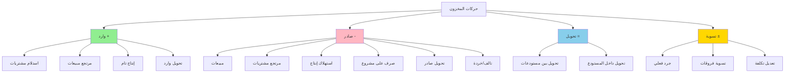
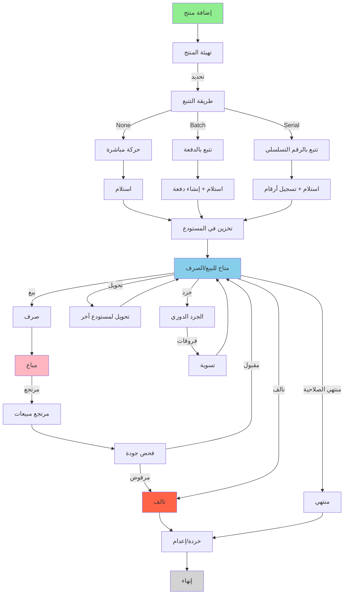
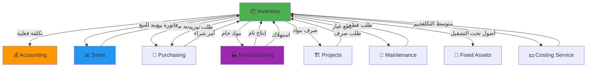

# 📦 مديول المخزون - Inventory Module
## التحليل التفصيلي الكامل والمعماري

---

## 📑 جدول المحتويات

1. [نظرة عامة](#overview)
2. [الكيانات الأساسية](#entities)
3. [حركات المخزون](#movements)
4. [دورة العمل](#workflow)
5. [الشاشات التفصيلية](#screens)
6. [التكامل مع المديولات](#integration)
7. [طرق تقييم المخزون](#costing-methods)
8. [قواعد العمل](#business-rules)
9. [Database Schema](#database)
10. [APIs المطلوبة](#apis)
11. [الأمثلة العملية](#examples)

---

<a name="overview"></a>
## 🎯 1. نظرة عامة على المديول

### الهدف الرئيسي
مديول المخزون مسؤول عن إدارة وتتبع جميع حركات المخزون داخل وخارج المستودعات، ويشمل:
- إدارة المستودعات والمواقع
- إدارة الأصناف والمنتجات
- حركات الوارد والصادر
- تحويلات المخزون بين المستودعات
- الجرد الفعلي والتسويات
- تتبع الدفعات والأرقام التسلسلية
- إدارة تواريخ الانتهاء
- نقاط إعادة الطلب
- تقييم المخزون بطرق مختلفة

### النطاق (Scope)
- ✅ Multi-Warehouse Management
- ✅ Multi-Location within Warehouse
- ✅ Batch/Lot Tracking
- ✅ Serial Number Tracking
- ✅ Expiry Date Management
- ✅ Barcode Management
- ✅ Multiple Costing Methods (FIFO, LIFO, Average, Standard)
- ✅ Min/Max Levels & Reorder Points
- ✅ Physical Inventory & Cycle Counting
- ✅ Stock Valuation Reports
- ✅ Stock Aging Analysis
- ✅ Multi-Unit of Measure (UOM)
- ✅ Quality Control Integration
- ✅ Consignment Inventory

---

<a name="entities"></a>
## 🗂️ 2. الكيانات الأساسية (Core Entities)

### 2.1 هيكل الكيانات

```
Inventory Module
├── Master Data
│   ├── Product (المنتج/الصنف)
│   ├── Product Category (تصنيف المنتجات)
│   ├── Product Brand (العلامة التجارية)
│   ├── Unit of Measure (وحدة القياس)
│   ├── UOM Conversion (تحويل الوحدات)
│   ├── Warehouse (المستودع)
│   ├── Warehouse Location (موقع داخل المستودع)
│   └── Barcode (الباركود)
│
├── Inventory Transactions
│   ├── Stock Entry (حركة مخزون)
│   │   ├── Material Receipt (استلام بضاعة)
│   │   ├── Material Issue (صرف بضاعة)
│   │   ├── Material Transfer (تحويل بضاعة)
│   │   ├── Material Return (إرجاع بضاعة)
│   │   └── Stock Adjustment (تسوية مخزون)
│   │
│   ├── Stock Transfer (تحويل بين مستودعات)
│   ├── Stock Reconciliation (جرد وتسوية)
│   └── Stock Reservation (حجز مخزون)
│
├── Inventory Tracking
│   ├── Batch/Lot (الدفعة)
│   ├── Serial Number (الرقم التسلسلي)
│   ├── Stock Balance (رصيد المخزون)
│   ├── Stock Movement History (سجل الحركات)
│   └── Stock Valuation (تقييم المخزون)
│
└── Inventory Planning
    ├── Reorder Level (نقطة إعادة الطلب)
    ├── Safety Stock (المخزون الآمن)
    ├── EOQ (Economic Order Quantity)
    └── ABC Analysis
```

### 2.2 تفاصيل الكيانات الرئيسية

#### 📦 Product (المنتج/الصنف)
```typescript
interface Product {
  // Basic Info
  id: string;
  code: string; // كود المنتج (فريد)
  barcode?: string; // الباركود الرئيسي
  alternateBarcodes?: string[]; // باركودات بديلة
  nameAr: string;
  nameEn: string;
  description?: string;
  shortDescription?: string;
  
  // Classification
  categoryId: string;
  category: ProductCategory;
  brandId?: string;
  brand?: Brand;
  
  // Product Type
  type: 'Stock' | 'Service' | 'Asset' | 'Bundle'; // نوع المنتج
  isStockable: boolean; // هل يؤثر على المخزون
  isForSale: boolean; // للبيع
  isForPurchase: boolean; // للشراء
  
  // Units of Measure
  baseUnitId: string; // الوحدة الأساسية
  baseUnit: UnitOfMeasure;
  secondaryUnits: ProductUOM[]; // وحدات أخرى مع معاملات التحويل
  
  // Tracking
  trackingType: 'None' | 'Batch' | 'Serial'; // طريقة التتبع
  hasBatchNumber: boolean;
  hasSerialNumber: boolean;
  hasExpiryDate: boolean;
  shelfLifeDays?: number; // العمر الافتراضي بالأيام
  
  // Valuation & Costing
  valuationMethod: 'FIFO' | 'LIFO' | 'Average' | 'Standard';
  standardCost?: number; // التكلفة القياسية
  lastPurchasePrice?: number;
  averageCost?: number; // متوسط التكلفة
  
  // Pricing
  sellingPrice: number; // سعر البيع
  minimumSellingPrice?: number;
  maximumSellingPrice?: number;
  
  // Inventory Management
  manageStock: boolean; // إدارة المخزون
  allowNegativeStock: boolean;
  reorderLevel: number; // نقطة إعادة الطلب
  minimumOrderQuantity: number; // الحد الأدنى للطلب
  safetyStock: number; // المخزون الآمن
  leadTimeDays: number; // مدة التوريد
  
  // Physical Properties
  weight?: number;
  weightUnit?: string;
  dimensions?: {
    length: number;
    width: number;
    height: number;
    unit: string;
  };
  
  // Quality Control
  requiresQualityInspection: boolean;
  inspectionCriteria?: string;
  
  // Warranty & Service
  hasWarranty: boolean;
  warrantyPeriodDays?: number;
  
  // Multi-Company
  companyId: string;
  
  // Status & Audit
  status: 'Active' | 'Inactive' | 'Discontinued';
  createdAt: DateTime;
  createdBy: string;
  modifiedAt: DateTime;
  modifiedBy: string;
  deletedAt?: DateTime;
  deletedBy?: string;
}
```

#### 🏢 Warehouse (المستودع)
```typescript
interface Warehouse {
  id: string;
  code: string;
  nameAr: string;
  nameEn: string;
  type: 'Main' | 'Branch' | 'Transit' | 'Quarantine' | 'Virtual';
  
  // Location
  address: Address;
  coordinates?: {
    latitude: number;
    longitude: number;
  };
  
  // Structure
  hasLocations: boolean; // هل يحتوي على مواقع داخلية
  locations?: WarehouseLocation[]; // رفوف، ممرات، مناطق
  
  // Warehouse Manager
  managerId: string;
  manager: Employee;
  
  // Warehouse Settings
  allowNegativeStock: boolean;
  autoReorderEnabled: boolean;
  requiresQualityCheck: boolean;
  
  // Integration
  defaultCostCenter?: string;
  accountingAccountId?: string; // حساب المخزون في الحسابات
  
  // Multi-Company
  companyId: string;
  branchId?: string;
  
  // Status
  status: 'Active' | 'Inactive' | 'Closed';
  
  // Audit
  createdAt: DateTime;
  createdBy: string;
}
```

#### 📍 Warehouse Location (موقع داخل المستودع)
```typescript
interface WarehouseLocation {
  id: string;
  warehouseId: string;
  code: string; // مثال: A-01-05 (ممر A، رف 01، موقع 05)
  name: string;
  
  // Hierarchy
  parentLocationId?: string; // للتسلسل الهرمي
  level: number; // المستوى (0 = رئيسي، 1 = فرعي، إلخ)
  
  // Type
  locationType: 'Zone' | 'Aisle' | 'Rack' | 'Shelf' | 'Bin';
  
  // Capacity
  maxCapacity?: number;
  maxWeight?: number;
  currentUtilization: number; // %
  
  // Restrictions
  allowedProductCategories?: string[]; // تصنيفات مسموحة
  restrictedProductCategories?: string[]; // تصنيفات ممنوعة
  temperatureControlled: boolean;
  requiresSpecialHandling: boolean;
  
  // Status
  status: 'Available' | 'Full' | 'Reserved' | 'Maintenance';
  
  // Audit
  createdAt: DateTime;
}
```

#### 📋 Stock Entry (حركة المخزون)
```typescript
interface StockEntry {
  id: string;
  entryNumber: string; // رقم الحركة التلقائي
  entryDate: Date;
  
  // Entry Type
  entryType: 'Receipt' | 'Issue' | 'Transfer' | 'Return' | 'Adjustment';
  
  // Purpose
  purpose: string; // Material Receipt, Sales Return, Production, etc.
  
  // Source & Destination
  sourceWarehouseId?: string;
  sourceWarehouse?: Warehouse;
  sourceLocationId?: string;
  
  targetWarehouseId?: string;
  targetWarehouse?: Warehouse;
  targetLocationId?: string;
  
  // Reference Documents
  referenceType?: string; // Purchase Order, Sales Invoice, etc.
  referenceId?: string;
  referenceNumber?: string;
  
  // Items
  items: StockEntryItem[];
  
  // Additional Info
  remarks?: string;
  attachments?: Attachment[];
  
  // Accounting
  affectsAccounting: boolean;
  journalEntryId?: string;
  totalValue: number; // القيمة الإجمالية
  
  // Multi-Company
  companyId: string;
  branchId?: string;
  
  // Workflow
  status: 'Draft' | 'Submitted' | 'Approved' | 'Rejected' | 'Cancelled';
  approvedBy?: string;
  approvedAt?: DateTime;
  
  // Audit
  createdAt: DateTime;
  createdBy: string;
  modifiedAt: DateTime;
  modifiedBy: string;
  deletedAt?: DateTime;
  deletedBy?: string;
}

interface StockEntryItem {
  id: string;
  lineNumber: number;
  
  // Product
  productId: string;
  product: Product;
  productCode: string;
  productName: string;
  
  // Quantity & Unit
  quantity: number;
  unitId: string;
  unit: UnitOfMeasure;
  
  // Tracking
  batchNumber?: string;
  serialNumbers?: string[]; // للأصناف المتتبعة بالرقم التسلسلي
  expiryDate?: Date;
  manufacturingDate?: Date;
  
  // Warehouse & Location
  sourceWarehouseId?: string;
  sourceLocationId?: string;
  targetWarehouseId?: string;
  targetLocationId?: string;
  
  // Costing
  costPrice: number; // التكلفة للوحدة
  totalCost: number; // التكلفة الإجمالية
  valuationRate: number; // سعر التقييم
  
  // Quality
  qualityStatus?: 'Passed' | 'Failed' | 'Pending';
  qualityRemarks?: string;
  
  // Additional
  remarks?: string;
}
```

#### 🏷️ Batch/Lot (الدفعة)
```typescript
interface Batch {
  id: string;
  batchNumber: string; // رقم الدفعة
  productId: string;
  product: Product;
  
  // Batch Info
  manufacturingDate?: Date;
  expiryDate?: Date;
  shelfLifeDays: number;
  
  // Supplier
  supplierId?: string;
  supplierBatchNumber?: string; // رقم دفعة المورد
  
  // Quantities
  receivedQuantity: number; // الكمية المستلمة
  currentQuantity: number; // الكمية الحالية
  reservedQuantity: number; // الكمية المحجوزة
  availableQuantity: number; // الكمية المتاحة
  
  // Costing
  batchCost: number; // تكلفة الدفعة
  unitCost: number; // تكلفة الوحدة
  
  // Status
  status: 'Active' | 'Expired' | 'Recalled' | 'Depleted';
  
  // Warehouses (الدفعة قد تكون في عدة مستودعات)
  locations: {
    warehouseId: string;
    locationId?: string;
    quantity: number;
  }[];
  
  // Audit
  createdAt: DateTime;
  createdBy: string;
}
```

#### 🔢 Serial Number (الرقم التسلسلي)
```typescript
interface SerialNumber {
  id: string;
  serialNumber: string; // الرقم التسلسلي
  productId: string;
  product: Product;
  
  // Batch
  batchId?: string;
  batchNumber?: string;
  
  // Status
  status: 'Available' | 'Reserved' | 'Sold' | 'InRepair' | 'Scrapped';
  
  // Current Location
  warehouseId: string;
  warehouse: Warehouse;
  locationId?: string;
  
  // Warranty
  warrantyStartDate?: Date;
  warrantyEndDate?: Date;
  
  // Customer (إذا كان مباع)
  customerId?: string;
  soldInvoiceId?: string;
  saleDate?: Date;
  
  // Purchase Info
  purchaseInvoiceId?: string;
  purchaseDate?: Date;
  purchaseCost: number;
  
  // Service History (سجل الصيانة)
  serviceHistory?: ServiceRecord[];
  
  // Audit
  createdAt: DateTime;
  lastMovementDate: DateTime;
}
```

#### 📊 Stock Balance (رصيد المخزون)
```typescript
interface StockBalance {
  id: string;
  
  // Product & Warehouse
  productId: string;
  warehouseId: string;
  locationId?: string;
  
  // Batch & Serial
  batchNumber?: string;
  
  // Quantities
  openingQuantity: number; // رصيد أول المدة
  receivedQuantity: number; // الوارد
  issuedQuantity: number; // المنصرف
  adjustmentQuantity: number; // التسويات
  currentQuantity: number; // الرصيد الحالي
  reservedQuantity: number; // المحجوز
  availableQuantity: number; // المتاح = الحالي - المحجوز
  
  // Valuation
  averageCost: number; // متوسط التكلفة
  totalValue: number; // القيمة الإجمالية
  
  // Date Range
  periodStartDate: Date;
  periodEndDate?: Date;
  
  // Multi-Company
  companyId: string;
  
  // Last Update
  lastTransactionDate: DateTime;
  lastTransactionId: string;
  
  // Audit
  updatedAt: DateTime;
}
```

---

<a name="movements"></a>
## 🔄 3. حركات المخزون (Inventory Movements)

### 3.1 أنواع حركات المخزون



### 3.2 دورة حركة الوارد (Receipt)

```
1. استلام بضاعة من مورد (من أمر شراء)
   ↓
2. فحص جودة (اختياري)
   ↓
3. قبول البضاعة
   ↓
4. تسجيل في النظام (Stock Entry - Receipt)
   ↓
5. تعيين دفعة/رقم تسلسلي
   ↓
6. تحديد الموقع في المستودع
   ↓
7. تحديث رصيد المخزون (+)
   ↓
8. إنشاء قيد محاسبي (+ المخزون، + الموردين)
```

### 3.3 دورة حركة الصادر (Issue)

```
1. طلب صرف (من أمر بيع، أمر إنتاج، مشروع...)
   ↓
2. التحقق من الرصيد المتاح
   ↓
3. اختيار الدفعة (FIFO/LIFO/FEFO)
   ↓
4. تسجيل الصرف (Stock Entry - Issue)
   ↓
5. تحديث رصيد المخزون (-)
   ↓
6. حساب التكلفة الفعلية
   ↓
7. إنشاء قيد محاسبي (- المخزون، + تكلفة المبيعات)
```

### 3.4 دورة التحويل (Transfer)

```
1. طلب تحويل بضاعة
   ↓
2. التحقق من الرصيد في المستودع المصدر
   ↓
3. إنشاء أمر تحويل (Stock Transfer)
   ↓
4. تسجيل خروج من المصدر (-)
   ↓
5. نقل البضاعة فعلياً
   ↓
6. تسجيل دخول في الوجهة (+)
   ↓
7. تحديث الأرصدة في كلا المستودعين
   ↓
8. إنشاء قيد محاسبي (إن وجد - بين حسابات المستودعات)
```

### 3.5 دورة الجرد (Stock Reconciliation)

```
1. تحديد المستودع/المنتجات للجرد
   ↓
2. طباعة قوائم الجرد
   ↓
3. العد الفعلي
   ↓
4. إدخال النتائج في النظام
   ↓
5. مقارنة مع الرصيد الدفتري
   ↓
6. اكتشاف الفروقات (+/-)
   ↓
7. التحقق من الفروقات
   ↓
8. اعتماد الجرد
   ↓
9. تسجيل التسويات
   ↓
10. تحديث الأرصدة
   ↓
11. إنشاء قيود محاسبية للفروقات
```

---

<a name="workflow"></a>
## 🔄 4. دورة العمل الكاملة

### 4.1 دورة حياة المنتج في المخزون



### 4.2 سيناريوهات العمل

#### سيناريو 1: شراء وبيع بدون تتبع
```
1. شراء 100 قطعة من منتج أ
   → Stock Entry (Receipt) +100
   → Stock Balance = 100
   
2. بيع 30 قطعة
   → Stock Entry (Issue) -30
   → Stock Balance = 70
   
3. بيع 20 قطعة
   → Stock Entry (Issue) -20
   → Stock Balance = 50
```

#### سيناريو 2: شراء بتتبع الدفعات (FIFO)
```
1. شراء دفعة BATCH-001: 50 قطعة بسعر 10 ريال
   → Stock Entry (Receipt) +50
   → Batch BATCH-001: 50 @ 10 = 500 ريال
   
2. شراء دفعة BATCH-002: 30 قطعة بسعر 12 ريال
   → Stock Entry (Receipt) +30
   → Batch BATCH-002: 30 @ 12 = 360 ريال
   → Total Stock Balance = 80
   
3. بيع 60 قطعة (FIFO)
   → صرف من BATCH-001: 50 @ 10 = 500 (نفذت)
   → صرف من BATCH-002: 10 @ 12 = 120
   → Total Cost = 620 ريال
   → Stock Balance = 20 (كلها من BATCH-002)
```

#### سيناريو 3: تتبع بالرقم التسلسلي
```
1. شراء 3 أجهزة لابتوب
   → Stock Entry (Receipt) +3
   → Serial Numbers: SN-001, SN-002, SN-003
   
2. بيع لابتوب واحد للعميل أ
   → Stock Entry (Issue) -1
   → Serial Number: SN-001 → Sold to Customer A
   → Warranty Start: Today
   → Remaining: SN-002, SN-003
   
3. استلام SN-001 للصيانة
   → Serial Number SN-001 Status: InRepair
   → Service Record Created
```

#### سيناريو 4: جرد وتسوية
```
1. الرصيد الدفتري: 100 قطعة
2. الجرد الفعلي: 97 قطعة
3. الفرق: -3 (نقص)

التسوية:
→ Stock Entry (Adjustment) -3
→ السبب: فاقد/تلف/سرقة
→ قيد محاسبي: 
   - Debit: فروقات جرد (مصروف)
   - Credit: المخزون
```

---

<a name="screens"></a>
## 🖥️ 5. الشاشات التفصيلية

### 5.1 شاشة المنتجات (Products List)

```
┌─────────────────────────────────────────────────────────────┐
│  📦 المنتجات (Products)                      [+ جديد] [⚙️]  │
├─────────────────────────────────────────────────────────────┤
│  🔍 [_____________] 📁 [التصنيف ▼] 🏷️ [العلامة ▼] 🎯 [الحالة ▼] │
│  📊 [النوع ▼] 🏢 [المستودع ▼]  [🔄 تحديث]  [📥 تصدير]    │
├─────────────────────────────────────────────────────────────┤
│ [عرض: شبكة 📋] [بطاقات 🎴] [كانبان 📊]                      │
├─────────────────────────────────────────────────────────────┤
│                                                             │
│ ┌──────┬────────┬──────┬───────┬────────┬────────┬────────┐│
│ │ 📷   │ الكود  │ الاسم │ الفئة  │ الرصيد │ المتاح │ الحالة ││
│ ├──────┼────────┼──────┼───────┼────────┼────────┼────────┤│
│ │ [📦] │P-0001  │منتج أ│إلكترو │  150   │  120   │ 🟢نشط ││
│ │      │        │      │نيات   │        │        │        ││
│ ├──────┼────────┼──────┼───────┼────────┼────────┼────────┤│
│ │ [📦] │P-0002  │منتج ب│غذائية │   45   │   30   │ 🟡محدود││
│ │      │        │      │       │        │        │        ││
│ ├──────┼────────┼──────┼───────┼────────┼────────┼────────┤│
│ │ [📦] │P-0003  │منتج ج│ملابس  │   12   │    8   │ 🔴نفذ  ││
│ │      │        │      │       │        │        │        ││
│ └──────┴────────┴──────┴───────┴────────┴────────┴────────┘│
│                                                             │
│  💡 عرض سريع للأرصدة:                                      │
│  ┌─────────────────────────────────────────────────────┐  │
│  │ 🟢 أصناف متوفرة: 250    🟡 أصناف محدودة: 45         │  │
│  │ 🔴 أصناف نفذت: 12       ⚠️ أصناف تحت نقطة الطلب: 8  │  │
│  └─────────────────────────────────────────────────────┘  │
├─────────────────────────────────────────────────────────────┤
│ عرض 1-50 من 307 منتج    [◀️ السابق] [التالي ▶️]          │
└─────────────────────────────────────────────────────────────┘
```

### 5.2 شاشة المنتج (Product Form)

```
┌──────────────────────────────────────────────────────────────┐
│ [💾 حفظ] [🗑️ حذف] [🖨️ طباعة باركود]  [⏮️][◀️][▶️][⏭️]      │
├──────────────────────────────────────────────────────────────┤
│ [معلومات أساسية] [المخزون] [الأسعار] [الوحدات] [الباركود]    │
│ [الموردين] [الأرصدة] [الحركات] [تقارير]                      │
├──────────────────────────────────────────────────────────────┤
│                                                              │
│  📦 معلومات المنتج                                           │
│  ┌────────────────────────────────────────────────────────┐ │
│  │ 📷 [صورة المنتج]                                      │ │
│  │                                                        │ │
│  │ الكود: [P-0001_________] 🔄 تلقائي ☑️                 │ │
│  │ الباركود: [123456789___] [🔍 مسح] [🖨️ طباعة]        │ │
│  │                                                        │ │
│  │ الاسم (عربي): [_____________________________]        │ │
│  │ الاسم (إنجليزي): [_____________________________]      │ │
│  │                                                        │ │
│  │ التصنيف: [إلكترونيات ▼]  العلامة: [سامسونج ▼]       │ │
│  │ النوع: [● مخزون  ○ خدمة  ○ أصل]                      │ │
│  │                                                        │ │
│  │ الوصف المختصر:                                        │ │
│  │ [_____________________________________________]        │ │
│  │                                                        │ │
│  │ الوصف التفصيلي:                                       │ │
│  │ [                                                      │ │
│  │                                                        │ │
│  │ ]                                                      │ │
│  └────────────────────────────────────────────────────────┘ │
│                                                              │
│  📊 إعدادات المخزون                                         │
│  ┌────────────────────────────────────────────────────────┐ │
│  │ ☑️ يؤثر على المخزون                                   │ │
│  │ ☑️ للبيع              ☑️ للشراء                       │ │
│  │                                                        │ │
│  │ التتبع: [● لا يوجد  ○ دفعات  ○ أرقام تسلسلية]        │ │
│  │ ☐ له تاريخ انتهاء    العمر الافتراضي: [___] يوم     │ │
│  │                                                        │ │
│  │ الوحدة الأساسية: [قطعة ▼]                            │ │
│  │ طريقة التقييم: [FIFO ▼]                              │ │
│  │                                                        │ │
│  │ ☐ السماح بالرصيد السالب                              │ │
│  │ ☑️ التحقق من نقطة إعادة الطلب                        │ │
│  │                                                        │ │
│  │ نقطة إعادة الطلب: [20_____]  المخزون الآمن: [10____] │ │
│  │ الحد الأدنى للطلب: [50_____]  مدة التوريد: [7___] يوم│ │
│  └────────────────────────────────────────────────────────┘ │
│                                                              │
│  💰 الأسعار والتكاليف                                       │
│  ┌────────────────────────────────────────────────────────┐ │
│  │ سعر البيع: [150.00____] ريال                          │ │
│  │ التكلفة القياسية: [100.00____] ريال                   │ │
│  │ متوسط التكلفة: [105.50] (تلقائي)                     │ │
│  │ آخر سعر شراء: [110.00] (تلقائي)                      │ │
│  └────────────────────────────────────────────────────────┘ │
│                                                              │
├──────────────────────────────────────────────────────────────┤
│ 🟢 نشط | أنشئ: أحمد - 2025-01-15 | آخر تعديل: محمد - اليوم │
└──────────────────────────────────────────────────────────────┘
```

### 5.3 تبويب الأرصدة (Stock Balances Tab)

```
┌──────────────────────────────────────────────────────────────┐
│  📊 أرصدة المخزون                                 [🔄 تحديث] │
├──────────────────────────────────────────────────────────────┤
│                                                              │
│  💼 الإجمالي الكلي:                                          │
│  ┌────────────────────────────────────────────────────────┐ │
│  │  الرصيد الكلي: 450      المحجوز: 30      المتاح: 420  │ │
│  │  القيمة الإجمالية: 45,000 ريال                        │ │
│  └────────────────────────────────────────────────────────┘ │
│                                                              │
│  🏢 حسب المستودع:                                           │
│  ┌──────────┬────────┬────────┬────────┬────────────────┐  │
│  │ المستودع │ الرصيد │ المحجوز│ المتاح │ القيمة        │  │
│  ├──────────┼────────┼────────┼────────┼────────────────┤  │
│  │ الرئيسي  │  300   │   20   │  280   │ 30,000 ريال   │  │
│  │ فرع أ    │  100   │   10   │   90   │ 10,000 ريال   │  │
│  │ فرع ب    │   50   │    0   │   50   │  5,000 ريال   │  │
│  └──────────┴────────┴────────┴────────┴────────────────┘  │
│                                                              │
│  🏷️ حسب الدفعة: (إن وجد)                                   │
│  ┌──────────┬─────────┬─────────┬────────┬───────────────┐ │
│  │ الدفعة   │ الوارد  │ التاريخ │ الرصيد │ تاريخ الانتهاء│ │
│  ├──────────┼─────────┼─────────┼────────┼───────────────┤ │
│  │BATCH-001 │   200   │2025-01-│   80   │  2026-01-15   │ │
│  │BATCH-002 │   150   │2025-02-│  120   │  2026-02-10   │ │
│  └──────────┴─────────┴─────────┴────────┴───────────────┘ │
│                                                              │
│  🔢 الأرقام التسلسلية: (إن وجد)                             │
│  ┌──────────────┬────────────┬────────┬──────────────────┐ │
│  │ الرقم        │ المستودع  │ الحالة │ تاريخ الضمان     │ │
│  ├──────────────┼────────────┼────────┼──────────────────┤ │
│  │ SN-2025-001  │ الرئيسي   │ متاح   │ 2026-01-15       │ │
│  │ SN-2025-002  │ الرئيسي   │ محجوز  │ 2026-01-15       │ │
│  │ SN-2025-003  │ فرع أ     │ متاح   │ 2026-01-20       │ │
│  └──────────────┴────────────┴────────┴──────────────────┘ │
│                                                              │
└──────────────────────────────────────────────────────────────┘
```

### 5.4 شاشة حركة مخزون (Stock Entry Form)

```
┌──────────────────────────────────────────────────────────────┐
│ [💾 حفظ] [✅ اعتماد] [🗑️ حذف] [🖨️ طباعة]    [⏮️][◀️][▶️][⏭️] │
├──────────────────────────────────────────────────────────────┤
│ [رئيسية] [الأصناف] [التكلفة] [المحاسبة] [مرفقات]             │
├──────────────────────────────────────────────────────────────┤
│                                                              │
│  📋 معلومات الحركة                                          │
│  ┌────────────────────────────────────────────────────────┐ │
│  │ رقم الحركة: [SE-2025-0001] 📅 التاريخ: [2025-01-15]  │ │
│  │                                                        │ │
│  │ نوع الحركة: [استلام بضاعة ▼]                         │ │
│  │ الغرض: [Material Receipt from Supplier ▼]            │ │
│  │                                                        │ │
│  │ المستودع المصدر: [لا يوجد___________]                 │ │
│  │ المستودع الوجهة: [المستودع الرئيسي ▼]                 │ │
│  │                                                        │ │
│  │ المرجع: [أمر شراء ▼] رقم: [PO-2025-0001]            │ │
│  │                                                        │ │
│  │ ملاحظات: [___________________________________]        │ │
│  └────────────────────────────────────────────────────────┘ │
│                                                              │
│  📦 الأصناف                                                  │
│  ┌────────────────────────────────────────────────────────┐ │
│  │ [+ إضافة صنف] [📱 مسح باركود]                         │ │
│  ├──┬──────┬────┬────┬──────┬────────┬──────┬────────────┤ │
│  │# │الصنف │الكمية│الوحدة│الدفعة│التكلفة│الموقع│الإجمالي ││ │
│  ├──┼──────┼────┼────┼──────┼────────┼──────┼────────────┤ │
│  │1 │منتج أ│ 100│قطعة│[New]│ 10.00 │[A-01]│   1,000   ││ │
│  │  │      │    │    │      │       │      │            ││ │
│  │  │      │ 🔍 معلومات الدفعة:                        ││ │
│  │  │      │ رقم الدفعة: [BATCH-2025-001________]      ││ │
│  │  │      │ تاريخ التصنيع: [2025-01-10]              ││ │
│  │  │      │ تاريخ الانتهاء: [2026-01-10]             ││ │
│  │  │      │                                            ││ │
│  ├──┼──────┼────┼────┼──────┼────────┼──────┼────────────┤ │
│  │2 │منتج ب│  50│كرتون│[New]│ 20.00│[B-05]│   1,000   ││ │
│  │  │      │    │    │      │       │      │            ││ │
│  │  │[+ صنف جديد]                                      ││ │
│  └──┴──────┴────┴────┴──────┴────────┴──────┴────────────┘ │
│                                                              │
│  💰 الإجماليات                                              │
│  ┌────────────────────────────────────────────────────────┐ │
│  │                          إجمالي عدد الأصناف: 2        │ │
│  │                          إجمالي الكمية: 150           │ │
│  │                     إجمالي القيمة: 2,000 ريال         │ │
│  └────────────────────────────────────────────────────────┘ │
│                                                              │
│  💼 المحاسبة                                                 │
│  ┌────────────────────────────────────────────────────────┐ │
│  │ ☑️ يؤثر على المحاسبة                                  │ │
│  │ تاريخ المحاسبة: [2025-01-15]                          │ │
│  │ السنة المالية: [2025]                                 │ │
│  │ القيد المحاسبي: [سيتم الإنشاء تلقائياً]               │ │
│  └────────────────────────────────────────────────────────┘ │
│                                                              │
├──────────────────────────────────────────────────────────────┤
│ 📊 مسودة | أنشئ: أحمد - 2025-01-15 10:30                   │
└──────────────────────────────────────────────────────────────┘
```

### 5.5 شاشة الجرد (Stock Reconciliation)

```
┌──────────────────────────────────────────────────────────────┐
│  📋 الجرد الفعلي                                 [🖨️ طباعة] │
├──────────────────────────────────────────────────────────────┤
│  المستودع: [المستودع الرئيسي ▼]  التاريخ: [2025-01-31]     │
│  نوع الجرد: [● شامل  ○ جزئي  ○ دوري]                       │
│  المسؤول عن الجرد: [أحمد محمد ▼]                            │
├──────────────────────────────────────────────────────────────┤
│                                                              │
│  📊 ملخص الجرد:                                              │
│  ┌────────────────────────────────────────────────────────┐ │
│  │  عدد الأصناف المجردة: 50                              │ │
│  │  أصناف بها فروقات: 8                                  │ │
│  │  إجمالي الزيادة: +15 قطعة (قيمة: 1,500 ريال)         │ │
│  │  إجمالي النقص: -22 قطعة (قيمة: 3,200 ريال)           │ │
│  │  صافي الفرق: -7 قطعة (قيمة: -1,700 ريال)             │ │
│  └────────────────────────────────────────────────────────┘ │
│                                                              │
│  🔍 الأصناف:                                                │
│  ┌──┬──────┬──────┬──────┬──────┬──────┬──────────────────┐│
│  │#│الصنف │الدفتري│الفعلي│الفرق│القيمة│السبب/الملاحظات   ││
│  ├──┼──────┼──────┼──────┼──────┼──────┼──────────────────┤│
│  │1│منتج أ│ 100  │ 100  │  0   │  -   │✅ مطابق         ││
│  ├──┼──────┼──────┼──────┼──────┼──────┼──────────────────┤│
│  │2│منتج ب│  50  │  48  │ -2   │-200 │⚠️ نقص (تلف)     ││
│  ├──┼──────┼──────┼──────┼──────┼──────┼──────────────────┤│
│  │3│منتج ج│  30  │  33  │ +3   │+300 │⚠️ زيادة         ││
│  ├──┼──────┼──────┼──────┼──────┼──────┼──────────────────┤│
│  │4│منتج د│  20  │  18  │ -2   │-400 │⚠️ نقص (سرقة؟)   ││
│  └──┴──────┴──────┴──────┴──────┴──────┴──────────────────┘│
│                                                              │
│  📝 إجراءات:                                                │
│  ┌────────────────────────────────────────────────────────┐ │
│  │ [💾 حفظ الجرد]  [✅ اعتماد واحتساب الفروقات]          │ │
│  │ [🗑️ إلغاء]      [📧 إرسال تقرير للإدارة]             │ │
│  └────────────────────────────────────────────────────────┘ │
│                                                              │
└──────────────────────────────────────────────────────────────┘
```

---

<a name="integration"></a>
## 🔗 6. التكامل مع المديولات الأخرى

### 6.1 خريطة التكامل الشاملة



### 6.2 التكامل مع المبيعات (Sales)

#### عند إنشاء فاتورة بيع:
```typescript
// 1. التحقق من توفر الرصيد
const checkStock = async (invoiceItems) => {
  for (const item of invoiceItems) {
    const available = await getAvailableStock(
      item.productId,
      item.warehouseId
    );
    
    if (available < item.quantity) {
      throw new Error(`الكمية المتاحة من ${item.productName}: ${available}`);
    }
  }
};

// 2. حجز الكمية (عند إنشاء أمر بيع)
const reserveStock = async (orderId, items) => {
  for (const item of items) {
    await createStockReservation({
      productId: item.productId,
      warehouseId: item.warehouseId,
      quantity: item.quantity,
      referenceType: 'SalesOrder',
      referenceId: orderId,
      expiryDate: addDays(new Date(), 7) // الحجز لمدة 7 أيام
    });
  }
};

// 3. صرف الكمية (عند اعتماد الفاتورة)
const issueStock = async (invoiceId, items) => {
  const stockEntry = {
    entryType: 'Issue',
    purpose: 'Sales Invoice',
    referenceType: 'SalesInvoice',
    referenceId: invoiceId,
    items: items.map(item => ({
      productId: item.productId,
      quantity: item.quantity,
      warehouseId: item.warehouseId,
      // اختيار الدفعة حسب FIFO/LIFO
      batchNumber: await selectBatch(item.productId, item.warehouseId),
      costPrice: await getCostPrice(item.productId)
    }))
  };
  
  return await createStockEntry(stockEntry);
};
```

#### عند مرتجع بيع:
```typescript
const processSalesReturn = async (returnId, items) => {
  // 1. إنشاء حركة إرجاع للمخزون
  const stockEntry = {
    entryType: 'Receipt',
    purpose: 'Sales Return',
    referenceType: 'SalesReturn',
    referenceId: returnId,
    items: items.map(item => ({
      productId: item.productId,
      quantity: item.quantity,
      warehouseId: item.warehouseId,
      // إرجاع لنفس الدفعة إن أمكن
      batchNumber: item.originalBatchNumber,
      costPrice: item.originalCostPrice,
      qualityStatus: item.condition === 'Good' ? 'Passed' : 'Failed',
      targetLocationId: item.condition === 'Damaged' 
        ? 'DAMAGED-LOCATION' 
        : null
    }))
  };
  
  return await createStockEntry(stockEntry);
};
```

### 6.3 التكامل مع المشتريات (Purchasing)

#### عند استلام بضاعة من مورد:
```typescript
const receivePurchaseOrder = async (poId, receivedItems) => {
  // 1. إنشاء حركة استلام
  const stockEntry = {
    entryType: 'Receipt',
    purpose: 'Purchase Receipt',
    referenceType: 'PurchaseOrder',
    referenceId: poId,
    items: receivedItems.map(item => ({
      productId: item.productId,
      quantity: item.receivedQuantity,
      unitId: item.unitId,
      warehouseId: item.warehouseId,
      // إنشاء دفعة جديدة
      batchNumber: await generateBatchNumber(item.productId),
      manufacturingDate: item.manufacturingDate,
      expiryDate: item.expiryDate,
      costPrice: item.purchasePrice,
      // الموقع في المستودع
      targetLocationId: await assignLocation(
        item.warehouseId, 
        item.productId
      )
    }))
  };
  
  const entry = await createStockEntry(stockEntry);
  
  // 2. تحديث أمر الشراء
  await updatePurchaseOrder(poId, {
    receivedQuantity: sum(receivedItems, 'receivedQuantity'),
    status: calculatePOStatus(poId)
  });
  
  // 3. إشعار بالأصناف التي وصلت لنقطة إعادة الطلب
  await checkReorderLevels();
  
  return entry;
};
```

#### عند مرتجع مشتريات:
```typescript
const processPurchaseReturn = async (returnId, items) => {
  const stockEntry = {
    entryType: 'Issue',
    purpose: 'Purchase Return',
    referenceType: 'PurchaseReturn',
    referenceId: returnId,
    items: items.map(item => ({
      productId: item.productId,
      quantity: item.quantity,
      warehouseId: item.warehouseId,
      batchNumber: item.batchNumber,
      costPrice: item.originalCostPrice
    }))
  };
  
  return await createStockEntry(stockEntry);
};
```

### 6.4 التكامل مع التصنيع (Manufacturing)

#### صرف مواد خام للإنتاج:
```typescript
const issueMaterialsForProduction = async (workOrderId, materials) => {
  const stockEntry = {
    entryType: 'Issue',
    purpose: 'Material Consumption',
    referenceType: 'WorkOrder',
    referenceId: workOrderId,
    items: materials.map(material => ({
      productId: material.productId,
      quantity: material.requiredQuantity,
      warehouseId: material.warehouseId,
      // اختيار الدفعة المناسبة
      batchNumber: await selectBatch(
        material.productId, 
        material.warehouseId,
        'FEFO' // First Expired First Out للمواد الخام
      ),
      costPrice: await getCostPrice(material.productId)
    }))
  };
  
  return await createStockEntry(stockEntry);
};
```

#### استلام منتجات تامة الصنع:
```typescript
const receiveFinishedGoods = async (workOrderId, products) => {
  const stockEntry = {
    entryType: 'Receipt',
    purpose: 'Manufacturing',
    referenceType: 'WorkOrder',
    referenceId: workOrderId,
    items: products.map(product => ({
      productId: product.productId,
      quantity: product.producedQuantity,
      warehouseId: product.targetWarehouseId,
      // إنشاء دفعة جديدة
      batchNumber: await generateBatchNumber(product.productId),
      manufacturingDate: new Date(),
      // حساب تكلفة الإنتاج
      costPrice: await calculateProductionCost(workOrderId, product.productId)
    }))
  };
  
  return await createStockEntry(stockEntry);
};
```

### 6.5 التكامل مع المحاسبة (Accounting)

#### القيود المحاسبية لحركات المخزون:

```typescript
// 1. عند الاستلام من مورد (Purchase Receipt)
const createReceiptJournalEntry = (stockEntry) => {
  return {
    date: stockEntry.entryDate,
    description: `استلام بضاعة - ${stockEntry.entryNumber}`,
    lines: [
      {
        account: 'Inventory', // المخزون
        debit: stockEntry.totalValue,
        credit: 0,
        costCenter: stockEntry.warehouseId
      },
      {
        account: 'Goods Received Not Invoiced', // بضاعة واردة غير مفوترة
        debit: 0,
        credit: stockEntry.totalValue
      }
    ]
  };
};

// 2. عند الصرف للبيع (Sales Issue)
const createIssueJournalEntry = (stockEntry) => {
  return {
    date: stockEntry.entryDate,
    description: `صرف بضاعة - ${stockEntry.entryNumber}`,
    lines: [
      {
        account: 'Cost of Goods Sold', // تكلفة المبيعات
        debit: stockEntry.totalValue,
        credit: 0
      },
      {
        account: 'Inventory', // المخزون
        debit: 0,
        credit: stockEntry.totalValue,
        costCenter: stockEntry.warehouseId
      }
    ]
  };
};

// 3. عند التسوية (Stock Adjustment)
const createAdjustmentJournalEntry = (stockEntry) => {
  const isIncrease = stockEntry.adjustmentType === 'Increase';
  
  return {
    date: stockEntry.entryDate,
    description: `تسوية مخزون - ${stockEntry.entryNumber}`,
    lines: isIncrease ? [
      {
        account: 'Inventory',
        debit: stockEntry.totalValue,
        credit: 0
      },
      {
        account: 'Stock Adjustment Gain', // أرباح تسويات
        debit: 0,
        credit: stockEntry.totalValue
      }
    ] : [
      {
        account: 'Stock Adjustment Loss', // خسائر تسويات
        debit: stockEntry.totalValue,
        credit: 0
      },
      {
        account: 'Inventory',
        debit: 0,
        credit: stockEntry.totalValue
      }
    ]
  };
};

// 4. عند التحويل بين مستودعات (إذا كان لكل مستودع حساب منفصل)
const createTransferJournalEntry = (stockEntry) => {
  return {
    date: stockEntry.entryDate,
    description: `تحويل مخزون - ${stockEntry.entryNumber}`,
    lines: [
      {
        account: 'Inventory', // مخزون المستودع الوجهة
        debit: stockEntry.totalValue,
        credit: 0,
        costCenter: stockEntry.targetWarehouseId
      },
      {
        account: 'Inventory', // مخزون المستودع المصدر
        debit: 0,
        credit: stockEntry.totalValue,
        costCenter: stockEntry.sourceWarehouseId
      }
    ]
  };
};
```

### 6.6 مصفوفة التكامل التفصيلية

| الحدث | المخزون | المحاسبة | المبيعات | المشتريات | التصنيع | المشاريع |
|-------|---------|----------|---------|-----------|---------|---------|
| استلام مشتريات | ✅ + | ✅ قيد | - | ✅ تحديث | - | - |
| مرتجع مشتريات | ✅ - | ✅ قيد عكسي | - | ✅ تحديث | - | - |
| فاتورة بيع | ✅ - | ✅ تكلفة | ✅ إغلاق | - | - | - |
| مرتجع بيع | ✅ + | ✅ قيد عكسي | ✅ تحديث | - | - | - |
| أمر إنتاج | ✅ - مواد | - | - | - | ✅ استهلاك | - |
| إنتاج تام | ✅ + منتجات | ✅ تكلفة | - | - | ✅ إنهاء | - |
| صرف مشروع | ✅ - | ✅ تكلفة | - | - | - | ✅ تحميل |
| جرد | ✅ ± تسوية | ✅ فروقات | - | - | - | - |
| تحويل | ✅ نقل | ✅ قيد (إن وجد) | - | - | - | - |

---

<a name="costing-methods"></a>
## 💰 7. طرق تقييم المخزون (Costing Methods)

### 7.1 FIFO (First In First Out)

**المبدأ:** أول ما يدخل أول ما يخرج

```typescript
// مثال FIFO
const calculateFIFOCost = (product, quantity) => {
  // الحصول على الدفعات مرتبة من الأقدم للأحدث
  const batches = await getBatches(product.id, 'ASC');
  
  let remainingQty = quantity;
  let totalCost = 0;
  const usedBatches = [];
  
  for (const batch of batches) {
    if (remainingQty <= 0) break;
    
    const qtyFromBatch = Math.min(remainingQty, batch.availableQuantity);
    totalCost += qtyFromBatch * batch.unitCost;
    
    usedBatches.push({
      batchNumber: batch.batchNumber,
      quantity: qtyFromBatch,
      unitCost: batch.unitCost
    });
    
    remainingQty -= qtyFromBatch;
  }
  
  return {
    totalCost,
    averageCost: totalCost / quantity,
    usedBatches
  };
};
```

**مثال عملي:**
```
الدفعات:
- BATCH-001: 50 وحدة @ 10 ريال (تاريخ: 2025-01-01)
- BATCH-002: 30 وحدة @ 12 ريال (تاريخ: 2025-01-15)

عند بيع 60 وحدة بطريقة FIFO:
- 50 من BATCH-001 @ 10 = 500 ريال
- 10 من BATCH-002 @ 12 = 120 ريال
- التكلفة الإجمالية = 620 ريال
- متوسط التكلفة = 620 / 60 = 10.33 ريال/وحدة
```

### 7.2 LIFO (Last In First Out)

**المبدأ:** آخر ما يدخل أول ما يخرج

```typescript
const calculateLIFOCost = (product, quantity) => {
  // الحصول على الدفعات مرتبة من الأحدث للأقدم
  const batches = await getBatches(product.id, 'DESC');
  
  let remainingQty = quantity;
  let totalCost = 0;
  const usedBatches = [];
  
  for (const batch of batches) {
    if (remainingQty <= 0) break;
    
    const qtyFromBatch = Math.min(remainingQty, batch.availableQuantity);
    totalCost += qtyFromBatch * batch.unitCost;
    
    usedBatches.push({
      batchNumber: batch.batchNumber,
      quantity: qtyFromBatch,
      unitCost: batch.unitCost
    });
    
    remainingQty -= qtyFromBatch;
  }
  
  return {
    totalCost,
    averageCost: totalCost / quantity,
    usedBatches
  };
};
```

**مثال عملي:**
```
نفس الدفعات السابقة

عند بيع 60 وحدة بطريقة LIFO:
- 30 من BATCH-002 @ 12 = 360 ريال
- 30 من BATCH-001 @ 10 = 300 ريال
- التكلفة الإجمالية = 660 ريال
- متوسط التكلفة = 660 / 60 = 11.00 ريال/وحدة
```

### 7.3 Weighted Average (المتوسط المرجح)

**المبدأ:** حساب متوسط تكلفة كل الوحدات المتاحة

```typescript
const calculateWeightedAverageCost = async (product, quantity) => {
  // الحصول على الرصيد الحالي والتكلفة
  const stockBalance = await getStockBalance(product.id);
  
  const averageCost = stockBalance.totalValue / stockBalance.currentQuantity;
  const totalCost = quantity * averageCost;
  
  return {
    totalCost,
    averageCost,
    method: 'Weighted Average'
  };
};

// تحديث المتوسط عند كل استلام
const updateAverageCostOnReceipt = async (product, newQuantity, newCost) => {
  const stockBalance = await getStockBalance(product.id);
  
  const oldValue = stockBalance.currentQuantity * stockBalance.averageCost;
  const newValue = newQuantity * newCost;
  const totalQuantity = stockBalance.currentQuantity + newQuantity;
  
  const newAverageCost = (oldValue + newValue) / totalQuantity;
  
  await updateStockBalance(product.id, {
    currentQuantity: totalQuantity,
    averageCost: newAverageCost,
    totalValue: totalQuantity * newAverageCost
  });
  
  return newAverageCost;
};
```

**مثال عملي:**
```
الرصيد الحالي:
- 80 وحدة بمتوسط 10.50 ريال = 840 ريال

استلام جديد:
- 20 وحدة بسعر 13 ريال = 260 ريال

المتوسط الجديد:
- (840 + 260) / (80 + 20) = 1100 / 100 = 11.00 ريال

عند بيع 60 وحدة:
- التكلفة = 60 × 11 = 660 ريال
```

### 7.4 Standard Cost (التكلفة القياسية)

**المبدأ:** استخدام تكلفة ثابتة محددة مسبقاً

```typescript
const calculateStandardCost = (product, quantity) => {
  const standardCost = product.standardCost;
  const totalCost = quantity * standardCost;
  
  return {
    totalCost,
    averageCost: standardCost,
    method: 'Standard Cost'
  };
};

// حساب الفروقات (Variances)
const calculateCostVariance = (product, actualCost, standardCost, quantity) => {
  const variance = (actualCost - standardCost) * quantity;
  const variancePercent = ((actualCost - standardCost) / standardCost) * 100;
  
  return {
    variance,
    variancePercent,
    type: variance > 0 ? 'Unfavorable' : 'Favorable'
  };
};
```

### 7.5 FEFO (First Expired First Out)

**المبدأ:** الأقرب للانتهاء يخرج أولاً (للمواد الغذائية والأدوية)

```typescript
const calculateFEFOCost = async (product, quantity) => {
  // الحصول على الدفعات مرتبة حسب تاريخ الانتهاء
  const batches = await getBatches(product.id, 'EXPIRY_DATE_ASC');
  
  let remainingQty = quantity;
  let totalCost = 0;
  const usedBatches = [];
  
  for (const batch of batches) {
    if (remainingQty <= 0) break;
    
    // تحذير إذا كانت الدفعة قريبة من الانتهاء
    if (isNearExpiry(batch.expiryDate, 30)) { // 30 يوم
      await sendExpiryWarning(batch);
    }
    
    const qtyFromBatch = Math.min(remainingQty, batch.availableQuantity);
    totalCost += qtyFromBatch * batch.unitCost;
    
    usedBatches.push({
      batchNumber: batch.batchNumber,
      quantity: qtyFromBatch,
      unitCost: batch.unitCost,
      expiryDate: batch.expiryDate
    });
    
    remainingQty -= qtyFromBatch;
  }
  
  return {
    totalCost,
    averageCost: totalCost / quantity,
    usedBatches
  };
};
```

### 7.6 مقارنة طرق التقييم

| الطريقة | الميزات | العيوب | الاستخدام المناسب |
|---------|---------|--------|-------------------|
| **FIFO** | - واقعي<br>- يتبع التدفق الطبيعي<br>- مقبول ضريبياً | - قد يخفي التضخم<br>- أرباح أعلى ظاهرياً | - معظم الصناعات<br>- المواد الغذائية |
| **LIFO** | - يعكس التكاليف الحالية<br>- ضرائب أقل في التضخم | - غير مقبول في IFRS<br>- معقد | - الولايات المتحدة<br>- البترول |
| **Weighted Average** | - بسيط<br>- يقلل التقلبات<br>- عادل | - لا يعكس التدفق الفعلي | - السلع المتجانسة<br>- المواد الخام |
| **Standard Cost** | - التخطيط<br>- مراقبة الأداء<br>- سهل | - يحتاج تحديث دوري<br>- فروقات | - التصنيع<br>- الإنتاج الكبير |
| **FEFO** | - يقلل الفاقد<br>- آمن صحياً | - يحتاج تتبع دقيق | - الأدوية<br>- الأغذية |

---

<a name="business-rules"></a>
## ⚖️ 8. قواعد العمل (Business Rules)

### 8.1 قواعد المنتج

```typescript
interface ProductRules {
  // قواعد الإنشاء
  creation: {
    requiredFields: ['code', 'nameAr', 'nameEn', 'baseUnit', 'type'];
    uniqueFields: ['code', 'barcode'];
    codeGeneration: 'Auto' | 'Manual';
    autoGenerateBarcode: boolean;
  };
  
  // قواعد المخزون
  inventory: {
    allowNegativeStock: boolean; // حسب إعدادات المنتج أو المستودع
    trackingMethods: ['None', 'Batch', 'Serial'];
    requireBatchForExpirable: true; // إجباري للمنتجات ذات الصلاحية
    requireSerialForWarranty: true; // إجباري للمنتجات بضمان
  };
  
  // قواعد التقييم
  valuation: {
    allowedMethods: ['FIFO', 'LIFO', 'Average', 'Standard'];
    changeMethodRestrictions: {
      requireApproval: true;
      affectsFuture: true; // يؤثر على المستقبل فقط
      noRetroactive: true; // لا يطبق بأثر رجعي
    };
  };
  
  // قواعد نقطة إعادة الطلب
  reorder: {
    formula: 'ReorderLevel = (LeadTimeDays × AverageDailySales) + SafetyStock';
    autoCreatePurchaseRequest: boolean;
    notifyWhenBelow: boolean;
    checkFrequency: 'Daily' | 'Realtime';
  };
}
```

### 8.2 قواعد حركات المخزون

```typescript
interface StockMovementRules {
  // قواعد عامة
  general: {
    requireApproval: boolean; // حسب نوع الحركة والقيمة
    allowBackdating: boolean;
    backdateDaysLimit: 30;
    allowFutureDate: false;
    requireReference: boolean; // حسب النوع
  };
  
  // قواعد الاستلام
  receipt: {
    requireQualityCheck: boolean; // حسب المنتج
    allowPartialReceipt: true;
    requireLocationAssignment: boolean;
    autoGenerateBatch: true;
    validateExpiryDate: true;
    expiryDateMustBeFuture: true;
  };
  
  // قواعد الصرف
  issue: {
    checkAvailability: true;
    allowOverselling: false; // أو true مع تحذير
    requireBatchSelection: boolean; // حسب المنتج
    autoSelectBatch: true; // حسب طريقة التقييم
    requireApprovalAboveAmount: 10000;
  };
  
  // قواعد التحويل
  transfer: {
    requireApproval: true;
    requirePhysicalMovement: boolean;
    allowSameWarehouse: false; // منع التحويل لنفس المستودع
    validateSourceStock: true;
    createTransitEntry: boolean; // حركة عبور
  };
  
  // قواعد التسوية
  adjustment: {
    requireApproval: true;
    requireReason: true;
    maximumAdjustmentPercent: 10; // % من الرصيد
    requireManagerApprovalAbove: 5; // %
    requireGMApprovalAbove: 10; // %
    requireDocumentation: true;
  };
}
```

### 8.3 قواعد الدفعات والأرقام التسلسلية

```typescript
interface TrackingRules {
  // قواعد الدفعات
  batch: {
    autoGenerateNumber: true;
    numberFormat: 'BATCH-{YYYY}{MM}{DD}-{0000}';
    uniquePerProduct: true;
    allowDuplicateAcrossProducts: true;
    requireManufacturingDate: boolean;
    requireExpiryDate: boolean;
    validateExpiryLogic: true; // الانتهاء بعد التصنيع
    allowExpiredSales: false;
    warnBeforeExpiry: 30; // days
  };
  
  // قواعد الأرقام التسلسلية
  serial: {
    autoGenerate: boolean;
    numberFormat: 'SN-{YYYY}-{000000}';
    uniqueGlobally: true;
    trackLocation: true;
    trackCustomer: true;
    trackWarranty: boolean;
    allowDuplicateSale: false; // منع بيع نفس الرقم مرتين
    requireReturn: true; // عند المرتجع
  };
  
  // قواعد انتهاء الصلاحية
  expiry: {
    autoCalculate: boolean; // من تاريخ التصنيع + العمر الافتراضي
    blockExpiredSales: true;
    blockExpiredIssue: true;
    allowExpiredAdjustment: true; // للإعدام
    automaticExpiryCheck: 'Daily';
    moveExpiredToQuarantine: boolean;
  };
}
```

### 8.4 قواعد الجرد

```typescript
interface StockCountRules {
  // أنواع الجرد
  types: {
    full: {
      frequency: 'Yearly' | 'Quarterly';
      freezeTransactions: true;
      requireAllProducts: true;
      requirePhysicalCount: true;
    };
    partial: {
      frequency: 'Monthly';
      freezeTransactions: false;
      selectiveProducts: true;
      requirePhysicalCount: true;
    };
    cycle: {
      frequency: 'Weekly' | 'Daily';
      freezeTransactions: false;
      abcAnalysis: true; // A يومي، B أسبوعي، C شهري
      requirePhysicalCount: true;
    };
  };
  
  // قواعد الفروقات
  variance: {
    allowedVariancePercent: 2; // %
    requireInvestigation: {
      percentageAbove: 5,
      amountAbove: 1000
    };
    requireApproval: {
      percentageAbove: 5,
      amountAbove: 5000
    };
    requireGMApproval: {
      percentageAbove: 10,
      amountAbove: 10000
    };
  };
  
  // قواعد التنفيذ
  execution: {
    requireTwoCounters: true;
    allowRecount: true;
    maxRecounts: 2;
    requireSupervisorSign: true;
    documentRequirements: ['Photos', 'Reports', 'Signatures'];
  };
}
```

---

<a name="database"></a>
## 🗄️ 9. Database Schema

### 9.1 جداول المنتجات

```sql
-- جدول المنتجات الرئيسي
CREATE TABLE Products (
    ProductId UNIQUEIDENTIFIER PRIMARY KEY DEFAULT NEWID(),
    Code NVARCHAR(50) NOT NULL UNIQUE,
    Barcode NVARCHAR(50),
    NameAr NVARCHAR(200) NOT NULL,
    NameEn NVARCHAR(200),
    Description NVARCHAR(MAX),
    
    -- Classification
    CategoryId UNIQUEIDENTIFIER,
    BrandId UNIQUEIDENTIFIER,
    
    -- Type
    Type NVARCHAR(20) NOT NULL, -- Stock, Service, Asset, Bundle
    IsStockable BIT DEFAULT 1,
    IsForSale BIT DEFAULT 1,
    IsForPurchase BIT DEFAULT 1,
    
    -- Units
    BaseUnitId UNIQUEIDENTIFIER NOT NULL,
    
    -- Tracking
    TrackingType NVARCHAR(20) DEFAULT 'None', -- None, Batch, Serial
    HasBatchNumber BIT DEFAULT 0,
    HasSerialNumber BIT DEFAULT 0,
    HasExpiryDate BIT DEFAULT 0,
    ShelfLifeDays INT,
    
    -- Valuation
    ValuationMethod NVARCHAR(20) DEFAULT 'FIFO', -- FIFO, LIFO, Average, Standard
    StandardCost DECIMAL(18,2),
    LastPurchasePrice DECIMAL(18,2),
    AverageCost DECIMAL(18,2),
    
    -- Pricing
    SellingPrice DECIMAL(18,2),
    MinimumSellingPrice DECIMAL(18,2),
    
    -- Inventory Management
    ManageStock BIT DEFAULT 1,
    AllowNegativeStock BIT DEFAULT 0,
    ReorderLevel DECIMAL(18,4) DEFAULT 0,
    MinimumOrderQuantity DECIMAL(18,4) DEFAULT 1,
    SafetyStock DECIMAL(18,4) DEFAULT 0,
    LeadTimeDays INT DEFAULT 0,
    
    -- Physical Properties
    Weight DECIMAL(18,4),
    WeightUnit NVARCHAR(10),
    Length DECIMAL(18,4),
    Width DECIMAL(18,4),
    Height DECIMAL(18,4),
    DimensionUnit NVARCHAR(10),
    
    -- Quality
    RequiresQualityInspection BIT DEFAULT 0,
    InspectionCriteria NVARCHAR(500),
    
    -- Warranty
    HasWarranty BIT DEFAULT 0,
    WarrantyPeriodDays INT,
    
    -- Multi-Company
    CompanyId UNIQUEIDENTIFIER NOT NULL,
    
    -- Status
    Status NVARCHAR(20) DEFAULT 'Active',
    
    -- Audit
    CreatedAt DATETIME2 DEFAULT GETUTCDATE(),
    CreatedBy UNIQUEIDENTIFIER,
    
    CONSTRAINT FK_WarehouseLocation_Warehouse FOREIGN KEY (WarehouseId) 
        REFERENCES Warehouses(WarehouseId) ON DELETE CASCADE,
    CONSTRAINT FK_WarehouseLocation_Parent FOREIGN KEY (ParentLocationId) 
        REFERENCES WarehouseLocations(LocationId),
    CONSTRAINT UQ_WarehouseLocation_Code UNIQUE (WarehouseId, Code)
);

CREATE INDEX IX_WarehouseLocations_Warehouse ON WarehouseLocations(WarehouseId);
CREATE INDEX IX_WarehouseLocations_Parent ON WarehouseLocations(ParentLocationId);
```

### 9.2 جداول حركات المخزون

```sql
-- جدول حركات المخزون الرئيسي
CREATE TABLE StockEntries (
    EntryId UNIQUEIDENTIFIER PRIMARY KEY DEFAULT NEWID(),
    EntryNumber NVARCHAR(50) NOT NULL UNIQUE,
    EntryDate DATE NOT NULL,
    PostingDate DATE,
    
    -- Entry Type
    EntryType NVARCHAR(20) NOT NULL, -- Receipt, Issue, Transfer, Return, Adjustment
    Purpose NVARCHAR(100), -- Purchase Receipt, Sales Issue, etc.
    
    -- Source & Destination
    SourceWarehouseId UNIQUEIDENTIFIER,
    SourceLocationId UNIQUEIDENTIFIER,
    TargetWarehouseId UNIQUEIDENTIFIER,
    TargetLocationId UNIQUEIDENTIFIER,
    
    -- Reference
    ReferenceType NVARCHAR(50),
    ReferenceId UNIQUEIDENTIFIER,
    ReferenceNumber NVARCHAR(50),
    
    -- Totals
    TotalQuantity DECIMAL(18,4),
    TotalValue DECIMAL(18,2),
    
    -- Additional Info
    Remarks NVARCHAR(MAX),
    
    -- Accounting
    AffectsAccounting BIT DEFAULT 1,
    JournalEntryId UNIQUEIDENTIFIER,
    
    -- Multi-Company
    CompanyId UNIQUEIDENTIFIER NOT NULL,
    BranchId UNIQUEIDENTIFIER,
    
    -- Workflow
    Status NVARCHAR(20) DEFAULT 'Draft',
    SubmittedAt DATETIME2,
    ApprovedBy UNIQUEIDENTIFIER,
    ApprovedAt DATETIME2,
    
    -- Audit
    CreatedAt DATETIME2 DEFAULT GETUTCDATE(),
    CreatedBy UNIQUEIDENTIFIER,
    ModifiedAt DATETIME2,
    ModifiedBy UNIQUEIDENTIFIER,
    DeletedAt DATETIME2,
    DeletedBy UNIQUEIDENTIFIER,
    
    CONSTRAINT FK_StockEntry_SourceWarehouse FOREIGN KEY (SourceWarehouseId) 
        REFERENCES Warehouses(WarehouseId),
    CONSTRAINT FK_StockEntry_TargetWarehouse FOREIGN KEY (TargetWarehouseId) 
        REFERENCES Warehouses(WarehouseId),
    CONSTRAINT FK_StockEntry_Company FOREIGN KEY (CompanyId) 
        REFERENCES Companies(CompanyId)
);

CREATE INDEX IX_StockEntries_Number ON StockEntries(EntryNumber);
CREATE INDEX IX_StockEntries_Date ON StockEntries(EntryDate);
CREATE INDEX IX_StockEntries_Type ON StockEntries(EntryType);
CREATE INDEX IX_StockEntries_Reference ON StockEntries(ReferenceType, ReferenceId);
CREATE INDEX IX_StockEntries_Company ON StockEntries(CompanyId);
CREATE INDEX IX_StockEntries_Status ON StockEntries(Status) WHERE DeletedAt IS NULL;
```

```sql
-- جدول بنود حركات المخزون
CREATE TABLE StockEntryItems (
    ItemId UNIQUEIDENTIFIER PRIMARY KEY DEFAULT NEWID(),
    EntryId UNIQUEIDENTIFIER NOT NULL,
    LineNumber INT NOT NULL,
    
    -- Product
    ProductId UNIQUEIDENTIFIER NOT NULL,
    ProductCode NVARCHAR(50),
    ProductName NVARCHAR(200),
    
    -- Quantity & Unit
    Quantity DECIMAL(18,4) NOT NULL,
    UnitId UNIQUEIDENTIFIER NOT NULL,
    
    -- Tracking
    BatchNumber NVARCHAR(50),
    SerialNumber NVARCHAR(50),
    ExpiryDate DATE,
    ManufacturingDate DATE,
    
    -- Warehouse & Location
    SourceWarehouseId UNIQUEIDENTIFIER,
    SourceLocationId UNIQUEIDENTIFIER,
    TargetWarehouseId UNIQUEIDENTIFIER,
    TargetLocationId UNIQUEIDENTIFIER,
    
    -- Costing
    CostPrice DECIMAL(18,2),
    TotalCost DECIMAL(18,2),
    ValuationRate DECIMAL(18,2),
    
    -- Quality
    QualityStatus NVARCHAR(20), -- Passed, Failed, Pending
    QualityRemarks NVARCHAR(500),
    
    -- Additional
    Remarks NVARCHAR(500),
    
    CONSTRAINT FK_StockEntryItem_Entry FOREIGN KEY (EntryId) 
        REFERENCES StockEntries(EntryId) ON DELETE CASCADE,
    CONSTRAINT FK_StockEntryItem_Product FOREIGN KEY (ProductId) 
        REFERENCES Products(ProductId),
    CONSTRAINT FK_StockEntryItem_Unit FOREIGN KEY (UnitId) 
        REFERENCES UnitsOfMeasure(UnitId)
);

CREATE INDEX IX_StockEntryItems_Entry ON StockEntryItems(EntryId);
CREATE INDEX IX_StockEntryItems_Product ON StockEntryItems(ProductId);
CREATE INDEX IX_StockEntryItems_Batch ON StockEntryItems(BatchNumber) WHERE BatchNumber IS NOT NULL;
CREATE INDEX IX_StockEntryItems_Serial ON StockEntryItems(SerialNumber) WHERE SerialNumber IS NOT NULL;
```

### 9.3 جداول الدفعات والأرقام التسلسلية

```sql
-- جدول الدفعات
CREATE TABLE Batches (
    BatchId UNIQUEIDENTIFIER PRIMARY KEY DEFAULT NEWID(),
    BatchNumber NVARCHAR(50) NOT NULL,
    ProductId UNIQUEIDENTIFIER NOT NULL,
    
    -- Dates
    ManufacturingDate DATE,
    ExpiryDate DATE,
    ShelfLifeDays INT,
    
    -- Supplier
    SupplierId UNIQUEIDENTIFIER,
    SupplierBatchNumber NVARCHAR(50),
    
    -- Quantities
    ReceivedQuantity DECIMAL(18,4) NOT NULL,
    CurrentQuantity DECIMAL(18,4) NOT NULL,
    ReservedQuantity DECIMAL(18,4) DEFAULT 0,
    AvailableQuantity AS (CurrentQuantity - ReservedQuantity) PERSISTED,
    
    -- Costing
    BatchCost DECIMAL(18,2),
    UnitCost DECIMAL(18,2),
    
    -- Status
    Status NVARCHAR(20) DEFAULT 'Active',
    
    -- Multi-Company
    CompanyId UNIQUEIDENTIFIER NOT NULL,
    
    -- Audit
    CreatedAt DATETIME2 DEFAULT GETUTCDATE(),
    CreatedBy UNIQUEIDENTIFIER,
    
    CONSTRAINT FK_Batch_Product FOREIGN KEY (ProductId) 
        REFERENCES Products(ProductId),
    CONSTRAINT FK_Batch_Supplier FOREIGN KEY (SupplierId) 
        REFERENCES Suppliers(SupplierId),
    CONSTRAINT UQ_Batch_Number UNIQUE (BatchNumber, ProductId, CompanyId)
);

CREATE INDEX IX_Batches_Product ON Batches(ProductId);
CREATE INDEX IX_Batches_ExpiryDate ON Batches(ExpiryDate) WHERE ExpiryDate IS NOT NULL;
CREATE INDEX IX_Batches_Status ON Batches(Status);
```

```sql
-- جدول توزيع الدفعات على المستودعات
CREATE TABLE BatchWarehouseDistribution (
    Id UNIQUEIDENTIFIER PRIMARY KEY DEFAULT NEWID(),
    BatchId UNIQUEIDENTIFIER NOT NULL,
    WarehouseId UNIQUEIDENTIFIER NOT NULL,
    LocationId UNIQUEIDENTIFIER,
    Quantity DECIMAL(18,4) NOT NULL,
    
    CONSTRAINT FK_BatchDist_Batch FOREIGN KEY (BatchId) 
        REFERENCES Batches(BatchId) ON DELETE CASCADE,
    CONSTRAINT FK_BatchDist_Warehouse FOREIGN KEY (WarehouseId) 
        REFERENCES Warehouses(WarehouseId),
    CONSTRAINT FK_BatchDist_Location FOREIGN KEY (LocationId) 
        REFERENCES WarehouseLocations(LocationId)
);

CREATE INDEX IX_BatchDist_Batch ON BatchWarehouseDistribution(BatchId);
CREATE INDEX IX_BatchDist_Warehouse ON BatchWarehouseDistribution(WarehouseId);
```

```sql
-- جدول الأرقام التسلسلية
CREATE TABLE SerialNumbers (
    SerialNumberId UNIQUEIDENTIFIER PRIMARY KEY DEFAULT NEWID(),
    SerialNumber NVARCHAR(50) NOT NULL UNIQUE,
    ProductId UNIQUEIDENTIFIER NOT NULL,
    
    -- Batch
    BatchId UNIQUEIDENTIFIER,
    BatchNumber NVARCHAR(50),
    
    -- Current Location
    WarehouseId UNIQUEIDENTIFIER NOT NULL,
    LocationId UNIQUEIDENTIFIER,
    
    -- Status
    Status NVARCHAR(20) DEFAULT 'Available', -- Available, Reserved, Sold, InRepair, Scrapped
    
    -- Warranty
    WarrantyStartDate DATE,
    WarrantyEndDate DATE,
    
    -- Purchase Info
    PurchaseInvoiceId UNIQUEIDENTIFIER,
    PurchaseDate DATE,
    PurchaseCost DECIMAL(18,2),
    
    -- Sale Info
    CustomerId UNIQUEIDENTIFIER,
    SalesInvoiceId UNIQUEIDENTIFIER,
    SaleDate DATE,
    
    -- Multi-Company
    CompanyId UNIQUEIDENTIFIER NOT NULL,
    
    -- Audit
    CreatedAt DATETIME2 DEFAULT GETUTCDATE(),
    CreatedBy UNIQUEIDENTIFIER,
    LastMovementDate DATETIME2,
    
    CONSTRAINT FK_SerialNumber_Product FOREIGN KEY (ProductId) 
        REFERENCES Products(ProductId),
    CONSTRAINT FK_SerialNumber_Batch FOREIGN KEY (BatchId) 
        REFERENCES Batches(BatchId),
    CONSTRAINT FK_SerialNumber_Warehouse FOREIGN KEY (WarehouseId) 
        REFERENCES Warehouses(WarehouseId),
    CONSTRAINT FK_SerialNumber_Customer FOREIGN KEY (CustomerId) 
        REFERENCES Customers(CustomerId)
);

CREATE INDEX IX_SerialNumbers_Number ON SerialNumbers(SerialNumber);
CREATE INDEX IX_SerialNumbers_Product ON SerialNumbers(ProductId);
CREATE INDEX IX_SerialNumbers_Status ON SerialNumbers(Status);
CREATE INDEX IX_SerialNumbers_Warehouse ON SerialNumbers(WarehouseId);
```

### 9.4 جداول الأرصدة

```sql
-- جدول أرصدة المخزون
CREATE TABLE StockBalances (
    BalanceId UNIQUEIDENTIFIER PRIMARY KEY DEFAULT NEWID(),
    
    -- Product & Warehouse
    ProductId UNIQUEIDENTIFIER NOT NULL,
    WarehouseId UNIQUEIDENTIFIER NOT NULL,
    LocationId UNIQUEIDENTIFIER,
    
    -- Batch (optional)
    BatchNumber NVARCHAR(50),
    
    -- Quantities
    OpeningQuantity DECIMAL(18,4) DEFAULT 0,
    ReceivedQuantity DECIMAL(18,4) DEFAULT 0,
    IssuedQuantity DECIMAL(18,4) DEFAULT 0,
    AdjustmentQuantity DECIMAL(18,4) DEFAULT 0,
    CurrentQuantity DECIMAL(18,4) NOT NULL,
    ReservedQuantity DECIMAL(18,4) DEFAULT 0,
    AvailableQuantity AS (CurrentQuantity - ReservedQuantity) PERSISTED,
    
    -- Valuation
    AverageCost DECIMAL(18,2),
    TotalValue DECIMAL(18,2),
    
    -- Period
    PeriodStartDate DATE,
    PeriodEndDate DATE,
    
    -- Multi-Company
    CompanyId UNIQUEIDENTIFIER NOT NULL,
    
    -- Last Transaction
    LastTransactionDate DATETIME2,
    LastTransactionId UNIQUEIDENTIFIER,
    
    -- Audit
    UpdatedAt DATETIME2 DEFAULT GETUTCDATE(),
    
    CONSTRAINT FK_StockBalance_Product FOREIGN KEY (ProductId) 
        REFERENCES Products(ProductId),
    CONSTRAINT FK_StockBalance_Warehouse FOREIGN KEY (WarehouseId) 
        REFERENCES Warehouses(WarehouseId),
    CONSTRAINT UQ_StockBalance UNIQUE (ProductId, WarehouseId, LocationId, BatchNumber, CompanyId)
);

CREATE INDEX IX_StockBalances_Product ON StockBalances(ProductId);
CREATE INDEX IX_StockBalances_Warehouse ON StockBalances(WarehouseId);
CREATE INDEX IX_StockBalances_Batch ON StockBalances(BatchNumber) WHERE BatchNumber IS NOT NULL;
CREATE INDEX IX_StockBalances_Company ON StockBalances(CompanyId);
```

```sql
-- جدول سجل حركات المخزون (Audit Trail)
CREATE TABLE StockMovementHistory (
    MovementId UNIQUEIDENTIFIER PRIMARY KEY DEFAULT NEWID(),
    
    -- Transaction
    EntryId UNIQUEIDENTIFIER NOT NULL,
    EntryNumber NVARCHAR(50),
    MovementDate DATETIME2 NOT NULL,
    MovementType NVARCHAR(20), -- In, Out
    
    -- Product
    ProductId UNIQUEIDENTIFIER NOT NULL,
    ProductCode NVARCHAR(50),
    ProductName NVARCHAR(200),
    
    -- Quantity
    Quantity DECIMAL(18,4) NOT NULL,
    UnitId UNIQUEIDENTIFIER,
    
    -- Before & After
    QuantityBefore DECIMAL(18,4),
    QuantityAfter DECIMAL(18,4),
    
    -- Costing
    CostPrice DECIMAL(18,2),
    TotalCost DECIMAL(18,2),
    
    -- Location
    WarehouseId UNIQUEIDENTIFIER,
    LocationId UNIQUEIDENTIFIER,
    
    -- Tracking
    BatchNumber NVARCHAR(50),
    SerialNumber NVARCHAR(50),
    
    -- Reference
    ReferenceType NVARCHAR(50),
    ReferenceId UNIQUEIDENTIFIER,
    ReferenceNumber NVARCHAR(50),
    
    -- Multi-Company
    CompanyId UNIQUEIDENTIFIER NOT NULL,
    
    -- Audit
    CreatedAt DATETIME2 DEFAULT GETUTCDATE(),
    CreatedBy UNIQUEIDENTIFIER,
    
    CONSTRAINT FK_StockMovement_Entry FOREIGN KEY (EntryId) 
        REFERENCES StockEntries(EntryId),
    CONSTRAINT FK_StockMovement_Product FOREIGN KEY (ProductId) 
        REFERENCES Products(ProductId)
);

CREATE INDEX IX_StockMovements_Entry ON StockMovementHistory(EntryId);
CREATE INDEX IX_StockMovements_Product ON StockMovementHistory(ProductId);
CREATE INDEX IX_StockMovements_Date ON StockMovementHistory(MovementDate);
CREATE INDEX IX_StockMovements_Warehouse ON StockMovementHistory(WarehouseId);
CREATE INDEX IX_StockMovements_Batch ON StockMovementHistory(BatchNumber) WHERE BatchNumber IS NOT NULL;
```

### 9.5 Views & Functions

```sql
-- View: نظرة شاملة على أرصدة المخزون
CREATE VIEW vw_StockBalancesSummary AS
SELECT 
    p.ProductId,
    p.Code AS ProductCode,
    p.NameAr AS ProductName,
    p.CategoryId,
    w.WarehouseId,
    w.Code AS WarehouseCode,
    w.NameAr AS WarehouseName,
    sb.CurrentQuantity,
    sb.ReservedQuantity,
    sb.AvailableQuantity,
    sb.AverageCost,
    sb.TotalValue,
    sb.LastTransactionDate,
    -- Status based on reorder level
    CASE 
        WHEN sb.CurrentQuantity <= 0 THEN 'OutOfStock'
        WHEN sb.CurrentQuantity <= p.ReorderLevel THEN 'BelowReorder'
        WHEN sb.CurrentQuantity <= p.SafetyStock THEN 'BelowSafety'
        ELSE 'InStock'
    END AS StockStatus,
    -- Reorder quantity suggestion
    CASE 
        WHEN sb.CurrentQuantity < p.ReorderLevel 
        THEN p.MinimumOrderQuantity
        ELSE 0
    END AS SuggestedReorderQuantity
FROM StockBalances sb
INNER JOIN Products p ON sb.ProductId = p.ProductId
INNER JOIN Warehouses w ON sb.WarehouseId = w.WarehouseId
WHERE sb.DeletedAt IS NULL
  AND p.DeletedAt IS NULL
  AND w.DeletedAt IS NULL;
```

```sql
-- View: الدفعات القريبة من الانتهاء
CREATE VIEW vw_ExpiringBatches AS
SELECT 
    b.BatchId,
    b.BatchNumber,
    p.ProductId,
    p.Code AS ProductCode,
    p.NameAr AS ProductName,
    b.ExpiryDate,
    DATEDIFF(DAY, GETDATE(), b.ExpiryDate) AS DaysToExpiry,
    b.CurrentQuantity,
    b.AvailableQuantity,
    b.UnitCost,
    b.CurrentQuantity * b.UnitCost AS TotalValue,
    CASE 
        WHEN b.ExpiryDate < GETDATE() THEN 'Expired'
        WHEN DATEDIFF(DAY, GETDATE(), b.ExpiryDate) <= 30 THEN 'ExpiringSoon'
        WHEN DATEDIFF(DAY, GETDATE(), b.ExpiryDate) <= 60 THEN 'Warning'
        ELSE 'OK'
    END AS ExpiryStatus
FROM Batches b
INNER JOIN Products p ON b.ProductId = p.ProductId
WHERE b.Status = 'Active'
  AND b.CurrentQuantity > 0
  AND b.ExpiryDate IS NOT NULL
  AND p.DeletedAt IS NULL;
```

```sql
-- Function: حساب الكمية المتاحة للمنتج
CREATE FUNCTION fn_GetAvailableStock(
    @ProductId UNIQUEIDENTIFIER,
    @WarehouseId UNIQUEIDENTIFIER
)
RETURNS DECIMAL(18,4)
AS
BEGIN
    DECLARE @Available DECIMAL(18,4);
    
    SELECT @Available = ISNULL(SUM(AvailableQuantity), 0)
    FROM StockBalances
    WHERE ProductId = @ProductId
      AND WarehouseId = @WarehouseId
      AND CompanyId = @CompanyId;
    
    RETURN @Available;
END;
```

```sql
-- Function: اختيار الدفعة حسب FIFO
CREATE FUNCTION fn_SelectBatchFIFO(
    @ProductId UNIQUEIDENTIFIER,
    @WarehouseId UNIQUEIDENTIFIER,
    @RequiredQuantity DECIMAL(18,4)
)
RETURNS TABLE
AS
RETURN
(
    SELECT TOP 100 PERCENT
        b.BatchId,
        b.BatchNumber,
        b.AvailableQuantity,
        b.UnitCost,
        b.ExpiryDate,
        CASE 
            WHEN b.AvailableQuantity >= @RequiredQuantity 
            THEN @RequiredQuantity
            ELSE b.AvailableQuantity
        END AS QuantityToIssue
    FROM Batches b
    INNER JOIN BatchWarehouseDistribution bwd ON b.BatchId = bwd.BatchId
    WHERE b.ProductId = @ProductId
      AND bwd.WarehouseId = @WarehouseId
      AND b.AvailableQuantity > 0
      AND b.Status = 'Active'
    ORDER BY b.CreatedAt ASC, b.BatchNumber ASC
);
```

```sql
-- Stored Procedure: تحديث رصيد المخزون
CREATE PROCEDURE sp_UpdateStockBalance
    @ProductId UNIQUEIDENTIFIER,
    @WarehouseId UNIQUEIDENTIFIER,
    @LocationId UNIQUEIDENTIFIER = NULL,
    @BatchNumber NVARCHAR(50) = NULL,
    @QuantityChange DECIMAL(18,4),
    @TransactionId UNIQUEIDENTIFIER,
    @CompanyId UNIQUEIDENTIFIER
AS
BEGIN
    SET NOCOUNT ON;
    BEGIN TRANSACTION;
    
    BEGIN TRY
        -- Check if balance record exists
        IF EXISTS (
            SELECT 1 FROM StockBalances 
            WHERE ProductId = @ProductId 
              AND WarehouseId = @WarehouseId
              AND ISNULL(LocationId, '') = ISNULL(@LocationId, '')
              AND ISNULL(BatchNumber, '') = ISNULL(@BatchNumber, '')
              AND CompanyId = @CompanyId
        )
        BEGIN
            -- Update existing balance
            UPDATE StockBalances
            SET CurrentQuantity = CurrentQuantity + @QuantityChange,
                ReceivedQuantity = ReceivedQuantity + CASE WHEN @QuantityChange > 0 THEN @QuantityChange ELSE 0 END,
                IssuedQuantity = IssuedQuantity + CASE WHEN @QuantityChange < 0 THEN ABS(@QuantityChange) ELSE 0 END,
                LastTransactionDate = GETUTCDATE(),
                LastTransactionId = @TransactionId,
                UpdatedAt = GETUTCDATE()
            WHERE ProductId = @ProductId 
              AND WarehouseId = @WarehouseId
              AND ISNULL(LocationId, '') = ISNULL(@LocationId, '')
              AND ISNULL(BatchNumber, '') = ISNULL(@BatchNumber, '')
              AND CompanyId = @CompanyId;
        END
        ELSE
        BEGIN
            -- Insert new balance record
            INSERT INTO StockBalances (
                ProductId, WarehouseId, LocationId, BatchNumber,
                CurrentQuantity, ReceivedQuantity, IssuedQuantity,
                LastTransactionDate, LastTransactionId, CompanyId
            )
            VALUES (
                @ProductId, @WarehouseId, @LocationId, @BatchNumber,
                @QuantityChange,
                CASE WHEN @QuantityChange > 0 THEN @QuantityChange ELSE 0 END,
                CASE WHEN @QuantityChange < 0 THEN ABS(@QuantityChange) ELSE 0 END,
                GETUTCDATE(), @TransactionId, @CompanyId
            );
        END
        
        -- Update product average cost if this is a receipt
        IF @QuantityChange > 0
        BEGIN
            DECLARE @CurrentQuantity DECIMAL(18,4);
            DECLARE @CurrentAvgCost DECIMAL(18,2);
            DECLARE @NewCost DECIMAL(18,2);
            
            SELECT @CurrentQuantity = SUM(CurrentQuantity),
                   @CurrentAvgCost = AVG(AverageCost)
            FROM StockBalances
            WHERE ProductId = @ProductId
              AND CompanyId = @CompanyId;
            
            -- Recalculate average cost (this is simplified - real implementation in costing service)
            -- Will be handled by the costing service
        END
        
        COMMIT TRANSACTION;
    END TRY
    BEGIN CATCH
        ROLLBACK TRANSACTION;
        THROW;
    END CATCH
END;
```

---

<a name="apis"></a>
## 🌐 10. APIs المطلوبة

### 10.1 Product APIs

```typescript
// GET /api/inventory/products - قائمة المنتجات
interface GetProductsRequest {
  page: number;
  pageSize: number;
  search?: string;
  categoryId?: string;
  brandId?: string;
  type?: 'Stock' | 'Service' | 'Asset';
  status?: 'Active' | 'Inactive' | 'Discontinued';
  trackingType?: 'None' | 'Batch' | 'Serial';
  stockStatus?: 'InStock' | 'BelowReorder' | 'OutOfStock';
  companyId?: string;
  warehouseId?: string;
  sortBy?: string;
  sortOrder?: 'asc' | 'desc';
}

// GET /api/inventory/products/{id} - تفاصيل منتج
interface GetProductResponse {
  product: Product;
  stockBalances: StockBalance[];
  batches?: Batch[];
  serialNumbers?: SerialNumber[];
  recentMovements: StockMovement[];
  alternateUnits: ProductUOM[];
}

// POST /api/inventory/products - إنشاء منتج
interface CreateProductRequest {
  code?: string;
  barcode?: string;
  nameAr: string;
  nameEn?: string;
  categoryId: string;
  type: 'Stock' | 'Service' | 'Asset';
  baseUnitId: string;
  trackingType: 'None' | 'Batch' | 'Serial';
  valuationMethod: 'FIFO' | 'LIFO' | 'Average' | 'Standard';
  sellingPrice: number;
  standardCost?: number;
  reorderLevel?: number;
  safetyStock?: number;
  // ... other fields
}

// PUT /api/inventory/products/{id} - تحديث منتج

// DELETE /api/inventory/products/{id} - حذف منتج

// GET /api/inventory/products/{id}/stock-balance - رصيد المنتج
interface GetProductStockBalanceRequest {
  productId: string;
  warehouseId?: string;
  includeReserved?: boolean;
  includeBatches?: boolean;
}

// GET /api/inventory/products/{id}/movements - حركات المنتج
interface GetProductMovementsRequest {
  productId: string;
  warehouseId?: string;
  fromDate?: Date;
  toDate?: Date;
  movementType?: 'In' | 'Out';
}

// POST /api/inventory/products/check-availability - التحقق من توفر كميات
interface CheckAvailabilityRequest {
  items: {
    productId: string;
    quantity: number;
    warehouseId: string;
  }[];
}

interface CheckAvailabilityResponse {
  available: boolean;
  items: {
    productId: string;
    productName: string;
    requestedQuantity: number;
    availableQuantity: number;
    isAvailable: boolean;
    shortageQuantity: number;
  }[];
}
```

### 10.2 Stock Entry APIs

```typescript
// GET /api/inventory/stock-entries - قائمة الحركات
interface GetStockEntriesRequest {
  page: number;
  pageSize: number;
  entryType?: 'Receipt' | 'Issue' | 'Transfer' | 'Adjustment';
  purpose?: string;
  warehouseId?: string;
  status?: 'Draft' | 'Submitted' | 'Approved';
  fromDate?: Date;
  toDate?: Date;
  referenceType?: string;
  referenceId?: string;
}

// GET /api/inventory/stock-entries/{id} - تفاصيل حركة
interface GetStockEntryResponse {
  entry: StockEntry;
  items: StockEntryItem[];
  journalEntry?: JournalEntry;
  affectedBalances: StockBalance[];
}

// POST /api/inventory/stock-entries - إنشاء حركة مخزون
interface CreateStockEntryRequest {
  entryDate: Date;
  entryType: 'Receipt' | 'Issue' | 'Transfer' | 'Adjustment';
  purpose: string;
  sourceWarehouseId?: string;
  targetWarehouseId?: string;
  referenceType?: string;
  referenceId?: string;
  items: {
    productId: string;
    quantity: number;
    unitId: string;
    costPrice?: number;
    batchNumber?: string;
    serialNumbers?: string[];
    expiryDate?: Date;
    manufacturingDate?: Date;
    sourceLocationId?: string;
    targetLocationId?: string;
  }[];
  remarks?: string;
}

// PUT /api/inventory/stock-entries/{id} - تحديث حركة

// POST /api/inventory/stock-entries/{id}/submit - إرسال للاعتماد

// POST /api/inventory/stock-entries/{id}/approve - اعتماد حركة
interface ApproveStockEntryResponse {
  entryId: string;
  status: 'Approved';
  affectedBalances: {
    productId: string;
    warehouseId: string;
    quantityBefore: number;
    quantityAfter: number;
  }[];
  journalEntryId?: string;
}

// POST /api/inventory/stock-entries/{id}/reject - رفض حركة

// POST /api/inventory/stock-entries/{id}/cancel - إلغاء حركة

// DELETE /api/inventory/stock-entries/{id} - حذف حركة
```

### 10.3 Stock Transfer APIs

```typescript
// POST /api/inventory/transfers - إنشاء تحويل
interface CreateTransferRequest {
  transferDate: Date;
  sourceWarehouseId: string;
  targetWarehouseId: string;
  items: {
    productId: string;
    quantity: number;
    batchNumber?: string;
    sourceLocationId?: string;
    targetLocationId?: string;
  }[];
  remarks?: string;
}

// GET /api/inventory/transfers/{id} - تفاصيل تحويل

// POST /api/inventory/transfers/{id}/ship - شحن البضاعة

// POST /api/inventory/transfers/{id}/receive - استلام البضاعة
```

### 10.4 Batch APIs

```typescript
// GET /api/inventory/batches - قائمة الدفعات
interface GetBatchesRequest {
  productId?: string;
  warehouseId?: string;
  status?: 'Active' | 'Expired' | 'Depleted';
  expiringWithinDays?: number;
  page: number;
  pageSize: number;
}

// GET /api/inventory/batches/{id} - تفاصيل دفعة
interface GetBatchResponse {
  batch: Batch;
  distribution: BatchWarehouseDistribution[];
  movements: StockMovement[];
}

// POST /api/inventory/batches - إنشاء دفعة يدوياً
interface CreateBatchRequest {
  batchNumber?: string;
  productId: string;
  manufacturingDate?: Date;
  expiryDate?: Date;
  supplierId?: string;
  supplierBatchNumber?: string;
  quantity: number;
  costPrice: number;
}

// GET /api/inventory/batches/expiring - الدفعات القريبة من الانتهاء
interface GetExpiringBatchesRequest {
  daysThreshold: number; // default: 30
  warehouseId?: string;
  categoryId?: string;
}

// POST /api/inventory/batches/{id}/mark-expired - وضع علامة منتهي الصلاحية
```

### 10.5 Serial Number APIs

```typescript
// GET /api/inventory/serial-numbers - قائمة الأرقام التسلسلية
interface GetSerialNumbersRequest {
  productId?: string;
  status?: 'Available' | 'Reserved' | 'Sold' | 'InRepair';
  warehouseId?: string;
  customerId?: string;
  search?: string;
}

// GET /api/inventory/serial-numbers/{serialNumber} - تفاصيل رقم تسلسلي
interface GetSerialNumberResponse {
  serialNumber: SerialNumber;
  product: Product;
  currentWarehouse: Warehouse;
  purchaseInfo?: {
    invoiceNumber: string;
    purchaseDate: Date;
    cost: number;
  };
  saleInfo?: {
    customer: Customer;
    invoiceNumber: string;
    saleDate: Date;
  };
  warrantyInfo?: {
    startDate: Date;
    endDate: Date;
    isActive: boolean;
  };
  serviceHistory: ServiceRecord[];
  movementHistory: StockMovement[];
}

// POST /api/inventory/serial-numbers/generate - توليد أرقام تسلسلية
interface GenerateSerialNumbersRequest {
  productId: string;
  quantity: number;
  prefix?: string;
  startNumber?: number;
}

// PUT /api/inventory/serial-numbers/{serialNumber}/status - تحديث حالة رقم
interface UpdateSerialNumberStatusRequest {
  status: 'Available' | 'Reserved' | 'Sold' | 'InRepair' | 'Scrapped';
  reason?: string;
}
```

### 10.6 Stock Reconciliation APIs

```typescript
// POST /api/inventory/reconciliation - إنشاء جرد
interface CreateReconciliationRequest {
  reconciliationDate: Date;
  warehouseId: string;
  reconciliationType: 'Full' | 'Partial' | 'Cycle';
  items: {
    productId: string;
    bookQuantity: number; // الرصيد الدفتري
    physicalQuantity: number; // الجرد الفعلي
    variance: number; // الفرق
    varianceValue: number; // قيمة الفرق
    batchNumber?: string;
    locationId?: string;
    reason?: string;
  }[];
  supervisor: string;
  notes?: string;
}

// GET /api/inventory/reconciliation/{id} - تفاصيل جرد

// POST /api/inventory/reconciliation/{id}/approve - اعتماد الجرد
interface ApproveReconciliationResponse {
  reconciliationId: string;
  adjustmentEntryId: string;
  totalVarianceValue: number;
  adjustedItems: number;
}

// GET /api/inventory/reconciliation/variance-report - تقرير فروقات الجرد
interface GetVarianceReportRequest {
  warehouseId?: string;
  fromDate: Date;
  toDate: Date;
  varianceThreshold?: number; // %
}
```

### 10.7 Reports APIs

```typescript
// GET /api/inventory/reports/stock-balance - تقرير الأرصدة
interface StockBalanceReportRequest {
  warehouseId?: string;
  categoryId?: string;
  asOfDate?: Date;
  showZeroBalance?: boolean;
  groupBy?: 'Warehouse' | 'Category' | 'Product';
}

// GET /api/inventory/reports/stock-movement - تقرير الحركات
interface StockMovementReportRequest {
  warehouseId?: string;
  productId?: string;
  fromDate: Date;
  toDate: Date;
  movementType?: 'In' | 'Out' | 'All';
}

// GET /api/inventory/reports/stock-valuation - تقرير تقييم المخزون
interface StockValuationReportRequest {
  warehouseId?: string;
  asOfDate?: Date;
  valuationMethod?: 'Current' | 'FIFO' | 'Average';
  groupBy?: 'Warehouse' | 'Category';
}

// GET /api/inventory/reports/aging - تقرير أعمار المخزون
interface StockAgingReportRequest {
  warehouseId?: string;
  categoryId?: string;
  agingPeriods: number[]; // [30, 60, 90, 120, 180]
}

// GET /api/inventory/reports/slow-moving - تقرير بطيء الحركة
interface SlowMovingReportRequest {
  warehouseId?: string;
  monthsThreshold: number; // default: 6
  minValue?: number;
}

// GET /api/inventory/reports/reorder - تقرير أصناف تحت نقطة الطلب
interface ReorderReportRequest {
  warehouseId?: string;
  categoryId?: string;
  includeSuggestions: boolean;
}

// GET /api/inventory/reports/abc-analysis - تحليل ABC
interface ABCAnalysisRequest {
  warehouseId?: string;
  basedOn: 'Value' | 'Quantity' | 'Frequency';
  period: 'Month' | 'Quarter' | 'Year';
}
```

---

<a name="examples"></a>
## 💡 11. الأمثلة العملية

### 11.1 مثال: استلام بضاعة من مورد (مع دفعات)

```typescript
// السيناريو: استلمنا 100 وحدة من منتج "لابتوب HP" من مورد

// الخطوة 1: إنشاء حركة استلام
const receiptRequest = {
  entryDate: "2025-01-15",
  entryType: "Receipt",
  purpose: "Purchase Receipt",
  targetWarehouseId: "wh-main-001",
  referenceType: "PurchaseOrder",
  referenceId: "po-2025-001",
  referenceNumber: "PO-2025-001",
  items: [
    {
      productId: "prod-laptop-hp-001",
      quantity: 100,
      unitId: "unit-pcs",
      costPrice: 3000,
      // إنشاء دفعة جديدة
      batchNumber: "BATCH-2025-0115-001",
      manufacturingDate: "2025-01-01",
      expiryDate: "2027-01-01", // ضمان سنتين
      targetLocationId: "loc-a-shelf-01"
    }
  ],
  remarks: "استلام من المورد - Dell Technologies"
};

// API Call
POST /api/inventory/stock-entries
Body: receiptRequest

Response: {
  entryId: "se-2025-001",
  entryNumber: "SE-2025-001",
  status: "Draft",
  totalValue: 300000
}

// الخطوة 2: اعتماد الحركة
POST /api/inventory/stock-entries/se-2025-001/approve

Response: {
  entryId: "se-2025-001",
  status: "Approved",
  affectedBalances: [
    {
      productId: "prod-laptop-hp-001",
      warehouseId: "wh-main-001",
      quantityBefore: 50,
      quantityAfter: 150
    }
  ],
  batchCreated: {
    batchId: "batch-001",
    batchNumber: "BATCH-2025-0115-001",
    quantity: 100,
    unitCost: 3000
  },
  journalEntryId: "je-2025-001" // القيد المحاسبي التلقائي
}

// القيد المحاسبي المُنشأ تلقائياً:
// Debit: Inventory (المخزون) - 300,000 ريال
// Credit: Goods Received Not Invoiced - 300,000 ريال
```

### 11.2 مثال: صرف للبيع (مع اختيار الدفعة بـ FIFO)

```typescript
// السيناريو: بيع 80 لابتوب
// الدفعات الموجودة:
// - BATCH-001: 50 وحدة @ 3000 ريال
// - BATCH-002: 70 وحدة @ 3100 ريال

// الخطوة 1: التحقق من توفر الكمية
POST /api/inventory/products/check-availability
Body: {
  items: [
    {
      productId: "prod-laptop-hp-001",
      quantity: 80,
      warehouseId: "wh-main-001"
    }
  ]
}

Response: {
  available: true,
  items: [
    {
      productId: "prod-laptop-hp-001",
      productName: "لابتوب HP",
      requestedQuantity: 80,
      availableQuantity: 120,
      isAvailable: true,
      shortageQuantity: 0
    }
  ]
}

// الخطوة 2: إنشاء حركة صرف (تُنشأ تلقائياً عند اعتماد فاتورة البيع)
const issueRequest = {
  entryDate: "2025-01-20",
  entryType: "Issue",
  purpose: "Sales Invoice",
  sourceWarehouseId: "wh-main-001",
  referenceType: "SalesInvoice",
  referenceId: "inv-2025-001",
  referenceNumber: "INV-2025-001",
  items: [
    {
      productId: "prod-laptop-hp-001",
      quantity: 80,
      unitId: "unit-pcs",
      // النظام يختار الدفعات تلقائياً حسب FIFO
      autoSelectBatch: true
    }
  ]
};

// عند المعالجة، النظام يختار:
// 50 من BATCH-001 @ 3000 = 150,000 ريال
// 30 من BATCH-002 @ 3100 = 93,000 ريال
// التكلفة الإجمالية = 243,000 ريال
// متوسط التكلفة = 243,000 / 80 = 3,037.50 ريال/وحدة

Response: {
  entryId: "se-2025-002",
  entryNumber: "SE-2025-002",
  status: "Approved",
  usedBatches: [
    {
      batchNumber: "BATCH-001",
      quantity: 50,
      unitCost: 3000,
      totalCost: 150000,
      depleted: true // نفذت الدفعة
    },
    {
      batchNumber: "BATCH-002",
      quantity: 30,
      unitCost: 3100,
      totalCost: 93000,
      remainingQuantity: 40
    }
  ],
  totalCost: 243000,
  averageCost: 3037.50,
  journalEntryId: "je-2025-002"
}

// القيد المحاسبي:
// Debit: Cost of Goods Sold (تكلفة المبيعات) - 243,000 ريال
// Credit: Inventory (المخزون) - 243,000 ريال
```

### 11.3 مثال: تحويل بين مستودعات

```typescript
// السيناريو: تحويل 20 لابتوب من المستودع الرئيسي إلى فرع جدة

// الخطوة 1: إنشاء أمر تحويل
const transferRequest = {
  transferDate: "2025-01-22",
  sourceWarehouseId: "wh-main-riyadh",
  targetWarehouseId: "wh-branch-jeddah",
  items: [
    {
      productId: "prod-laptop-hp-001",
      quantity: 20,
      batchNumber: "BATCH-002", // من الدفعة المتبقية
      sourceLocationId: "loc-a-shelf-01",
      targetLocationId: "loc-b-shelf-05"
    }
  ],
  remarks: "تحويل لتلبية طلبات فرع جدة"
};

POST /api/inventory/transfers
Body: transferRequest

Response: {
  transferId: "tr-2025-001",
  transferNumber: "TR-2025-001",
  status: "Draft"
}

// الخطوة 2: شحن البضاعة (تسجيل خروج من المصدر)
POST /api/inventory/transfers/tr-2025-001/ship

Response: {
  transferId: "tr-2025-001",
  status: "InTransit",
  sourceEntry: {
    entryId: "se-2025-003",
    entryType: "Issue",
    warehouseId: "wh-main-riyadh",
    quantity: -20
  }
}

// الخطوة 3: استلام البضاعة في الوجهة
POST /api/inventory/transfers/tr-2025-001/receive

Response: {
  transferId: "tr-2025-001",
  status: "Completed",
  targetEntry: {
    entryId: "se-2025-004",
    entryType: "Receipt",
    warehouseId: "wh-branch-jeddah",
    quantity: +20
  },
  affectedBalances: [
    {
      productId: "prod-laptop-hp-001",
      sourceWarehouse: "wh-main-riyadh",
      sourceBalance: 100, // كان 120، أصبح 100
      targetWarehouse: "wh-branch-jeddah",
      targetBalance: 20 // كان 0، أصبح 20
    }
  ]
}
```

### 11.4 مثال: جرد فعلي مع فروقات

```typescript
// السيناريو: جرد شهري للمستودع الرئيسي
// اكتشفنا فروقات في بعض الأصناف

const reconciliationRequest = {
  reconciliationDate: "2025-01-31",
  warehouseId: "wh-main-001",
  reconciliationType: "Full",
  supervisor: "user-manager-001",
  items: [
    {
      productId: "prod-laptop-hp-001",
      bookQuantity: 100, // الرصيد الدفتري
      physicalQuantity: 98, // الجرد الفعلي
      variance: -2, // نقص
      varianceValue: -6200, // 2 × 3100
      batchNumber: "BATCH-002",
      reason: "تلف أثناء النقل"
    },
    {
      productId: "prod-mouse-wireless",
      bookQuantity: 500,
      physicalQuantity: 505,
      variance: +5, // زيادة
      varianceValue: +250, // 5 × 50
      reason: "خطأ في التسجيل السابق"
    },
    {
      productId: "prod-keyboard",
      bookQuantity: 300,
      physicalQuantity: 300,
      variance: 0,
      varianceValue: 0
    }
  ],
  notes: "جرد شهري - يناير 2025"
};

POST /api/inventory/reconciliation
Body: reconciliationRequest

Response: {
  reconciliationId: "rec-2025-001",
  reconciliationNumber: "REC-2025-001",
  status: "Draft",
  summary: {
    totalItems: 3,
    itemsWithVariance: 2,
    totalVarianceValue: -5950, // صافي الفرق
    increasedItems: 1,
    decreasedItems: 1
  }
}

// اعتماد الجرد
POST /api/inventory/reconciliation/rec-2025-001/approve

Response: {
  reconciliationId: "rec-2025-001",
  status: "Approved",
  adjustmentEntryId: "se-2025-005",
  adjustedItems: 2,
  totalVarianceValue: -5950,
  journalEntryId: "je-2025-003"
}

// القيود المحاسبية الناتجة:
// للنقص (تلف):
// Debit: Stock Loss Expense (خسائر المخزون) - 6,200 ريال
// Credit: Inventory (المخزون) - 6,200 ريال

// للزيادة:
// Debit: Inventory (المخزون) - 250 ريال
// Credit: Stock Gain (أرباح تسويات) - 250 ريال

// صافي الأثر على الربح والخسارة: خسارة 5,950 ريال
```

### 11.5 مثال: تتبع رقم تسلسلي من الشراء حتى البيع

```typescript
// السيناريو: تتبع لابتوب واحد برقم تسلسلي

// 1. عند الاستلام من المورد
const receipt = {
  // ... بيانات الاستلام
  items: [
    {
      productId: "prod-laptop-hp-001",
      quantity: 1,
      serialNumbers: ["SN-HP-2025-001234"],
      costPrice: 3000,
      targetWarehouseId: "wh-main-001"
    }
  ]
};

// النظام ينشئ سجل الرقم التسلسلي تلقائياً:
{
  serialNumberId: "sn-001",
  serialNumber: "SN-HP-2025-001234",
  productId: "prod-laptop-hp-001",
  status: "Available",
  warehouseId: "wh-main-001",
  purchaseDate: "2025-01-15",
  purchaseCost: 3000,
  warrantyStartDate: "2025-01-15",
  warrantyEndDate: "2027-01-15" // سنتان
}

// 2. عند البيع للعميل
const sale = {
  customerId: "cust-001",
  items: [
    {
      productId: "prod-laptop-hp-001",
      quantity: 1,
      serialNumber: "SN-HP-2025-001234",
      sellingPrice: 4500
    }
  ]
};

// تحديث حالة الرقم التسلسلي:
PUT /api/inventory/serial-numbers/SN-HP-2025-001234/status
Body: {
  status: "Sold",
  customerId: "cust-001",
  invoiceId: "inv-2025-001"
}

// السجل بعد البيع:
{
  serialNumber: "SN-HP-2025-001234",
  status: "Sold",
  customerId: "cust-001",
  customer: "شركة ABC",
  salesInvoiceId: "inv-2025-001",
  saleDate: "2025-01-20",
  warrantyActive: true,
  warrantyRemainingDays: 720
}

// 3. عند استلامه للصيانة
POST /api/maintenance/service-requests
Body: {
  serialNumber: "SN-HP-2025-001234",
  customerId: "cust-001",
  issueDescription: "مشكلة في الشاشة",
  requestDate: "2025-06-10"
}

// تحديث حالة:
{
  serialNumber: "SN-HP-2025-001234",
  status: "InRepair",
  currentLocation: "Maintenance Department",
  serviceHistory: [
    {
      serviceId: "sr-2025-050",
      requestDate: "2025-06-10",
      issue: "مشكلة في الشاشة",
      status: "InProgress"
    }
  ]
}

// 4. بعد الصيانة
{
  serialNumber: "SN-HP-2025-001234",
  status: "Sold", // عاد للعميل
  serviceHistory: [
    {
      serviceId: "sr-2025-050",
      requestDate: "2025-06-10",
      completedDate: "2025-06-15",
      issue: "مشكلة في الشاشة",
      solution: "تم استبدال الشاشة",
      cost: 500, // تحت الضمان
      status: "Completed"
    }
  ]
}

// 5. الاستعلام عن تاريخ الجهاز
GET /api/inventory/serial-numbers/SN-HP-2025-001234

Response: {
  serialNumber: "SN-HP-2025-001234",
  product: {
    id: "prod-laptop-hp-001",
    name: "لابتوب HP EliteBook"
  },
  currentStatus: "Sold",
  currentOwner: {
    customerId: "cust-001",
    customerName: "شركة ABC"
  },
  purchaseInfo: {
    date: "2025-01-15",
    cost: 3000,
    supplier: "Dell Technologies"
  },
  saleInfo: {
    date: "2025-01-20",
    invoice: "INV-2025-001",
    sellingPrice: 4500,
    profit: 1500
  },
  warrantyInfo: {
    startDate: "2025-01-15",
    endDate: "2027-01-15",
    isActive: true,
    remainingDays: 585
  },
  serviceHistory: [
    {
      date: "2025-06-10",
      type: "Repair",
      description: "استبدال شاشة",
      cost: 500,
      technician: "أحمد الفني"
    }
  ],
  movementHistory: [
    {
      date: "2025-01-15",
      type: "Receipt",
      from: "Supplier",
      to: "Main Warehouse"
    },
    {
      date: "2025-01-20",
      type: "Sale",
      from: "Main Warehouse",
      to: "Customer"
    },
    {
      date: "2025-06-10",
      type: "Service In",
      from: "Customer",
      to: "Maintenance"
    },
    {
      date: "2025-06-15",
      type: "Service Out",
      from: "Maintenance",
      to: "Customer"
    }
  ]
}
```

---

## 📚 12. الملخص والنقاط الرئيسية

### 12.1 الميزات الأساسية للمديول

✅ **إدارة شاملة للمخزون**
- مستودعات متعددة مع مواقع داخلية
- تتبع دقيق للكميات والأرصدة
- دعم وحدات قياس متعددة

✅ **تتبع متقدم**
- تتبع بالدفعات (Batches)
- تتبع بالأرقام التسلسلية (Serial Numbers)
- إدارة تواريخ الانتهاء والصلاحية

✅ **طرق تقييم مرنة**
- FIFO, LIFO, Weighted Average, Standard Cost
- FEFO للمواد القابلة للتلف
- إعادة حساب تلقائية للتكلفة

✅ **تكامل محاسبي كامل**
- قيود تلقائية لكل حركة
- ربط مع مراكز التكلفة
- تقييم دوري للمخزون

✅ **جرد وتسويات**
- جرد كامل، جزئي، أو دوري
- اكتشاف الفروقات تلقائياً
- تسويات معتمدة وموثقة

✅ **تقارير شاملة**
- أرصدة المخزون
- حركات المخزون
- تقييم المخزون
- بطيء الحركة
- أعمار المخزون
- تحليل ABC

### 12.2 أفضل الممارسات

1. **تحديد طريقة التتبع المناسبة:**
   - None: للمواد المتجانسة بسيطة
   - Batch: للأغذية والأدوية
   - Serial: للإلكترونيات والأجهزة

2. **اختيار طريقة التقييم:**
   - FIFO: للمعظم (موصى به)
   - Weighted Average: للمواد الخام
   - Standard: للتصنيع
   - FEFO: للقابل للتلف

3. **تنظيم المستودعات:**
   - استخدم مواقع داخلية للمستودعات الكبيرة
   - نظام ترميز واضح (A-01-05)
   - فصل المناطق حسب النوع

4. **الجرد الدوري:**
   - جرد سنوي شامل
   - جرد شهري جزئي
   - جرد يومي للأصناف السريعة (ABC-A)

5. **إدارة الدفعات:**
   - تفعيل التتبع للمواد ذات الصلاحية
   - مراقبة تواريخ الانتهاء
   - استخدام FEFO للصرف

---

## 📖 المراجع والملفات المرتبطة

- `01 - مديول المبيعات (Sales Module)`
- `03 - مديول المحاسبة (Accounting Module)` - قادم
- `04 - مديول المشتريات (Purchasing Module)` - قادم
- `05 - خدمة التكلفة (Costing Service)` - قادم
- `System Architecture & Core Infrastructure Blueprint`
- `Metadata Framework & Localization Engine`

---

**تم إعداد هذا المستند بواسطة:** Claude Sonnet 4.5  
**التاريخ:** 2025-01-02  
**النسخة:** 1.0  
**الحالة:** ✅ مكتمل

**الملف التالي:** مديول المحاسبة (Accounting Module)atedAt DATETIME2 DEFAULT GETUTCDATE(),
    CreatedBy UNIQUEIDENTIFIER,
    ModifiedAt DATETIME2,
    ModifiedBy UNIQUEIDENTIFIER,
    DeletedAt DATETIME2,
    DeletedBy UNIQUEIDENTIFIER,
    
    CONSTRAINT FK_Product_Category FOREIGN KEY (CategoryId) 
        REFERENCES ProductCategories(CategoryId),
    CONSTRAINT FK_Product_BaseUnit FOREIGN KEY (BaseUnitId) 
        REFERENCES UnitsOfMeasure(UnitId),
    CONSTRAINT FK_Product_Company FOREIGN KEY (CompanyId) 
        REFERENCES Companies(CompanyId)
);

-- فهارس
CREATE INDEX IX_Products_Code ON Products(Code);
CREATE INDEX IX_Products_Barcode ON Products(Barcode) WHERE Barcode IS NOT NULL;
CREATE INDEX IX_Products_Category ON Products(CategoryId);
CREATE INDEX IX_Products_Company ON Products(CompanyId);
CREATE INDEX IX_Products_Status ON Products(Status) WHERE DeletedAt IS NULL;
```

```sql
-- جدول المستودعات
CREATE TABLE Warehouses (
    WarehouseId UNIQUEIDENTIFIER PRIMARY KEY DEFAULT NEWID(),
    Code NVARCHAR(50) NOT NULL UNIQUE,
    NameAr NVARCHAR(200) NOT NULL,
    NameEn NVARCHAR(200),
    Type NVARCHAR(20) DEFAULT 'Main', -- Main, Branch, Transit, Quarantine
    
    -- Address
    AddressLine1 NVARCHAR(200),
    AddressLine2 NVARCHAR(200),
    City NVARCHAR(100),
    State NVARCHAR(100),
    PostalCode NVARCHAR(20),
    CountryCode NVARCHAR(10),
    
    -- Coordinates
    Latitude DECIMAL(10,8),
    Longitude DECIMAL(11,8),
    
    -- Settings
    HasLocations BIT DEFAULT 0,
    AllowNegativeStock BIT DEFAULT 0,
    AutoReorderEnabled BIT DEFAULT 0,
    RequiresQualityCheck BIT DEFAULT 0,
    
    -- Manager
    ManagerId UNIQUEIDENTIFIER,
    
    -- Accounting
    DefaultCostCenterId UNIQUEIDENTIFIER,
    AccountingAccountId UNIQUEIDENTIFIER,
    
    -- Multi-Company
    CompanyId UNIQUEIDENTIFIER NOT NULL,
    BranchId UNIQUEIDENTIFIER,
    
    -- Status
    Status NVARCHAR(20) DEFAULT 'Active',
    
    -- Audit
    CreatedAt DATETIME2 DEFAULT GETUTCDATE(),
    CreatedBy UNIQUEIDENTIFIER,
    ModifiedAt DATETIME2,
    ModifiedBy UNIQUEIDENTIFIER,
    DeletedAt DATETIME2,
    
    CONSTRAINT FK_Warehouse_Manager FOREIGN KEY (ManagerId) 
        REFERENCES Employees(EmployeeId),
    CONSTRAINT FK_Warehouse_Company FOREIGN KEY (CompanyId) 
        REFERENCES Companies(CompanyId)
);

CREATE INDEX IX_Warehouses_Code ON Warehouses(Code);
CREATE INDEX IX_Warehouses_Company ON Warehouses(CompanyId);
```

```sql
-- جدول مواقع المستودع
CREATE TABLE WarehouseLocations (
    LocationId UNIQUEIDENTIFIER PRIMARY KEY DEFAULT NEWID(),
    WarehouseId UNIQUEIDENTIFIER NOT NULL,
    Code NVARCHAR(50) NOT NULL,
    Name NVARCHAR(200),
    
    -- Hierarchy
    ParentLocationId UNIQUEIDENTIFIER,
    Level INT DEFAULT 0,
    
    -- Type
    LocationType NVARCHAR(20), -- Zone, Aisle, Rack, Shelf, Bin
    
    -- Capacity
    MaxCapacity DECIMAL(18,4),
    MaxWeight DECIMAL(18,4),
    CurrentUtilization DECIMAL(5,2) DEFAULT 0,
    
    -- Status
    Status NVARCHAR(20) DEFAULT 'Available',
    
    -- Audit
    Cre