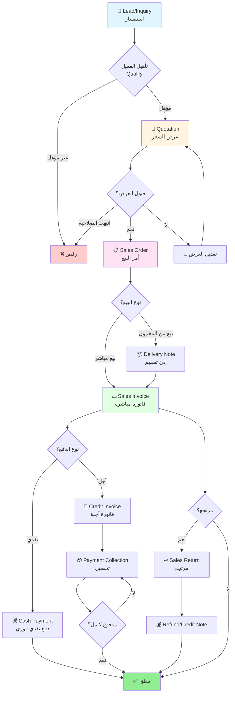
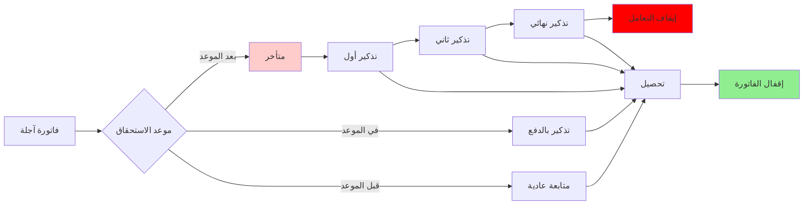
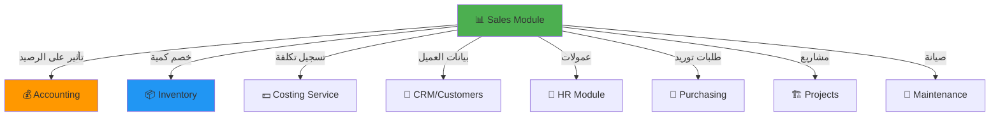

# 📊 مديول المبيعات - Sales Module
## التحليل التفصيلي الكامل والمعماري

---

## 📑 جدول المحتويات

1. [نظرة عامة](#overview)
2. [الكيانات الأساسية](#entities)
3. [دورة العمل الكاملة](#workflow)
4. [الشاشات التفصيلية](#screens)
5. [التكامل مع المديولات](#integration)
6. [قواعد العمل](#business-rules)
7. [Database Schema](#database)
8. [APIs المطلوبة](#apis)
9. [الأمثلة العملية](#examples)

---

<a name="overview"></a>
## 🎯 1. نظرة عامة على المديول

### الهدف الرئيسي
مديول المبيعات مسؤول عن إدارة دورة البيع الكاملة من لحظة استلام الطلب حتى تحصيل المبلغ، ويشمل:
- إدارة العملاء والمناديب
- عروض الأسعار والعقود
- أوامر البيع
- الفواتير (نقدي/آجل)
- المرتجعات والخصومات
- نقاط البيع (POS)
- المطاعم
- المتجر الإلكتروني
- قوائم الأسعار والعروض

### النطاق (Scope)
- ✅ B2B Sales (مبيعات للشركات)
- ✅ B2C Sales (مبيعات للأفراد)
- ✅ Retail (POS)
- ✅ Restaurant Management
- ✅ E-Commerce
- ✅ Multi-Currency & Multi-Language
- ✅ Multi-Branch & Multi-Company

---

<a name="entities"></a>
## 🗂️ 2. الكيانات الأساسية (Core Entities)

### 2.1 هيكل الكيانات

```
Sales Module
├── Customers Management
│   ├── Customer (العميل)
│   ├── Customer Category (تصنيف العملاء)
│   ├── Customer Price List (قائمة أسعار خاصة)
│   ├── Customer Credit Limit (حد ائتماني)
│   └── Customer Address (عناوين متعددة)
│
├── Sales Team
│   ├── Sales Representative (مندوب مبيعات)
│   ├── Sales Team (فريق مبيعات)
│   ├── Sales Territory (منطقة مبيعات)
│   └── Sales Target (أهداف المبيعات)
│
├── Sales Documents
│   ├── Quotation (عرض السعر)
│   ├── Sales Order (أمر البيع)
│   ├── Sales Invoice (فاتورة البيع)
│   ├── Sales Return (مرتجع البيع)
│   ├── Delivery Note (إذن تسليم)
│   └── Sales Contract (عقد البيع)
│
├── Pricing & Promotions
│   ├── Price List (قائمة الأسعار)
│   ├── Price List Item (بند السعر)
│   ├── Promotion (عرض ترويجي)
│   ├── Discount Rules (قواعد الخصم)
│   └── Bundle Offer (عروض الحزم)
│
├── Point of Sale
│   ├── POS Profile (ملف نقطة البيع)
│   ├── POS Session (جلسة البيع)
│   ├── POS Invoice (فاتورة نقطة البيع)
│   └── Cash Register (الخزينة)
│
└── Restaurant Management
    ├── Restaurant Table (طاولة)
    ├── Restaurant Order (طلب مطعم)
    ├── Restaurant Menu (قائمة الطعام)
    └── Kitchen Order (أمر المطبخ)
```

### 2.2 تفاصيل الكيانات الرئيسية

#### 📋 Customer (العميل)
```typescript
interface Customer {
  // Basic Info
  id: string;
  code: string; // كود تلقائي أو يدوي
  nameAr: string;
  nameEn: string;
  type: 'Individual' | 'Company'; // فرد أو شركة
  category: CustomerCategory;
  
  // Classification
  customerGroup: string; // تصنيف رئيسي
  customerType: 'Retail' | 'Wholesale' | 'Distributor';
  priceList: PriceList; // قائمة الأسعار الافتراضية
  
  // Contact Info
  phone: string;
  mobile: string;
  email: string;
  website?: string;
  
  // Tax & Legal
  taxNumber?: string; // الرقم الضريبي
  commercialRegistration?: string;
  
  // Credit Management
  creditLimit: number;
  currentBalance: number; // الرصيد الحالي
  availableCredit: number; // الحد المتاح
  paymentTerms: PaymentTerm; // شروط الدفع
  
  // Sales Info
  salesRepresentative: SalesRep; // المندوب المسؤول
  territory: Territory; // المنطقة
  
  // Multiple Addresses
  addresses: Address[]; // عناوين متعددة (توصيل، فواتير، مراسلات)
  defaultBillingAddress: Address;
  defaultShippingAddress: Address;
  
  // Multi-Company
  companyId: string;
  branchId: string;
  
  // Status & Audit
  status: 'Active' | 'Inactive' | 'Blocked';
  isBlocked: boolean;
  blockReason?: string;
  createdAt: DateTime;
  createdBy: string;
  modifiedAt: DateTime;
  modifiedBy: string;
}
```

#### 📄 Sales Invoice (فاتورة البيع)
```typescript
interface SalesInvoice {
  // Header
  id: string;
  invoiceNumber: string; // رقم تلقائي من sequence
  invoiceDate: Date;
  dueDate: Date;
  
  // Customer Info
  customerId: string;
  customer: Customer;
  customerName: string; // cached للطباعة
  billingAddress: Address;
  shippingAddress: Address;
  
  // Document Relations
  quotationId?: string; // من عرض سعر
  salesOrderId?: string; // من أمر بيع
  deliveryNoteId?: string; // من إذن تسليم
  
  // Invoice Type
  invoiceType: 'Cash' | 'Credit'; // نقدي أو آجل
  isCashInvoice: boolean;
  
  // Sales Info
  salesRepresentative: SalesRep;
  territory: Territory;
  priceList: PriceList;
  
  // Items
  items: SalesInvoiceItem[];
  
  // Totals
  subtotal: number; // المجموع قبل الضريبة والخصم
  discountType: 'Percentage' | 'Amount';
  discountValue: number;
  discountAmount: number; // قيمة الخصم
  totalBeforeTax: number; // بعد الخصم قبل الضريبة
  taxAmount: number; // قيمة الضريبة
  totalAmount: number; // الإجمالي النهائي
  
  // Payment Info
  paidAmount: number; // المدفوع
  remainingAmount: number; // المتبقي
  paymentStatus: 'Unpaid' | 'PartiallyPaid' | 'Paid';
  
  // Inventory Effect
  affectsInventory: boolean; // تؤثر على المخزون
  inventoryTransactionId?: string;
  warehouseId: string;
  
  // Accounting Effect
  affectsAccounting: boolean; // تؤثر على الحسابات
  journalEntryId?: string; // القيد المحاسبي المرتبط
  accountingDate: Date;
  fiscalYear: string;
  
  // Multi-Currency
  currency: string;
  exchangeRate: number;
  totalInBaseCurrency: number;
  
  // Multi-Company
  companyId: string;
  branchId: string;
  
  // Notes & Attachments
  notes?: string;
  internalNotes?: string;
  attachments?: Attachment[];
  
  // Workflow
  status: 'Draft' | 'Submitted' | 'Approved' | 'Rejected' | 'Cancelled';
  approvedBy?: string;
  approvedAt?: DateTime;
  
  // Audit
  createdAt: DateTime;
  createdBy: string;
  modifiedAt: DateTime;
  modifiedBy: string;
  deletedAt?: DateTime; // soft delete
  deletedBy?: string;
}

interface SalesInvoiceItem {
  id: string;
  lineNumber: number; // ترتيب البند
  
  // Product Info
  productId: string;
  product: Product;
  productCode: string;
  productName: string; // cached
  description?: string;
  
  // Quantity & Unit
  quantity: number;
  unitId: string;
  unit: Unit;
  
  // Pricing
  unitPrice: number; // سعر الوحدة
  discountType: 'Percentage' | 'Amount';
  discountValue: number;
  discountAmount: number;
  priceAfterDiscount: number;
  
  // Tax
  taxRate: number; // نسبة الضريبة
  taxAmount: number;
  
  // Totals
  totalBeforeTax: number;
  totalAmount: number; // الإجمالي شامل الضريبة
  
  // Warehouse & Batch
  warehouseId: string;
  batchNumber?: string;
  serialNumber?: string;
  expiryDate?: Date;
  
  // Cost (للتكلفة الفعلية)
  costPrice: number; // تكلفة الوحدة
  totalCost: number;
  profit: number; // الربح
  profitMargin: number; // هامش الربح %
}
```

#### 💰 Quotation (عرض السعر)
```typescript
interface Quotation {
  id: string;
  quotationNumber: string;
  quotationDate: Date;
  validUntil: Date; // صالح حتى
  
  // Customer Info
  customerId: string;
  customer: Customer;
  contactPerson?: string;
  
  // Items & Pricing
  items: QuotationItem[];
  priceList: PriceList;
  
  // Totals (نفس هيكل الفاتورة)
  subtotal: number;
  discountAmount: number;
  taxAmount: number;
  totalAmount: number;
  
  // Terms & Conditions
  paymentTerms: string;
  deliveryTerms: string;
  termsAndConditions: string;
  
  // Status & Workflow
  status: 'Draft' | 'Sent' | 'Accepted' | 'Rejected' | 'Expired';
  sentDate?: Date;
  acceptedDate?: Date;
  rejectedDate?: Date;
  rejectionReason?: string;
  
  // Conversion
  convertedToSalesOrder: boolean;
  salesOrderId?: string;
  
  // Standard Fields
  companyId: string;
  branchId: string;
  salesRepresentative: SalesRep;
  createdAt: DateTime;
  createdBy: string;
}
```

#### 📦 Sales Order (أمر البيع)
```typescript
interface SalesOrder {
  id: string;
  orderNumber: string;
  orderDate: Date;
  expectedDeliveryDate: Date;
  
  // Source
  quotationId?: string; // إذا كان من عرض سعر
  
  // Customer
  customerId: string;
  customer: Customer;
  shippingAddress: Address;
  
  // Items
  items: SalesOrderItem[];
  
  // Delivery Status
  deliveryStatus: 'Pending' | 'PartiallyDelivered' | 'Delivered';
  deliveredQuantity: number;
  remainingQuantity: number;
  
  // Invoice Status
  invoiceStatus: 'NotInvoiced' | 'PartiallyInvoiced' | 'FullyInvoiced';
  invoicedAmount: number;
  remainingAmount: number;
  
  // Totals
  subtotal: number;
  discountAmount: number;
  taxAmount: number;
  totalAmount: number;
  
  // Status
  status: 'Draft' | 'Confirmed' | 'InProgress' | 'Completed' | 'Cancelled';
  
  // Multi-Company
  companyId: string;
  branchId: string;
  warehouseId: string;
  
  // Audit
  createdAt: DateTime;
  createdBy: string;
}
```

---

<a name="workflow"></a>
## 🔄 3. دورة العمل الكاملة (Complete Workflow)

### 3.1 المسار الكامل للبيع



### 3.2 سيناريوهات البيع المختلفة

#### سيناريو 1: البيع الكامل (Full Cycle)
```
1. إنشاء عرض سعر → 2. قبول العميل → 3. إنشاء أمر بيع
→ 4. إذن تسليم من المخزون → 5. فاتورة بيع آجلة
→ 6. تحصيل المبلغ → 7. إغلاق
```

#### سيناريو 2: البيع السريع (Quick Sale)
```
1. فاتورة نقدية مباشرة → 2. دفع فوري → 3. إغلاق
```

#### سيناريو 3: POS (نقطة البيع)
```
1. إضافة أصناف → 2. حساب الإجمالي → 3. دفع
→ 4. طباعة فاتورة → 5. إغلاق
```

#### سيناريو 4: المطاعم
```
1. طلب على الطاولة → 2. إرسال للمطبخ → 3. تجهيز
→ 4. تقديم → 5. حساب وطباعة فاتورة → 6. دفع
```

### 3.3 دورة التحصيل (Collection Cycle)



---

<a name="screens"></a>
## 🖥️ 4. الشاشات التفصيلية

### 4.1 شاشة قائمة العملاء (Customers List)

#### التخطيط (Layout)
```
┌─────────────────────────────────────────────────────────┐
│  🧑‍💼 العملاء (Customers)                   [+ جديد] [⚙️] │
├─────────────────────────────────────────────────────────┤
│  🔍 بحث: [___________] 📋 النوع: [الكل ▼] 🏢 الفرع: [الكل ▼] │
│  💳 التصنيف: [الكل ▼] 📊 الحالة: [نشط ▼]                 │
├─────────────────────────────────────────────────────────┤
│ ☐ الكود   الاسم      النوع    التصنيف   الرصيد   المندوب│
│ ☐ C0001  شركة النور  شركة    تجزئة     15,000   أحمد   │
│ ☐ C0002  محمد علي    فرد      جملة     -5,000   سعيد   │
│ ☐ C0003  الوكالة     شركة    موزع     25,000   خالد   │
│ ...                                                    │
├─────────────────────────────────────────────────────────┤
│ عرض 1-50 من 1,250 عميل    [◀️ السابق] [التالي ▶️]      │
└─────────────────────────────────────────────────────────┘
```

#### المميزات (Features)
- ✅ **Multi-View**: List / Card / Kanban
- ✅ **Filters**: بحث متقدم، فلاتر متعددة، حفظ الفلاتر
- ✅ **Bulk Actions**: تفعيل/إيقاف جماعي، تصدير Excel
- ✅ **Quick Actions**: عرض سريع، تعديل سريع، حذف
- ✅ **Real-time Updates**: تحديث تلقائي للرصيد
- ✅ **Pagination**: Server-side pagination
- ✅ **Column Customization**: إظهار/إخفاء أعمدة

### 4.2 شاشة العميل (Customer Form)

#### البنية (Structure)
```typescript
interface CustomerFormStructure {
  toolbar: {
    actions: ['Save', 'SaveAndNew', 'Delete', 'Print', 'Duplicate'];
    navigation: ['First', 'Previous', 'Next', 'Last'];
  };
  
  tabs: [
    {
      name: 'basicInfo',
      label: 'معلومات أساسية',
      sections: [
        {
          name: 'generalInfo',
          fields: ['code', 'nameAr', 'nameEn', 'type', 'category']
        },
        {
          name: 'contactInfo',
          fields: ['phone', 'mobile', 'email', 'website']
        },
        {
          name: 'taxInfo',
          fields: ['taxNumber', 'commercialRegistration']
        }
      ]
    },
    {
      name: 'salesInfo',
      label: 'معلومات المبيعات',
      sections: [
        {
          name: 'salesTeam',
          fields: ['salesRep', 'territory', 'priceList']
        },
        {
          name: 'creditManagement',
          fields: ['creditLimit', 'paymentTerms', 'currentBalance']
        }
      ]
    },
    {
      name: 'addresses',
      label: 'العناوين',
      component: 'DataGrid',
      columns: ['type', 'address', 'city', 'country', 'isDefault']
    },
    {
      name: 'transactions',
      label: 'المعاملات',
      subTabs: [
        {name: 'invoices', label: 'الفواتير', component: 'DataGrid'},
        {name: 'payments', label: 'المدفوعات', component: 'DataGrid'},
        {name: 'quotations', label: 'عروض الأسعار', component: 'DataGrid'}
      ]
    },
    {
      name: 'reports',
      label: 'التقارير',
      sections: [
        {name: 'accountStatement', label: 'كشف حساب'},
        {name: 'salesAnalysis', label: 'تحليل المبيعات'},
        {name: 'ageingReport', label: 'تقرير أعمار الديون'}
      ]
    },
    {
      name: 'attachments',
      label: 'المرفقات',
      component: 'FileUpload'
    }
  ];
  
  statusBar: {
    fields: ['status', 'createdBy', 'createdAt', 'modifiedBy', 'modifiedAt']
  };
}
```

#### التخطيط المرئي
```
┌──────────────────────────────────────────────────────────────┐
│ [💾 حفظ] [🗑️ حذف] [🖨️ طباعة]    [⏮️ أول][◀️ سابق][▶️ تالي][⏭️ آخر] │
├──────────────────────────────────────────────────────────────┤
│ [معلومات أساسية] [مبيعات] [عناوين] [معاملات] [تقارير] [مرفقات] │
├──────────────────────────────────────────────────────────────┤
│                                                              │
│  📋 معلومات عامة                                             │
│  ┌──────────────────────────────────────────────────────┐   │
│  │ الكود: [C0001_____] 🔄                               │   │
│  │ الاسم (عربي): [____________________________]        │   │
│  │ الاسم (إنجليزي): [____________________________]      │   │
│  │ النوع: [● فرد  ○ شركة]                             │   │
│  │ التصنيف: [تجزئة ▼]                                  │   │
│  └──────────────────────────────────────────────────────┘   │
│                                                              │
│  📞 معلومات الاتصال                                         │
│  ┌──────────────────────────────────────────────────────┐   │
│  │ الهاتف: [____________]  المحمول: [____________]     │   │
│  │ البريد: [____________________________]              │   │
│  │ الموقع: [____________________________]              │   │
│  └──────────────────────────────────────────────────────┘   │
│                                                              │
│  💳 معلومات ضريبية                                          │
│  ┌──────────────────────────────────────────────────────┐   │
│  │ الرقم الضريبي: [____________________________]       │   │
│  │ السجل التجاري: [____________________________]       │   │
│  └──────────────────────────────────────────────────────┘   │
│                                                              │
├──────────────────────────────────────────────────────────────┤
│ 🟢 نشط | أنشئ بواسطة: أحمد | بتاريخ: 2025-01-15 10:30     │
└──────────────────────────────────────────────────────────────┘
```

### 4.3 شاشة فاتورة البيع (Sales Invoice Form)

#### البنية الكاملة
```
┌──────────────────────────────────────────────────────────────┐
│ [💾 حفظ] [✅ اعتماد] [🗑️ حذف] [🖨️ طباعة] [📧 إرسال]           │
├──────────────────────────────────────────────────────────────┤
│ [رئيسية] [الأصناف] [الدفع] [المحاسبة] [المخزون] [مرفقات]       │
├──────────────────────────────────────────────────────────────┤
│                                                              │
│  📄 معلومات الفاتورة                                         │
│  ┌──────────────────────────────────────────────────────┐   │
│  │ رقم الفاتورة: [INV-2025-0001] 📅 التاريخ: [2025-01-15] │
│  │ العميل: [🔍 ابحث...________] 🆔 C0001 - شركة النور    │
│  │ المندوب: [أحمد محمد ▼]  المنطقة: [الرياض ▼]         │
│  │ قائمة الأسعار: [تجزئة ▼]  العملة: [ريال ▼] 1.00    │
│  │ النوع: [● نقدي  ○ آجل]  الاستحقاق: [2025-02-15]    │
│  └──────────────────────────────────────────────────────┘   │
│                                                              │
│  📦 الأصناف                                                  │
│  ┌──────────────────────────────────────────────────────┐   │
│  │ [+ إضافة صنف]                                        │   │
│  ├──┬────────┬──────┬───────┬───────┬───────┬───────────┤   │
│  │# │ الصنف  │ الكمية│ السعر │ الخصم │ الضريبة│ الإجمالي │   │
│  ├──┼────────┼──────┼───────┼───────┼───────┼───────────┤   │
│  │1 │منتج أ  │  10  │ 100  │  10%  │  15%  │  1,035   │   │
│  │2 │منتج ب  │   5  │ 200  │   5%  │  15%  │  1,092.5 │   │
│  │  │[+ صنف] │      │       │       │       │          │   │
│  └──┴────────┴──────┴───────┴───────┴───────┴───────────┘   │
│                                                              │
│  💰 الإجماليات                                               │
│  ┌──────────────────────────────────────────────────────┐   │
│  │                          المجموع قبل الخصم: 1,500.00 │   │
│  │              الخصم [10%▼] [150.00___]: - 150.00     │   │
│  │                          المجموع بعد الخصم: 1,350.00 │   │
│  │                     الضريبة (15%): + 202.50         │   │
│  │             ══════════════════════════════════════    │   │
│  │                   الإجمالي النهائي: 1,552.50 ريال   │   │
│  └──────────────────────────────────────────────────────┘   │
│                                                              │
│  💵 الدفع (نقدي)                                            │
│  ┌──────────────────────────────────────────────────────┐   │
│  │ المبلغ المستحق: 1,552.50  المدفوع: [1,552.50____]  │   │
│  │ الباقي: 0.00  📝 طريقة الدفع: [نقدي ▼]             │   │
│  └──────────────────────────────────────────────────────┘   │
│                                                              │
├──────────────────────────────────────────────────────────────┤
│ 📊 مسودة | أنشئ: أحمد - 2025-01-15 10:30                   │
└──────────────────────────────────────────────────────────────┘
```

#### المميزات الخاصة
1. **Auto-Complete للعميل**: بحث ذكي مع عرض معلومات سريعة
2. **Product Picker**: اختيار منتج مع عرض:
   - الكمية المتاحة
   - السعر حسب قائمة الأسعار
   - الصورة
   - المواصفات
3. **Barcode Scanner**: مسح باركود لإضافة المنتج
4. **Real-time Calculations**: حساب تلقائي للإجماليات
5. **Discount Calculator**: حاسبة خصم مرنة (نسبة أو مبلغ)
6. **Tax Management**: ضرائب متعددة حسب المنتج
7. **Payment Methods**: طرق دفع متعددة للفاتورة الواحدة
8. **Print Templates**: قوالب طباعة متعددة

### 4.4 شاشة نقطة البيع (POS Screen)

#### التصميم
```
┌────────────────────────────────────────────────────────────────┐
│  🏪 نقطة البيع - الفرع الرئيسي         الجلسة: #45  [✕ إغلاق] │
├────────────────────────────────────────────────────────────────┤
│                                                                │
│  ┌─────────────────────────────┐  ┌────────────────────────┐ │
│  │  🔍 [بحث أو مسح باركود...]   │  │  📋 الفاتورة          │ │
│  ├─────────────────────────────┤  ├────────────────────────┤ │
│  │  📁 الأقسام                  │  │ العميل: [🔍 ابحث...]  │ │
│  │  [الكل] [طعام] [مشروبات]    │  │ المندوب: أحمد         │ │
│  │  [إلكترونيات] [ملابس]...    │  ├────────────────────────┤ │
│  ├─────────────────────────────┤  │ # الصنف    الكم السعر  │ │
│  │                             │  │ 1 منتج أ    2  200.00 │ │
│  │  [منتج أ]  [منتج ب]        │  │ 2 منتج ب    1  150.00 │ │
│  │   100 ر.س   150 ر.س        │  │ 3 منتج ج    3  300.00 │ │
│  │                             │  │                        │ │
│  │  [منتج ج]  [منتج د]        │  │ المجموع:      650.00  │ │
│  │   200 ر.س   180 ر.س        │  │ الخصم:        -50.00  │ │
│  │                             │  │ الضريبة(15%):  90.00  │ │
│  │  [منتج هـ] [منتج و]        │  │ ──────────────────────│ │
│  │   120 ر.س   90 ر.س         │  │ 🟢 الإجمالي:  690.00  │ │
│  │                             │  │                        │ │
│  └─────────────────────────────┘  ├────────────────────────┤ │
│                                   │ [🗑️ مسح] [💾 تعليق]   │ │
│  [🔄 فواتير معلقة: 3]            │ [💳 دفع]              │ │
│  [📊 إغلاق الجلسة]               └────────────────────────┘ │
│                                                                │
└────────────────────────────────────────────────────────────────┘
```

#### خصائص POS
- ⚡ **سرعة عالية**: استجابة فورية
- 📱 **Touch Friendly**: مناسب للشاشات اللمس
- 🔊 **Sound Feedback**: صوت عند المسح
- 🎨 **Visual Feedback**: تأثيرات بصرية
- ⌨️ **Keyboard Shortcuts**: اختصارات لوحة المفاتيح
- 💾 **Auto Save**: حفظ تلقائي
- 📴 **Offline Mode**: يعمل بدون إنترنت
- 🖨️ **Fast Print**: طباعة سريعة

---

<a name="integration"></a>
## 🔗 5. التكامل مع المديولات الأخرى

### 5.1 خريطة التكامل



### 5.2 نقاط التكامل التفصيلية

#### 5.2.1 التكامل مع الحسابات (Accounting)

**عند إنشاء فاتورة بيع:**
```typescript
// القيد المحاسبي التلقائي
interface JournalEntry {
  date: Date;
  description: "فاتورة بيع رقم INV-2025-0001";
  lines: [
    {
      account: "العملاء - شركة النور", // من دليل الحسابات
      debit: 1552.50,
      credit: 0,
      costCenter: "فرع الرياض",
      reference: "INV-2025-0001"
    },
    {
      account: "المبيعات",
      debit: 0,
      credit: 1350.00,
      costCenter: "فرع الرياض"
    },
    {
      account: "ضريبة المبيعات المستحقة",
      debit: 0,
      credit: 202.50,
      costCenter: "فرع الرياض"
    }
  ]
}
```

**نقاط التكامل:**
- ✅ إنشاء قيد تلقائي عند اعتماد الفاتورة
- ✅ تحديث رصيد العميل في دليل الحسابات
- ✅ تسجيل ضريبة القيمة المضافة
- ✅ توزيع على مراكز التكلفة
- ✅ إلغاء القيد عند إلغاء الفاتورة

#### 5.2.2 التكامل مع المخزون (Inventory)

**عند إنشاء فاتورة بيع:**
```typescript
interface InventoryTransaction {
  transactionType: "Sales Invoice";
  transactionNumber: "INV-2025-0001";
  date: Date;
  warehouse: "المستودع الرئيسي";
  items: [
    {
      product: "منتج أ",
      quantity: -10, // سالب للخروج
      unitCost: 80, // التكلفة الفعلية
      totalCost: 800,
      batchNumber: "BATCH-001",
      serialNumbers: ["SN001", "SN002", ...],
      movementType: "Out"
    }
  ];
  affectsStock: true;
  status: "Posted";
}
```

**نقاط التكامل:**
- ✅ خصم الكمية من المخزون تلقائياً
- ✅ تتبع الدفعات (Batches)
- ✅ تتبع الأرقام التسلسلية (Serial Numbers)
- ✅ تحديث متوسط التكلفة
- ✅ تحديث الكمية المتاحة للبيع

#### 5.2.3 التكامل مع خدمة التكلفة (Costing Service)

```typescript
// حساب التكلفة والربح
interface CostCalculation {
  invoiceId: "INV-2025-0001";
  items: [
    {
      product: "منتج أ",
      quantity: 10,
      sellingPrice: 100,
      totalSales: 1000,
      costPrice: 80, // من المخزون
      totalCost: 800,
      profit: 200,
      profitMargin: 20 // %
    }
  ];
  totalSales: 1552.50;
  totalCost: 1200;
  grossProfit: 352.50;
  grossProfitMargin: 22.7; // %
}
```

**نقاط التكامل:**
- ✅ حساب التكلفة الفعلية من المخزون
- ✅ حساب الربح لكل صنف
- ✅ حساب هامش الربح
- ✅ تقارير الربحية

#### 5.2.4 التكامل مع الموارد البشرية (HR)

**حساب العمولات:**
```typescript
interface CommissionCalculation {
  salesRepId: "REP-001";
  salesRepName: "أحمد محمد";
  period: "2025-01";
  invoices: [
    {
      invoiceNumber: "INV-2025-0001",
      amount: 1552.50,
      commissionRate: 2, // %
      commissionAmount: 31.05
    }
  ];
  totalSales: 50000;
  totalCommission: 1000;
  status: "Calculated";
  paidInPayroll: false;
}
```

**نقاط التكامل:**
- ✅ حساب عمولات المبيعات
- ✅ ربط مع المرتبات
- ✅ تقارير الأداء
- ✅ أهداف المبيعات

#### 5.2.5 التكامل مع المشتريات (Purchasing)

**إنشاء طلب شراء تلقائي:**
```typescript
// عند نفاذ المخزون
interface AutoPurchaseRequest {
  triggeredBy: "Sales Order SO-2025-0001";
  product: "منتج أ";
  currentStock: 5;
  reorderLevel: 10;
  orderQuantity: 50; // حسب EOQ
  supplier: "المورد المفضل";
  status: "Draft";
}
```

**نقاط التكامل:**
- ✅ إنشاء طلب شراء عند النفاذ
- ✅ تتبع العجز في المخزون
- ✅ توقعات الطلب

### 5.3 مصفوفة التكامل

| الحدث | المحاسبة | المخزون | التكلفة | الموارد البشرية | المشتريات |
|-------|----------|---------|---------|----------------|-----------|
| إنشاء فاتورة | ✅ قيد | ✅ خصم | ✅ حساب | ✅ عمولة | - |
| إلغاء فاتورة | ✅ عكس قيد | ✅ إرجاع | ✅ إلغاء | ✅ إلغاء عمولة | - |
| مرتجع بيع | ✅ قيد معاكس | ✅ إرجاع | ✅ تعديل | - | - |
| دفعة نقدية | ✅ قيد استلام | - | - | - | - |
| أمر بيع | - | ✅ حجز | - | - | ✅ طلب شراء |

---

<a name="business-rules"></a>
## ⚖️ 6. قواعد العمل (Business Rules)

### 6.1 قواعد العميل

```typescript
interface CustomerValidationRules {
  // قواعد إنشاء العميل
  creation: {
    requiredFields: ['nameAr', 'nameEn', 'type', 'category'];
    uniqueFields: ['code', 'taxNumber', 'email'];
    codeGeneration: 'Auto' | 'Manual';
    codePrefix: 'C';
    codeLength: 6;
  };
  
  // قواعد الحد الائتماني
  creditLimit: {
    checkCreditLimit: true;
    allowExceed: false; // أو true مع موافقة
    approvalRequired: true; // عند التجاوز
    approverRole: 'Sales Manager';
    warningAt: 80; // % تحذير عند 80%
  };
  
  // قواعد الحظر
  blocking: {
    autoBlockWhen: {
      overdueInvoices: 3; // عدد الفواتير المتأخرة
      overdueDays: 30; // عدد الأيام
      overdueAmount: 10000; // المبلغ المتأخر
    };
    blockActions: ['NewInvoice', 'NewOrder'];
    allowActions: ['ViewStatement', 'MakePayment'];
  };
  
  // قواعد الخصم
  discount: {
    maxDiscountPercent: 10; // %
    requireApprovalAbove: 10; // %
    approverRole: 'Sales Manager';
    discountAuthority: {
      'SalesRep': 5,
      'SalesSupervisor': 10,
      'SalesManager': 20,
      'GeneralManager': 100
    };
  };
}
```

### 6.2 قواعد الفاتورة

```typescript
interface InvoiceBusinessRules {
  // قواعد الإنشاء
  creation: {
    requiredFields: ['customer', 'date', 'items'];
    minimumItems: 1;
    allowFutureDate: false;
    allowBackDate: true;
    backDateDays: 30;
    autoNumbering: true;
    numberFormat: 'INV-{YYYY}-{0000}';
  };
  
  // قواعد الأصناف
  items: {
    allowNegativeQuantity: false;
    allowZeroPrice: false;
    requireWarehouse: true;
    checkAvailability: true;
    allowOverselling: false; // أو true مع تحذير
    maxDiscountPerItem: 20; // %
    requireCostCenter: true;
  };
  
  // قواعد الاعتماد
  approval: {
    requireApproval: true;
    approvalWorkflow: [
      {
        condition: 'amount > 10000',
        approver: 'Sales Manager'
      },
      {
        condition: 'amount > 50000',
        approver: 'General Manager'
      }
    ];
    allowSelfApproval: false;
  };
  
  // قواعد التعديل والحذف
  modification: {
    allowEditAfterApproval: false;
    allowDeleteAfterApproval: false;
    allowCancelAfterPayment: false;
    requireReasonForCancel: true;
  };
  
  // قواعد المحاسبة
  accounting: {
    autoPostJournalEntry: true;
    postOnApproval: true; // أو عند الحفظ
    requireFiscalYear: true;
    blockPreviousPeriod: true;
  };
  
  // قواعد الضريبة
  tax: {
    includeTax: true;
    taxRate: 15; // %
    taxAccount: 'VAT Payable';
    showTaxBreakdown: true;
    exemptCategories: ['Food', 'Medicine']; // معفى من الضريبة
  };
}
```

### 6.3 قواعد الدفع

```typescript
interface PaymentRules {
  // قواعد الدفع النقدي
  cashPayment: {
    requireCashAccount: true;
    defaultCashAccount: 'Cash in Hand';
    allowPartialPayment: true;
    allowOverPayment: true; // رصيد للعميل
  };
  
  // قواعد الدفع الآجل
  creditPayment: {
    checkCreditLimit: true;
    requireDueDate: true;
    defaultPaymentTerms: 30; // days
    allowEarlyPaymentDiscount: true;
    earlyPaymentDiscountRate: 2; // %
    earlyPaymentDays: 10;
  };
  
  // قواعد طرق الدفع المتعددة
  multiplePayments: {
    allowMultipleMethods: true;
    maxPaymentMethods: 3;
    requireBankDetails: ['BankTransfer', 'Cheque'];
    validateCheque: true;
  };
}
```

### 6.4 قواعد المرتجعات

```typescript
interface ReturnRules {
  // قواعد عامة
  general: {
    allowReturnAfterDays: 30;
    requireOriginalInvoice: true;
    requireReason: true;
    allowPartialReturn: true;
    maxReturnQuantity: 'original'; // لا يتجاوز الكمية الأصلية
  };
  
  // قواعد المخزون
  inventory: {
    returnToStock: true;
    requireQualityCheck: true;
    allowDamagedReturn: false;
    separateDamagedLocation: true;
  };
  
  // قواعد الاسترداد
  refund: {
    allowCashRefund: true;
    allowCreditNote: true;
    defaultRefundMethod: 'CreditNote';
    requireManagerApproval: true;
    refundProcessingDays: 7;
  };
}
```

---

<a name="database"></a>
## 🗄️ 7. Database Schema

### 7.1 جداول العملاء

```sql
-- جدول العملاء الرئيسي
CREATE TABLE Customers (
    CustomerId UNIQUEIDENTIFIER PRIMARY KEY DEFAULT NEWID(),
    Code NVARCHAR(20) NOT NULL UNIQUE,
    NameAr NVARCHAR(200) NOT NULL,
    NameEn NVARCHAR(200),
    Type NVARCHAR(20) NOT NULL, -- Individual, Company
    CategoryId UNIQUEIDENTIFIER,
    
    -- Contact Info
    Phone NVARCHAR(20),
    Mobile NVARCHAR(20),
    Email NVARCHAR(100),
    Website NVARCHAR(200),
    
    -- Tax Info
    TaxNumber NVARCHAR(50),
    CommercialRegistration NVARCHAR(50),
    
    -- Credit Management
    CreditLimit DECIMAL(18,2) DEFAULT 0,
    CurrentBalance DECIMAL(18,2) DEFAULT 0,
    PaymentTermId UNIQUEIDENTIFIER,
    
    -- Sales Info
    SalesRepresentativeId UNIQUEIDENTIFIER,
    TerritoryId UNIQUEIDENTIFIER,
    PriceListId UNIQUEIDENTIFIER,
    
    -- Multi-Company
    CompanyId UNIQUEIDENTIFIER NOT NULL,
    BranchId UNIQUEIDENTIFIER,
    
    -- Status
    Status NVARCHAR(20) DEFAULT 'Active',
    IsBlocked BIT DEFAULT 0,
    BlockReason NVARCHAR(500),
    
    -- Audit
    CreatedAt DATETIME2 DEFAULT GETUTCDATE(),
    CreatedBy UNIQUEIDENTIFIER,
    ModifiedAt DATETIME2,
    ModifiedBy UNIQUEIDENTIFIER,
    DeletedAt DATETIME2,
    DeletedBy UNIQUEIDENTIFIER,
    
    CONSTRAINT FK_Customer_Category FOREIGN KEY (CategoryId) 
        REFERENCES CustomerCategories(CategoryId),
    CONSTRAINT FK_Customer_SalesRep FOREIGN KEY (SalesRepresentativeId) 
        REFERENCES SalesRepresentatives(RepresentativeId),
    CONSTRAINT FK_Customer_Company FOREIGN KEY (CompanyId) 
        REFERENCES Companies(CompanyId)
);

-- فهارس لتحسين الأداء
CREATE INDEX IX_Customers_Code ON Customers(Code);
CREATE INDEX IX_Customers_Company ON Customers(CompanyId);
CREATE INDEX IX_Customers_Status ON Customers(Status) WHERE DeletedAt IS NULL;
CREATE INDEX IX_Customers_SalesRep ON Customers(SalesRepresentativeId);
```

```sql
-- جدول عناوين العملاء
CREATE TABLE CustomerAddresses (
    AddressId UNIQUEIDENTIFIER PRIMARY KEY DEFAULT NEWID(),
    CustomerId UNIQUEIDENTIFIER NOT NULL,
    AddressType NVARCHAR(20) NOT NULL, -- Billing, Shipping, Correspondence
    AddressLine1 NVARCHAR(200) NOT NULL,
    AddressLine2 NVARCHAR(200),
    City NVARCHAR(100),
    State NVARCHAR(100),
    PostalCode NVARCHAR(20),
    CountryCode NVARCHAR(10),
    IsDefault BIT DEFAULT 0,
    
    CONSTRAINT FK_CustomerAddress_Customer FOREIGN KEY (CustomerId) 
        REFERENCES Customers(CustomerId) ON DELETE CASCADE
);
```

### 7.2 جداول الفواتير

```sql
-- جدول رأس الفاتورة
CREATE TABLE SalesInvoices (
    InvoiceId UNIQUEIDENTIFIER PRIMARY KEY DEFAULT NEWID(),
    InvoiceNumber NVARCHAR(50) NOT NULL UNIQUE,
    InvoiceDate DATE NOT NULL,
    DueDate DATE,
    
    -- Customer
    CustomerId UNIQUEIDENTIFIER NOT NULL,
    CustomerName NVARCHAR(200), -- cached
    BillingAddressId UNIQUEIDENTIFIER,
    ShippingAddressId UNIQUEIDENTIFIER,
    
    -- Document Relations
    QuotationId UNIQUEIDENTIFIER,
    SalesOrderId UNIQUEIDENTIFIER,
    DeliveryNoteId UNIQUEIDENTIFIER,
    
    -- Invoice Type
    InvoiceType NVARCHAR(20) NOT NULL, -- Cash, Credit
    IsCashInvoice BIT DEFAULT 0,
    
    -- Sales Info
    SalesRepresentativeId UNIQUEIDENTIFIER,
    TerritoryId UNIQUEIDENTIFIER,
    PriceListId UNIQUEIDENTIFIER,
    
    -- Totals
    Subtotal DECIMAL(18,2) NOT NULL,
    DiscountType NVARCHAR(20), -- Percentage, Amount
    DiscountValue DECIMAL(18,2),
    DiscountAmount DECIMAL(18,2) DEFAULT 0,
    TotalBeforeTax DECIMAL(18,2) NOT NULL,
    TaxAmount DECIMAL(18,2) DEFAULT 0,
    TotalAmount DECIMAL(18,2) NOT NULL,
    
    -- Payment
    PaidAmount DECIMAL(18,2) DEFAULT 0,
    RemainingAmount DECIMAL(18,2) NOT NULL,
    PaymentStatus NVARCHAR(20) DEFAULT 'Unpaid', -- Unpaid, PartiallyPaid, Paid
    
    -- Inventory
    AffectsInventory BIT DEFAULT 1,
    InventoryTransactionId UNIQUEIDENTIFIER,
    WarehouseId UNIQUEIDENTIFIER NOT NULL,
    
    -- Accounting
    AffectsAccounting BIT DEFAULT 1,
    JournalEntryId UNIQUEIDENTIFIER,
    AccountingDate DATE,
    FiscalYearId UNIQUEIDENTIFIER,
    
    -- Multi-Currency
    CurrencyCode NVARCHAR(10) NOT NULL DEFAULT 'SAR',
    ExchangeRate DECIMAL(18,6) DEFAULT 1,
    TotalInBaseCurrency DECIMAL(18,2),
    
    -- Multi-Company
    CompanyId UNIQUEIDENTIFIER NOT NULL,
    BranchId UNIQUEIDENTIFIER,
    
    -- Notes
    Notes NVARCHAR(MAX),
    InternalNotes NVARCHAR(MAX),
    
    -- Workflow
    Status NVARCHAR(20) DEFAULT 'Draft', -- Draft, Submitted, Approved, Rejected, Cancelled
    ApprovedBy UNIQUEIDENTIFIER,
    ApprovedAt DATETIME2,
    
    -- Audit
    CreatedAt DATETIME2 DEFAULT GETUTCDATE(),
    CreatedBy UNIQUEIDENTIFIER,
    ModifiedAt DATETIME2,
    ModifiedBy UNIQUEIDENTIFIER,
    DeletedAt DATETIME2,
    DeletedBy UNIQUEIDENTIFIER,
    
    CONSTRAINT FK_SalesInvoice_Customer FOREIGN KEY (CustomerId) 
        REFERENCES Customers(CustomerId),
    CONSTRAINT FK_SalesInvoice_Warehouse FOREIGN KEY (WarehouseId) 
        REFERENCES Warehouses(WarehouseId),
    CONSTRAINT FK_SalesInvoice_Company FOREIGN KEY (CompanyId) 
        REFERENCES Companies(CompanyId)
);

-- فهارس
CREATE INDEX IX_SalesInvoices_Number ON SalesInvoices(InvoiceNumber);
CREATE INDEX IX_SalesInvoices_Date ON SalesInvoices(InvoiceDate);
CREATE INDEX IX_SalesInvoices_Customer ON SalesInvoices(CustomerId);
CREATE INDEX IX_SalesInvoices_Status ON SalesInvoices(Status) WHERE DeletedAt IS NULL;
CREATE INDEX IX_SalesInvoices_Company ON SalesInvoices(CompanyId);
```

```sql
-- جدول بنود الفاتورة
CREATE TABLE SalesInvoiceItems (
    ItemId UNIQUEIDENTIFIER PRIMARY KEY DEFAULT NEWID(),
    InvoiceId UNIQUEIDENTIFIER NOT NULL,
    LineNumber INT NOT NULL,
    
    -- Product
    ProductId UNIQUEIDENTIFIER NOT NULL,
    ProductCode NVARCHAR(50),
    ProductName NVARCHAR(200),
    Description NVARCHAR(500),
    
    -- Quantity & Unit
    Quantity DECIMAL(18,4) NOT NULL,
    UnitId UNIQUEIDENTIFIER NOT NULL,
    
    -- Pricing
    UnitPrice DECIMAL(18,2) NOT NULL,
    DiscountType NVARCHAR(20),
    DiscountValue DECIMAL(18,2),
    DiscountAmount DECIMAL(18,2) DEFAULT 0,
    PriceAfterDiscount DECIMAL(18,2) NOT NULL,
    
    -- Tax
    TaxRate DECIMAL(5,2) DEFAULT 0,
    TaxAmount DECIMAL(18,2) DEFAULT 0,
    
    -- Totals
    TotalBeforeTax DECIMAL(18,2) NOT NULL,
    TotalAmount DECIMAL(18,2) NOT NULL,
    
    -- Warehouse & Batch
    WarehouseId UNIQUEIDENTIFIER,
    BatchNumber NVARCHAR(50),
    SerialNumber NVARCHAR(50),
    ExpiryDate DATE,
    
    -- Cost (للتكلفة)
    CostPrice DECIMAL(18,2),
    TotalCost DECIMAL(18,2),
    Profit DECIMAL(18,2),
    ProfitMargin DECIMAL(5,2),
    
    CONSTRAINT FK_SalesInvoiceItem_Invoice FOREIGN KEY (InvoiceId) 
        REFERENCES SalesInvoices(InvoiceId) ON DELETE CASCADE,
    CONSTRAINT FK_SalesInvoiceItem_Product FOREIGN KEY (ProductId) 
        REFERENCES Products(ProductId),
    CONSTRAINT FK_SalesInvoiceItem_Unit FOREIGN KEY (UnitId) 
        REFERENCES Units(UnitId)
);

-- فهرس
CREATE INDEX IX_SalesInvoiceItems_Invoice ON SalesInvoiceItems(InvoiceId);
CREATE INDEX IX_SalesInvoiceItems_Product ON SalesInvoiceItems(ProductId);
```

### 7.3 Views & Functions

```sql
-- View: كشف حساب العميل
CREATE VIEW vw_CustomerStatement AS
SELECT 
    c.CustomerId,
    c.Code AS CustomerCode,
    c.NameAr AS CustomerName,
    i.InvoiceDate AS TransactionDate,
    i.InvoiceNumber AS Reference,
    'Invoice' AS TransactionType,
    i.TotalAmount AS Debit,
    0 AS Credit,
    i.RemainingAmount AS Balance,
    i.DueDate,
    CASE 
        WHEN i.DueDate < GETDATE() AND i.RemainingAmount > 0 
        THEN 'Overdue' 
        ELSE 'Current' 
    END AS Status
FROM Customers c
INNER JOIN SalesInvoices i ON c.CustomerId = i.CustomerId
WHERE i.DeletedAt IS NULL
UNION ALL
SELECT 
    c.CustomerId,
    c.Code,
    c.NameAr,
    p.PaymentDate,
    p.PaymentNumber,
    'Payment',
    0,
    p.Amount,
    0,
    NULL,
    'Paid'
FROM Customers c
INNER JOIN Payments p ON c.CustomerId = p.CustomerId
WHERE p.DeletedAt IS NULL;
```

```sql
-- Function: حساب الرصيد الحالي للعميل
CREATE FUNCTION fn_GetCustomerBalance(@CustomerId UNIQUEIDENTIFIER)
RETURNS DECIMAL(18,2)
AS
BEGIN
    DECLARE @Balance DECIMAL(18,2);
    
    SELECT @Balance = ISNULL(SUM(TotalAmount - PaidAmount), 0)
    FROM SalesInvoices
    WHERE CustomerId = @CustomerId
      AND Status = 'Approved'
      AND DeletedAt IS NULL;
    
    RETURN @Balance;
END;
```

```sql
-- Stored Procedure: إنشاء قيد محاسبي للفاتورة
CREATE PROCEDURE sp_CreateInvoiceJournalEntry
    @InvoiceId UNIQUEIDENTIFIER
AS
BEGIN
    SET NOCOUNT ON;
    
    DECLARE @JournalEntryId UNIQUEIDENTIFIER = NEWID();
    DECLARE @InvoiceNumber NVARCHAR(50);
    DECLARE @CustomerId UNIQUEIDENTIFIER;
    DECLARE @TotalAmount DECIMAL(18,2);
    DECLARE @TotalBeforeTax DECIMAL(18,2);
    DECLARE @TaxAmount DECIMAL(18,2);
    
    -- Get invoice data
    SELECT 
        @InvoiceNumber = InvoiceNumber,
        @CustomerId = CustomerId,
        @TotalAmount = TotalAmount,
        @TotalBeforeTax = TotalBeforeTax,
        @TaxAmount = TaxAmount
    FROM SalesInvoices
    WHERE InvoiceId = @InvoiceId;
    
    -- Create journal entry header
    INSERT INTO JournalEntries (JournalEntryId, EntryDate, Description, Reference)
    VALUES (@JournalEntryId, GETDATE(), N'فاتورة بيع رقم ' + @InvoiceNumber, @InvoiceNumber);
    
    -- Debit: Accounts Receivable (العملاء)
    INSERT INTO JournalEntryLines (JournalEntryId, AccountId, Debit, Credit)
    SELECT @JournalEntryId, AccountId, @TotalAmount, 0
    FROM Customers c
    INNER JOIN Accounts a ON a.Code = 'AR-' + c.Code
    WHERE c.CustomerId = @CustomerId;
    
    -- Credit: Sales Revenue (المبيعات)
    INSERT INTO JournalEntryLines (JournalEntryId, AccountId, Debit, Credit)
    VALUES (@JournalEntryId, 
            (SELECT AccountId FROM Accounts WHERE Code = 'SALES'), 
            0, @TotalBeforeTax);
    
    -- Credit: VAT Payable (ضريبة القيمة المضافة)
    IF @TaxAmount > 0
    BEGIN
        INSERT INTO JournalEntryLines (JournalEntryId, AccountId, Debit, Credit)
        VALUES (@JournalEntryId, 
                (SELECT AccountId FROM Accounts WHERE Code = 'VAT-PAYABLE'), 
                0, @TaxAmount);
    END
    
    -- Update invoice with journal entry ID
    UPDATE SalesInvoices
    SET JournalEntryId = @JournalEntryId
    WHERE InvoiceId = @InvoiceId;
END;
```

---

<a name="apis"></a>
## 🌐 8. APIs المطلوبة

### 8.1 Customer APIs

```typescript
// GET /api/customers - قائمة العملاء
interface GetCustomersRequest {
  page: number;
  pageSize: number;
  search?: string;
  type?: 'Individual' | 'Company';
  category?: string;
  status?: 'Active' | 'Inactive' | 'Blocked';
  salesRepId?: string;
  companyId?: string;
  branchId?: string;
  sortBy?: string;
  sortOrder?: 'asc' | 'desc';
}

interface GetCustomersResponse {
  items: Customer[];
  totalCount: number;
  page: number;
  pageSize: number;
}

// GET /api/customers/{id} - تفاصيل عميل
interface GetCustomerResponse {
  customer: Customer;
  addresses: Address[];
  currentBalance: number;
  creditLimit: number;
  availableCredit: number;
  overdueAmount: number;
  lastInvoiceDate: Date;
  totalSales: number;
}

// POST /api/customers - إنشاء عميل جديد
interface CreateCustomerRequest {
  code?: string; // اختياري للإنشاء التلقائي
  nameAr: string;
  nameEn?: string;
  type: 'Individual' | 'Company';
  categoryId: string;
  phone?: string;
  mobile?: string;
  email?: string;
  // ... باقي الحقول
}

// PUT /api/customers/{id} - تحديث عميل
interface UpdateCustomerRequest {
  nameAr?: string;
  nameEn?: string;
  phone?: string;
  // ... الحقول المطلوب تحديثها
}

// DELETE /api/customers/{id} - حذف عميل (soft delete)

// GET /api/customers/{id}/statement - كشف حساب
interface CustomerStatementRequest {
  customerId: string;
  fromDate: Date;
  toDate: Date;
  includePayments: boolean;
}

// GET /api/customers/{id}/invoices - فواتير العميل
interface CustomerInvoicesRequest {
  customerId: string;
  status?: string;
  fromDate?: Date;
  toDate?: Date;
}
```

### 8.2 Invoice APIs

```typescript
// GET /api/sales/invoices - قائمة الفواتير
interface GetInvoicesRequest {
  page: number;
  pageSize: number;
  search?: string;
  customerId?: string;
  status?: 'Draft' | 'Submitted' | 'Approved';
  invoiceType?: 'Cash' | 'Credit';
  paymentStatus?: 'Unpaid' | 'PartiallyPaid' | 'Paid';
  fromDate?: Date;
  toDate?: Date;
  companyId?: string;
  branchId?: string;
}

// GET /api/sales/invoices/{id} - تفاصيل فاتورة
interface GetInvoiceResponse {
  invoice: SalesInvoice;
  items: SalesInvoiceItem[];
  payments: Payment[];
  journalEntry?: JournalEntry;
  inventoryTransactions: InventoryTransaction[];
}

// POST /api/sales/invoices - إنشاء فاتورة جديدة
interface CreateInvoiceRequest {
  customerId: string;
  invoiceDate: Date;
  dueDate?: Date;
  invoiceType: 'Cash' | 'Credit';
  warehouseId: string;
  items: {
    productId: string;
    quantity: number;
    unitId: string;
    unitPrice: number;
    discountType?: 'Percentage' | 'Amount';
    discountValue?: number;
    taxRate?: number;
  }[];
  discountType?: 'Percentage' | 'Amount';
  discountValue?: number;
  notes?: string;
}

// PUT /api/sales/invoices/{id} - تحديث فاتورة
interface UpdateInvoiceRequest {
  // نفس CreateInvoiceRequest
}

// POST /api/sales/invoices/{id}/submit - إرسال للاعتماد
// POST /api/sales/invoices/{id}/approve - اعتماد الفاتورة
// POST /api/sales/invoices/{id}/reject - رفض الفاتورة
interface RejectInvoiceRequest {
  reason: string;
}

// POST /api/sales/invoices/{id}/cancel - إلغاء الفاتورة
interface CancelInvoiceRequest {
  reason: string;
}

// DELETE /api/sales/invoices/{id} - حذف فاتورة (soft delete)

// GET /api/sales/invoices/{id}/print - طباعة فاتورة
interface PrintInvoiceRequest {
  invoiceId: string;
  templateId?: string;
  language?: 'ar' | 'en';
  format?: 'pdf' | 'html';
}

// POST /api/sales/invoices/{id}/send-email - إرسال بالبريد
interface SendInvoiceEmailRequest {
  invoiceId: string;
  to: string[];
  cc?: string[];
  subject?: string;
  message?: string;
}
```

### 8.3 Quotation APIs

```typescript
// POST /api/sales/quotations
// GET /api/sales/quotations
// GET /api/sales/quotations/{id}
// PUT /api/sales/quotations/{id}
// DELETE /api/sales/quotations/{id}

// POST /api/sales/quotations/{id}/send - إرسال العرض للعميل
// POST /api/sales/quotations/{id}/accept - قبول العرض
// POST /api/sales/quotations/{id}/reject - رفض العرض
// POST /api/sales/quotations/{id}/convert-to-order - تحويل لأمر بيع
```

### 8.4 Payment APIs

```typescript
// POST /api/sales/payments - تسجيل دفعة
interface CreatePaymentRequest {
  customerId: string;
  paymentDate: Date;
  amount: number;
  paymentMethod: 'Cash' | 'BankTransfer' | 'Cheque' | 'CreditCard';
  reference?: string;
  invoices: {
    invoiceId: string;
    amount: number;
  }[];
  notes?: string;
}

// GET /api/sales/payments - قائمة المدفوعات
// GET /api/sales/payments/{id} - تفاصيل دفعة
```

### 8.5 POS APIs

```typescript
// POST /api/pos/sessions - فتح جلسة
interface OpenPOSSessionRequest {
  posProfileId: string;
  openingCash: number;
}

// POST /api/pos/sessions/{id}/close - إغلاق جلسة
interface ClosePOSSessionRequest {
  sessionId: string;
  closingCash: number;
  closingNotes?: string;
}

// POST /api/pos/invoices - إنشاء فاتورة POS
interface CreatePOSInvoiceRequest {
  sessionId: string;
  items: POSItem[];
  paymentMethod: string;
  cashReceived?: number;
  changeAmount?: number;
}

// GET /api/pos/products/search - بحث المنتجات (للباركود)
interface SearchPOSProductRequest {
  query: string; // barcode or name
  warehouseId: string;
}
```

---

<a name="examples"></a>
## 💡 9. أمثلة عملية

### 9.1 مثال: دورة بيع كاملة

#### الخطوة 1: إنشاء عرض سعر
```http
POST /api/sales/quotations
Content-Type: application/json

{
  "customerId": "cust-001",
  "quotationDate": "2025-01-15",
  "validUntil": "2025-02-15",
  "items": [
    {
      "productId": "prod-001",
      "quantity": 10,
      "unitId": "unit-pcs",
      "unitPrice": 100
    }
  ],
  "discountType": "Percentage",
  "discountValue": 10,
  "termsAndConditions": "الدفع خلال 30 يوم"
}

Response: {
  "quotationId": "quot-001",
  "quotationNumber": "QT-2025-0001",
  "status": "Draft",
  "totalAmount": 1035
}
```

#### الخطوة 2: إرسال العرض للعميل
```http
POST /api/sales/quotations/quot-001/send
Content-Type: application/json

{
  "to": ["customer@example.com"],
  "subject": "عرض سعر رقم QT-2025-0001",
  "message": "نرفق لكم عرض السعر المطلوب..."
}
```

#### الخطوة 3: قبول العرض وتحويله لأمر بيع
```http
POST /api/sales/quotations/quot-001/accept

Response: {
  "status": "Accepted"
}

POST /api/sales/quotations/quot-001/convert-to-order

Response: {
  "salesOrderId": "so-001",
  "orderNumber": "SO-2025-0001"
}
```

#### الخطوة 4: إنشاء إذن تسليم
```http
POST /api/inventory/delivery-notes
Content-Type: application/json

{
  "salesOrderId": "so-001",
  "deliveryDate": "2025-01-20",
  "warehouseId": "wh-001",
  "items": [
    {
      "productId": "prod-001",
      "quantity": 10,
      "batchNumber": "BATCH-001"
    }
  ]
}

Response: {
  "deliveryNoteId": "dn-001",
  "deliveryNoteNumber": "DN-2025-0001"
}
```

#### الخطوة 5: إنشاء فاتورة بيع
```http
POST /api/sales/invoices
Content-Type: application/json

{
  "customerId": "cust-001",
  "invoiceDate": "2025-01-20",
  "dueDate": "2025-02-20",
  "invoiceType": "Credit",
  "salesOrderId": "so-001",
  "deliveryNoteId": "dn-001",
  "warehouseId": "wh-001",
  "items": [
    {
      "productId": "prod-001",
      "quantity": 10,
      "unitId": "unit-pcs",
      "unitPrice": 100,
      "discountType": "Percentage",
      "discountValue": 10,
      "taxRate": 15
    }
  ]
}

Response: {
  "invoiceId": "inv-001",
  "invoiceNumber": "INV-2025-0001",
  "totalAmount": 1035,
  "status": "Draft"
}
```

#### الخطوة 6: اعتماد الفاتورة
```http
POST /api/sales/invoices/inv-001/approve

Response: {
  "status": "Approved",
  "journalEntryId": "je-001",
  "inventoryTransactionId": "it-001"
}
```

#### الخطوة 7: تسجيل الدفع
```http
POST /api/sales/payments
Content-Type: application/json

{
  "customerId": "cust-001",
  "paymentDate": "2025-02-20",
  "amount": 1035,
  "paymentMethod": "BankTransfer",
  "reference": "TRX-123456",
  "invoices": [
    {
      "invoiceId": "inv-001",
      "amount": 1035
    }
  ]
}

Response: {
  "paymentId": "pay-001",
  "paymentNumber": "PAY-2025-0001",
  "status": "Posted"
}
```

### 9.2 مثال: فاتورة POS

```http
# 1. فتح جلسة
POST /api/pos/sessions
{
  "posProfileId": "pos-profile-001",
  "openingCash": 1000
}

Response: { "sessionId": "session-001" }

# 2. إنشاء فاتورة
POST /api/pos/invoices
{
  "sessionId": "session-001",
  "items": [
    {
      "productId": "prod-001",
      "quantity": 2,
      "unitPrice": 100
    },
    {
      "productId": "prod-002",
      "quantity": 1,
      "unitPrice": 150
    }
  ],
  "paymentMethod": "Cash",
  "cashReceived": 400,
  "changeAmount": 50
}

Response: {
  "invoiceId": "inv-pos-001",
  "invoiceNumber": "POS-001",
  "totalAmount": 350,
  "changeAmount": 50
}

# 3. إغلاق الجلسة
POST /api/pos/sessions/session-001/close
{
  "closingCash": 2350,
  "closingNotes": "جلسة طبيعية"
}
```

---

## 📚 مصادر إضافية

### التقارير المطلوبة
1. **تقارير المبيعات**
   - تقرير المبيعات اليومي
   - تقرير المبيعات الشهري
   - تحليل المبيعات حسب المنتج
   - تحليل المبيعات حسب العميل
   - تحليل المبيعات حسب المندوب
   - تحليل المبيعات حسب المنطقة

2. **تقارير العملاء**
   - كشف حساب العميل
   - أعمار الديون (Aging Report)
   - العملاء الأكثر مبيعات
   - العملاء المتأخرين في السداد

3. **تقارير الربحية**
   - هامش الربح حسب الفاتورة
   - هامش الربح حسب المنتج
   - هامش الربح حسب العميل

4. **تقارير الأداء**
   - أداء المناديب
   - تحقيق الأهداف
   - معدل التحويل (Quotation → Order → Invoice)

### الإشعارات المطلوبة
- ✉️ إشعار للعميل عند إنشاء فاتورة
- ✉️ تذكير بموعد الاستحقاق
- ✉️ إشعار بالتأخير في السداد
- ✉️ إشعار للمدير عند تجاوز الحد الائتماني
- ✉️ إشعار للمخزن عند أمر بيع جديد

---

**تم إعداد هذا المستند بواسطة:** Claude Sonnet 4.5  
**التاريخ:** 2025-01-02  
**النسخة:** 1.0  
**الحالة:** ✅ مكتمل

**الملف التالي:** مديول المخزون (Inventory Module)
